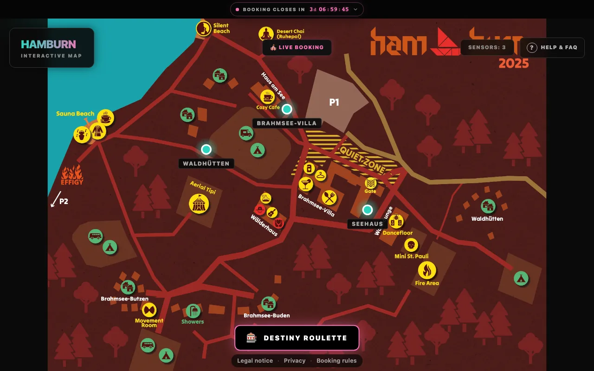
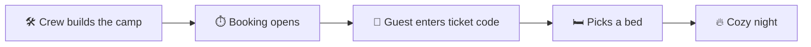

<div align="center">


# Hamburn CozyNights

**Beds, not spreadsheets.**<br />
Ticket holders pick their own bed on the Hamburn camp map. The crew builds the camp, decides when booking opens and keeps an eye on every spot from one Control Center.

[](https://morpheusmxml.github.io/hamburn-cozynights/)


[How booking works](https://morpheusmxml.github.io/hamburn-cozynights/guide/booking) ·
[Admin guide](https://morpheusmxml.github.io/hamburn-cozynights/admin/) ·
[Architecture](https://morpheusmxml.github.io/hamburn-cozynights/reference/architecture) ·
[Local development](https://morpheusmxml.github.io/hamburn-cozynights/develop/)

</div>



## ✨ What it does

|     |                              |                                                                                                        |
| --- | ---------------------------- | ------------------------------------------------------------------------------------------------------ |
| 🗺️  | **Interactive camp map**     | Every house sits on the real site plan; guests see at a glance where beds are free.                    |
| 🎫  | **One ticket, one bed**      | No accounts or passwords for guests. The ticket code is the key, and it holds exactly one spot.        |
| 🎰  | **Destiny Roulette**         | A random free bed and burner name for the undecided; booked guests can nuke their spot and respin.     |
| 🎆  | **Booking fireworks**        | Neon rockets rise from your new spot and burst like the cursor does; a fire finale ends the show.      |
| 🛠️  | **Staging, Live, Closed**    | The crew builds the layout in staging; a booking window opens and closes booking by timer, and closing freezes it. |
| 🔐  | **Google Workspace sign-in** | Admins use their `@mauersegler.art` account. Newcomers request access, a superuser approves.           |
| 💾  | **Layout templates**         | Export the camp as JSON; a file is compared with the camp and only the changes you pick are applied.   |
| 📥  | **Ticket list with review**  | Load the ticket shop's list after a review; fix an address or hand a ticket over in a few clicks.      |
| 🛡️  | **Privacy first**            | Server-side rendering only, encrypted burner names, hashed ticket lookups, strict database rules.      |
| 🔥  | **Burning effigy title**     | Magic balls build rainbow timber letters, then fire eats them letter by letter. Light them yourself.   |
| ⚖️  | **Legal pages**              | Legal notice, privacy policy and booking rules on every page; the operator's details stay out of git.  |
| 📬  | **Booking confirmations**    | E-mail to the ticket holder, Telegram if they like, and a crew group that hears about admin changes.   |
| 🎟️  | **Booking pass**             | A QR code and a short code per booking; the crew checks it with a phone camera, a PC or a USB scanner. |
| ♿   | **Special-needs spots**      | Guests ask with their ticket code, even before booking opens; the crew books a fitting spot.           |
| ✉️  | **Message texts**            | Every sentence guests get by e-mail, on Telegram or from the bot is editable in the admin area, with a live preview. |

## 🧭 How it works



## 🚀 Quick start

You need Node.js 22+ and Docker.

```bash
git clone https://github.com/MorpheusMXML/hamburn-cozynights.git
cd hamburn-cozynights/hamburn-cozynights
cp .env.example .env     # fill it in, the comments explain every value
docker compose up -d     # PocketBase on 127.0.0.1:8090
npm ci
npm run dev              # http://localhost:5173
```

The full walkthrough, including admin sign-in on your machine, is in [Local development](https://morpheusmxml.github.io/hamburn-cozynights/develop/).

## 📚 Documentation

The documentation lives in [`docs/`](docs/) and is published at **[morpheusmxml.github.io/hamburn-cozynights](https://morpheusmxml.github.io/hamburn-cozynights/)**.

| Guide                                                                                       | Admin                                                                                           | Under the hood                                                                             | Develop                                                                                           |
| ------------------------------------------------------------------------------------------- | ----------------------------------------------------------------------------------------------- | ------------------------------------------------------------------------------------------ | ------------------------------------------------------------------------------------------------- |
| [What is CozyNights?](https://morpheusmxml.github.io/hamburn-cozynights/guide/)             | [Control Center](https://morpheusmxml.github.io/hamburn-cozynights/admin/)                      | [Architecture](https://morpheusmxml.github.io/hamburn-cozynights/reference/architecture)   | [Local development](https://morpheusmxml.github.io/hamburn-cozynights/develop/)                   |
| [Booking a bed](https://morpheusmxml.github.io/hamburn-cozynights/guide/booking)            | [Admin access & roles](https://morpheusmxml.github.io/hamburn-cozynights/admin/access)          | [Security & privacy](https://morpheusmxml.github.io/hamburn-cozynights/reference/security) | [Environments & deployment](https://morpheusmxml.github.io/hamburn-cozynights/develop/deployment) |
| [Special-needs spot](https://morpheusmxml.github.io/hamburn-cozynights/guide/special-needs) | [Houses, rooms & spots](https://morpheusmxml.github.io/hamburn-cozynights/admin/camp-layout)    |                                                                                            | [Working on these docs](https://morpheusmxml.github.io/hamburn-cozynights/develop/docs)           |
| [Staging, Live & Closed](https://morpheusmxml.github.io/hamburn-cozynights/guide/phases)    | [Layout templates](https://morpheusmxml.github.io/hamburn-cozynights/admin/templates)           | [Data model & templates](https://morpheusmxml.github.io/hamburn-cozynights/reference/data-model) | [Landing page title](https://morpheusmxml.github.io/hamburn-cozynights/develop/effigy-title)      |
| [FAQ](https://morpheusmxml.github.io/hamburn-cozynights/guide/faq)                          | [Event checklist](https://morpheusmxml.github.io/hamburn-cozynights/admin/event-checklist)      |                                                                                            | [Testing & release checks](https://morpheusmxml.github.io/hamburn-cozynights/develop/testing)     |
|                                                                                             | [Tickets & e-mail addresses](https://morpheusmxml.github.io/hamburn-cozynights/admin/tickets)   |                                                                                            | [Branches, integration & releases](https://morpheusmxml.github.io/hamburn-cozynights/develop/integration) |
|                                                                                             | [Legal pages](https://morpheusmxml.github.io/hamburn-cozynights/admin/legal)                    |                                                                                            |                                                                                                   |
|                                                                                             | [Notifications](https://morpheusmxml.github.io/hamburn-cozynights/admin/notifications)          |                                                                                            |                                                                                                   |
|                                                                                             | [Booking passes](https://morpheusmxml.github.io/hamburn-cozynights/admin/passes)                |                                                                                            |                                                                                                   |
|                                                                                             | [Special-needs requests](https://morpheusmxml.github.io/hamburn-cozynights/admin/special-needs) |                                                                                            |                                                                                                   |

## 🗂️ Repository

```text
.
├── docs/                   documentation site (VitePress → GitHub Pages)
├── .github/workflows/      staging deploy, docs deploy
└── hamburn-cozynights/     the app: SvelteKit + PocketBase
    ├── src/                routes, components, server logic
    ├── pb_migrations/      database schema and API rules
    ├── pb_hooks/           PocketBase hooks
    ├── scripts/            admin tool, health check, test setup
    ├── deploy/             deploy script, nginx vhost, server runbook
    └── tests/              Vitest and Playwright
```

<div align="center">
<sub>Made with 🔥 for Hamburn by the Mauersegler* crew.</sub>
</div>
