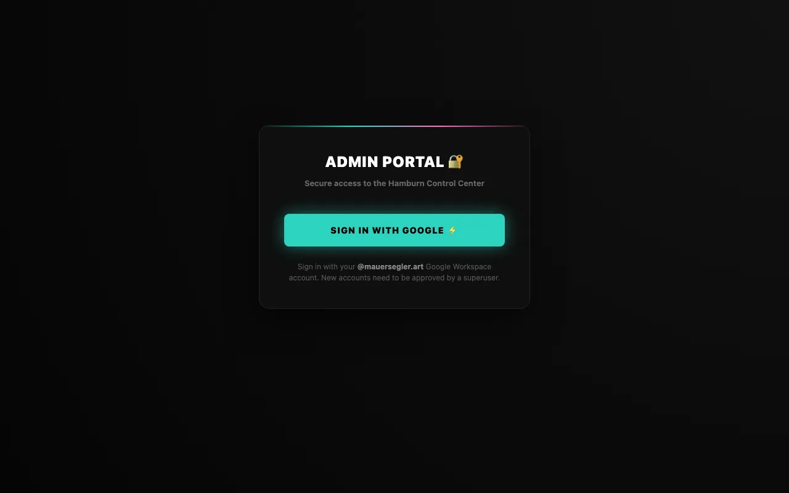
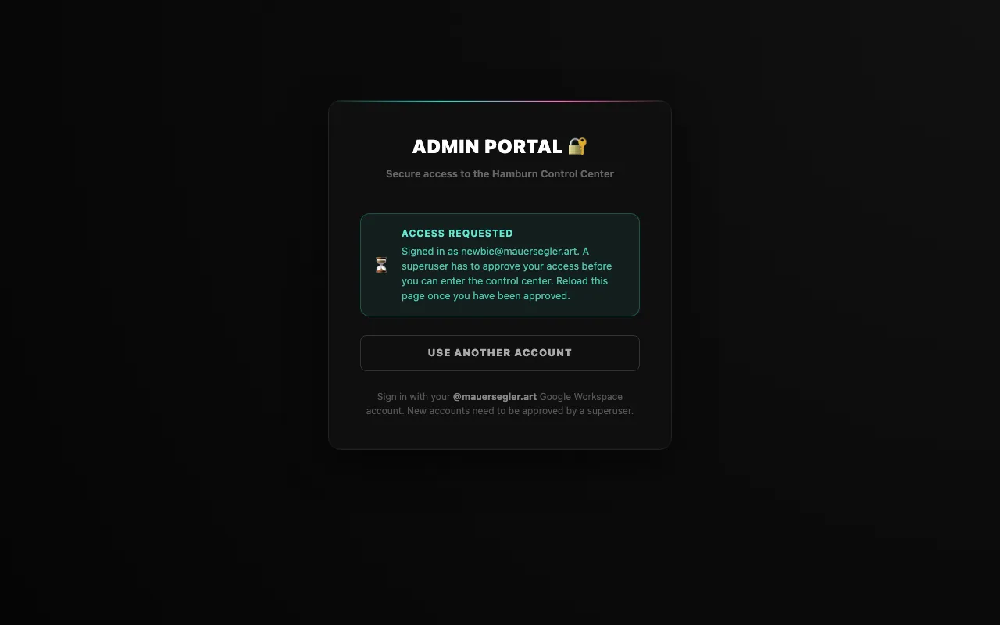
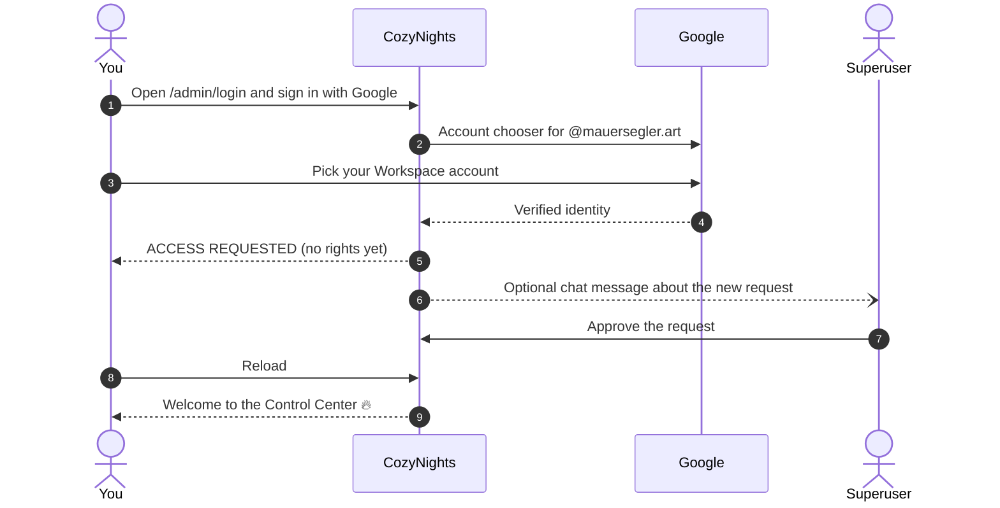
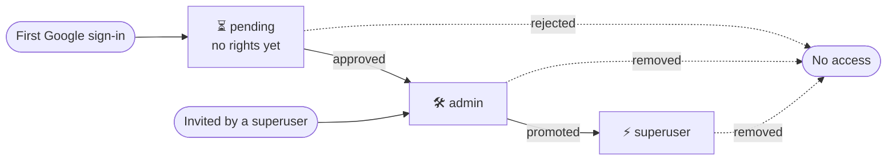

# Admin access & roles

The admin area lives at **`/admin`**. From the start page you can also get there with the **🔒 Crew** link at the bottom.

## Who can get in

Only **Google Workspace accounts of `@mauersegler.art`** whose address Google has verified. Private Gmail addresses and accounts of other domains are turned away, even if they belong to crew members.

There is **no password** and **no sign-up form** in CozyNights. You sign in with Google, and a superuser decides whether that account gets access.



## First sign-in: the access request

<div class="steps">

1. **Sign in with Google.** Open `/admin/login` and press <kbd>SIGN IN WITH GOOGLE ⚡️</kbd>. Pick your `@mauersegler.art` account in Google's account chooser.
2. **Your request is created.** If nobody has invited you yet, CozyNights records an *access request* for your account and shows **ACCESS REQUESTED**. At this point the account has no rights at all.
3. **A superuser approves it.** Let one of the superusers know. If the crew chat is connected, they already got a message about your request.
4. **Reload.** Once approved, reload the page and you're in the [Control Center](./).

</div>





> [!TIP] Invited in advance?
> A superuser can also invite you before your first sign-in. Then Google sign-in takes you straight into the Control Center, no waiting.

Signed in with the wrong Google account? Press <kbd>USE ANOTHER ACCOUNT</kbd> on the waiting page.

## Roles

Every admin account has one role:



A request can also be approved straight to superuser.

| What you can do | pending | admin | superuser |
| --- | :---: | :---: | :---: |
| See the Control Center, statistics and occupancy | <span class="no">✗</span> | <span class="yes">✓</span> | <span class="yes">✓</span> |
| Build the camp: houses, rooms, spots | <span class="no">✗</span> | <span class="yes">✓</span> | <span class="yes">✓</span> |
| Plan the booking window, arm and pause the timer (at least a day ahead) | <span class="no">✗</span> | <span class="yes">✓</span> | <span class="yes">✓</span> |
| **Switch the phase right now** (Staging, Live Booking, Closed) | <span class="no">✗</span> | <span class="no">✗</span> | <span class="yes">✓</span> |
| Lock and unlock spots, mark spots ♿ special or normal | <span class="no">✗</span> | <span class="yes">✓</span> | <span class="yes">✓</span> |
| Decide [special-needs requests](./special-needs), book spots for them, open and close requests | <span class="no">✗</span> | <span class="yes">✓</span> | <span class="yes">✓</span> |
| [Check guests in](./passes) with their booking pass, undo a check-in | <span class="no">✗</span> | <span class="yes">✓</span> | <span class="yes">✓</span> |
| Change the [message texts](./notifications#message-texts) guests get | <span class="no">✗</span> | <span class="yes">✓</span> | <span class="yes">✓</span> |
| Export a layout template, compare a file with the camp | <span class="no">✗</span> | <span class="yes">✓</span> | <span class="yes">✓</span> |
| **Apply a layout template** | <span class="no">✗</span> | <span class="no">✗</span> | <span class="yes">✓</span> |
| Find tickets, change their e-mail address, hand them over | <span class="no">✗</span> | <span class="yes">✓</span> | <span class="yes">✓</span> |
| **Load the ticket list** | <span class="no">✗</span> | <span class="no">✗</span> | <span class="yes">✓</span> |
| **Clear all bookings** (Staging Mode only) | <span class="no">✗</span> | <span class="no">✗</span> | <span class="yes">✓</span> |
| Approve, invite and remove admins | <span class="no">✗</span> | <span class="no">✗</span> | <span class="yes">✓</span> on the server |

Superusers carry a **SUPERUSER ⚡️** badge in the admin header.

## Managing admins

Approving, inviting and removing admins deliberately happens **outside the web app**, on the server that runs CozyNights. Even a hijacked browser session can't hand out access. Superusers use the PocketBase dashboard (collection `admins`, field `role`), which is only reachable from the server itself, or the admin tool that ships with the app:

```bash
./scripts/cozy-admin.sh list                                 # open requests, admins, superusers
./scripts/cozy-admin.sh approve someone@mauersegler.art      # approve an access request as admin
./scripts/cozy-admin.sh approve someone@mauersegler.art superuser  # … or straight as superuser
./scripts/cozy-admin.sh add someone@mauersegler.art          # invite before the first sign-in
./scripts/cozy-admin.sh remove someone@mauersegler.art --yes # reject a request or revoke access
```

The few superusers who also need the PocketBase dashboard on the server get that from an operator; `./scripts/cozy-admin.sh --help` lists every command of the tool.

Changes apply on the **next click**: CozyNights re-checks the role on every request, so an approved admin gets in with a reload, and a removed admin is out immediately.

The same tool creates the guests' ticket codes (`tickets generate`, `add`, `import`, `list`, `remove`), see [Ticket codes](./event-checklist#ticket-codes). The ticket list with e-mail addresses can also be loaded in the app, see [Tickets & e-mail addresses](./tickets).

::: info Crew group
Access requests, approvals, role changes, removals and every admin sign-in show up in the crew's Telegram group, so nothing goes unnoticed. See [Notifications](./notifications#crew-group).
:::

## Sessions

- A session lasts **three days** and is renewed every time you use the admin area.
- **Once a week you sign in with Google again**, even if you use the admin area every day (**WEEKLY CHECK 🔐**). That's when Google applies what the Workspace decided: a suspended account is out, required 2-Step Verification is asked for.
- <kbd>Eject 🚀</kbd> in the top-right corner signs you out.
- The session cookie can't be read by scripts on the page and is only sent over HTTPS.

## Sign-in messages

| Message | What happened | What to do |
| --- | --- | --- |
| **WRONG ACCOUNT 🛑** | The account isn't a verified `@mauersegler.art` Workspace account, e.g. a private Gmail address. | Sign in again and pick your Workspace account. |
| **NO ACCESS 🛑** | This Google account can't access the Control Center. | Ask a superuser. |
| **SIGN-IN CANCELLED** | You cancelled on Google's page. | Try again whenever you're ready. |
| **SIGN-IN EXPIRED ⏳** | The sign-in took longer than 10 minutes, or was started in another tab. | Start again at `/admin/login`. |
| **WEEKLY CHECK 🔐** | Your last Google sign-in was more than 7 days ago. | Sign in with Google again. |
| **BACKEND UNREACHABLE 📡** | CozyNights can't reach its database right now. | Try again shortly; tell the operators if it persists. |
| **SIGN-IN FAILED** | Google didn't complete the sign-in. | Try again. |
| *Google sign-in is not configured on this server yet.* | This installation has no Google sign-in set up, typical for a fresh local install. | Operators: see [Local development](../develop/#admin-sign-in-locally). |

## Why Google only?

- **No passwords** that could leak, be reused or need resetting.
- **Leaving the Workspace means losing access,** at the latest at the next weekly sign-in. To end it at once, also run `./scripts/cozy-admin.sh remove <email> --yes`.
- **2-Step Verification comes from Google.** Make it mandatory for the Workspace in the Google Admin console (Security → Authentication → 2-Step Verification), ideally with passkeys or security keys for superusers. CozyNights has no second factor of its own on purpose: Google's is stronger than a code by e-mail or chat, and the weekly sign-in makes sure it applies.
- **Checked twice, independently.** Both the database and the app verify the domain, the verified address and the Workspace membership, and a new account can never start with more than *pending*.

More in [Security & privacy](../reference/security#admin-sign-in).
