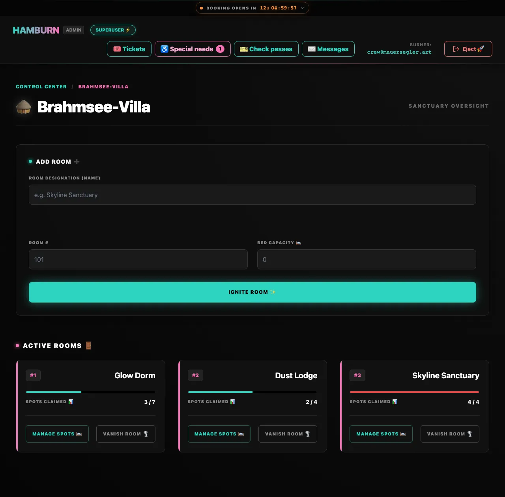
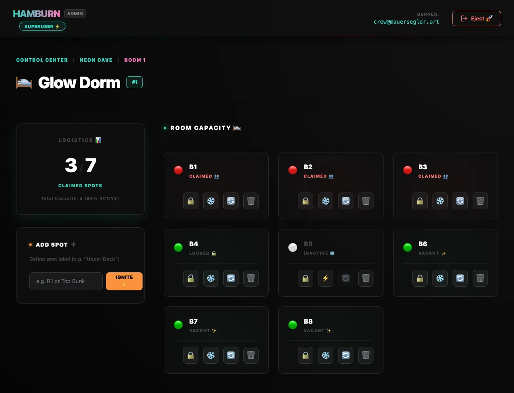

# Houses, rooms & spots

The camp is a simple tree: **houses** on the map contain **rooms**, and rooms contain **spots**, one per bed.

> [!IMPORTANT] Staging only
> All structural changes need Staging Mode. During Live Booking and after booking closed the server refuses them. Only locking/unlocking 🔒, marking spots ♿ special or normal, the **details** below and [bunk beds](#bunk-beds) 🪜 still work. The pages show it: a line on top says whether the layout can be changed, and every locked button or field is greyed out with a padlock and [says why](./index#locked-not-now) when you try it. See [Staging, Live Booking & Closed](../guide/phases).

## Houses

### Create a house

- **Map view:** click an empty place on the map. In the *GENERATE SANCTUARY* sidebar enter a name (**UNIT DESIGNATION**) and the **INITIAL CAPACITY (BEDS)**, then press <kbd>IGNITE HOUSE ✨</kbd>.
- **List view:** click **Ignite New House**. CozyNights switches to the map view and opens the same sidebar. The house starts in the middle of the map; drag it into place afterwards.

CozyNights creates the house, a first room called **Main Module** (#1), and spots **B1 … Bn** for the capacity you entered. Like every new spot, they are **active right away**. Every house needs a name of its own; a camp holds up to 200 houses.

### Move, rename, delete

| Task | How |
| --- | --- |
| Move | Drag the pin in map view, or move a selected pin with the arrow keys (<kbd>Shift</kbd> for bigger steps). For an exact place, type the **MAP POSITION 📍** in the sidebar (X 0–1000, Y 0–700) and press <kbd>MOVE PIN</kbd>. Every move is saved right away. Houses keep a small distance from each other. |
| Rename | Click the house in map view, or <kbd>RENAME ✏️</kbd> on its card in list view → change the name → <kbd>SYNC MODULE ✨</kbd>. |
| Delete | <kbd>VANISH FROM PLAYA 🌪️</kbd> in the sidebar or <kbd>VANISH 🌪️</kbd> on the card, then confirm. |

> [!CAUTION] Deleting is final
> Deleting a house deletes all its rooms and spots too. Any test bookings on them are released first, and ticket codes stay valid. Not sure? [Export a template](./templates) before you delete.

### House details 🏷️ {#house-details}

**HOUSE DETAILS 🏷️** on the house page says what the place is like. Guests read it when they pick a spot, and the ♿ picker matches [special-needs requests](./special-needs) with it.

| Field | What it is |
| --- | --- |
| KIND | 🏠 House · 🛖 Hut group · ⛺ Tent area · 📍 Other. A **hut group** keeps one pin on the map and its huts are its rooms: the pin gets the 🛖 icon and the guest page says *Choose a hut*. |
| FEATURES | ♿ Wheelchair accessible · ⬇️ Ground floor · 🚻 Toilets + showers inside · 🔥 Heated · ❄️ No heating · 🤫 Quiet zone. Everything inside the house inherits them. |
| DESCRIPTION | Up to 500 characters of your own, shown to guests: *"Showers and toilets in the wash house, 50 m along the path."* |

Press <kbd>SAVE DETAILS 🏷️</kbd>. Details can be changed **in every phase** — they describe the place, they don't move a booking.

::: tip Say nothing rather than something wrong
An empty field means *not specified*, and the app never guesses. A spot the crew didn't describe never matches a guest's wish and never counts as fitting a ♿ request, so it is worth filling in the details before booking opens.
:::

## Rooms

Open a house with <kbd>MANAGE ROOMS ⚙️</kbd>, by clicking its card, or via <kbd>ADD ROOMS ➕</kbd> in the red alert panel.

### Add a room

Fill in **ADD ROOM ➕**:

| Field | Example | Note |
| --- | --- | --- |
| ROOM DESIGNATION (NAME) | *Skyline Sanctuary* | Shown to guests. Required. |
| ROOM # | *101* | Required: a whole number from 1 to 9999, used only once in the house. Rooms are sorted by this number. |
| BED CAPACITY 🛌 | *4* | Creates spots *Spot 1 … Spot 4* right away. |

A house holds up to 50 rooms, a room up to 50 spots. In a hut group the form asks for a *hut designation* and ignites a hut — the house's kind decides the wording.

Press <kbd>IGNITE ROOM ✨</kbd>.

> [!NOTE] New spots are active
> Every new spot, whether it comes with a house, with a room or on its own, is **active**: guests can book it as soon as booking opens. Lock 🔒 or deactivate ❄️ the spots that shouldn't be booked, see [Spot actions](#spot-actions).

### Room details 🏷️ {#room-details}

**ROOM DETAILS 🏷️** on the room page works like the house panel, with the room's own list:

| Field | What it is |
| --- | --- |
| NAME | Only in Staging Mode: the name belongs to the layout. The field is gone while booking is live or closed. |
| KIND | Room · Hut · Tent · Other. A room added to a hut group starts as a **hut** (and in a tent area as a tent), so you rarely have to set it. |
| FEATURES | ♿ Wheelchair accessible · ⬇️ Ground floor · 🛁 Own bathroom · 🔥 Heated · ❄️ No heating · 🤫 Quiet zone · 🔌 Power socket. They come **on top of** the house's: a heated room in an unheated hut group counts as heated. |
| DESCRIPTION | Up to 500 characters, shown to guests. |

### Room cards

Each card under **ACTIVE ROOMS 🚪** (or *huts*, *tents*, depending on the house's kind) shows the room number, name, its kind and features, what kind of beds it holds and **SPOTS CLAIMED 📊** (taken / active). Click a card or <kbd>MANAGE SPOTS 🛌</kbd> to manage its spots. Below the cards, **🛏️ Who is here** lists the house's bookings room by room: the guest, when they booked, the check-in (see [Bookings & check-ins](./bookings)). <kbd>VANISH ROOM 🌪️</kbd> deletes the room **with all its spots and any bookings on them**; the guests get a *spot was released* message, and their ticket codes stay valid.

## Spots

Open a room by clicking its card on the house page.

**LOGISTICS 📊** counts taken versus active spots. **ADD SPOT ➕** adds a single spot: give it a label such as *B1* or *Top Bunk* (each label only once per room) and press <kbd>IGNITE ⚡️</kbd>.

### What kind of bed a spot is

**SPOT TYPES 🛏️** in the room's sidebar sets every spot of the room at once, in label order:

| Choice | Result |
| --- | --- |
| Bunk beds: B1 + B2 stacked, B3 + B4, … | B1 is the lower bunk, B2 the upper one above it, and the two are stacked as one [bunk bed](#bunk-beds); then B3 + B4, and so on — a room of four bunk beds in one click. With an odd number of spots the last one stays on its own, with no bed type. |
| All single beds | Every spot a single bed. Bunk beds are taken apart. |
| Not specified | Clears the bed type again. Bunk beds are taken apart. |

<kbd>🏷️ DETAILS</kbd> on a spot card opens its own editor: the **BED** (single bed, lower or upper bunk, one half of a double bed, sofa, mattress, camp bed), a **🔌 power socket** at that spot, and in Staging Mode its **LABEL**. Guests see the bed under the spot's label, and the ♿ picker uses it: *a lower bunk or a bed without a ladder* fits every bed but an upper bunk. A spot that is part of a [bunk bed](#bunk-beds) gets its bed from the stacking: the **BED** field is greyed out there and says so.

### Bunk beds 🪜 {#bunk-beds}

Two spots of a room can be **stacked** into one bunk bed: a lower bunk and an upper bunk. Both stay spots of their own — each keeps its label, its state and its 🔒 and ♿ marks, and guests book each on its own — they only get a level, and the room page shows the pair as one tile.

**Stack two spots:** press <kbd>🪜 STACK</kbd> on the spot that becomes the **lower** bunk. Its card lights up and asks *Pick the spot that goes on top ▲*; every other spot on its own now offers <kbd>▲ PUT ON TOP</kbd>. Press that on the spot that becomes the **upper** bunk: the card lifts off, the two slide together into one tile, and the ladder between them draws itself. <kbd>CANCEL ✕</kbd>, <kbd>Esc</kbd> or <kbd>🪜 STACK</kbd> again leaves stacking without changing anything. <kbd>🪜 STACK</kbd> is greyed out while fewer than two spots of the room stand alone.

**The tile** shows the upper bunk on top and the lower bunk below, with the ladder, <kbd>⇅ SWAP</kbd> and <kbd>UNSTACK ⤴</kbd> on the strip between them. Each half carries a neutral chip, **▲ UPPER** or **▼ LOWER**, next to its state, and the same buttons as a spot on its own.

| Button | What happens |
| --- | --- |
| <kbd>⇅ SWAP</kbd> | The two levels change places: the upper bunk goes down, the lower one up. Bookings stay on their spots. |
| <kbd>UNSTACK ⤴</kbd> | The bunk bed is taken apart: both spots stand alone again, with no bed type (a *lower bunk* without an upper one would tell the ♿ picker the wrong thing). |
| <kbd>🗑 DELETE</kbd> on one half | Deletes that spot only, in Staging Mode like any other. The other half stays, as a spot on its own with no bed type — the dialog says so: *Its bunk partner "B2" becomes a single spot again.* |

- **A whole room at once:** **SPOT TYPES 🛏️** → *Bunk beds: B1 + B2 stacked, B3 + B4, …* stacks the spots in pairs, in label order (B1 + B2, B3 + B4, …). *All single beds* and *Not specified* take every bunk bed apart again.
- **In every phase.** Stacking, swapping and unstacking work in Staging Mode, during Live Booking and after booking closed, like 🔒 and ♿: they describe the beds and move no booking. A booked spot keeps its guest and simply gets a level.
- **The level is the bed.** A stacked spot's bed type is *Lower bunk* or *Upper bunk*, set by the stacking. In <kbd>🏷️ DETAILS</kbd> the **BED** field is greyed out and reads *Set by the bunk bed: lower bunk, below B2. Unstack it to change.* The 🔌 socket and the label can still be changed there.
- **What guests see:** a neon pixel bunk bed — the frame posts, the bed ends and the ladder as glowing pixel lines, the two mattresses as edgy boxes in their [state colour](./index#the-state-colours), the upper bunk on top. Each mattress *is* that spot's booking button, with the chip *▲ Upper* / *▼ Lower* next to the label and *above B1* / *below B2* under it (see [Booking a bed](../guide/booking#step-by-step)). Their booking pass says *Upper bunk · above B1*.
- **The ♿ picker and the wishes read the levels.** *A lower bunk or a bed without a ladder* fits the lower bunk and marks the upper one as a clear mismatch, and the roulette wish <kbd>🛏️ No ladder</kbd> keeps only the lower one — so a stacked pair needs nothing else filled in (see [Special-needs requests](./special-needs#_1-mark-special-needs-spots)).
- **Templates keep the pairing** as `bunk_partner`, the label of the other spot, on both spots (see [Layout templates](./templates#file-format)).

### Spot states

The status of a spot is written in [its state colour](./index#the-state-colours) on both sides, the admin card and the guest's card: green free, red claimed, violet held by the crew, grey inactive or not bookable right now, turquoise the guest's own spot; pink marks ♿ special needs and nothing else.

| Admin card | Guests see |
| --- | --- |
| 🟢 **VACANT ✨** | 🟢 *Available*: they can book it. |
| 🔴 **CLAIMED 👥** | 🔴 *Occupied* with the guest's burner name — 🩵 *Yours* for the guest who holds it. |
| 🟣 **LOCKED 🔒** | 🟣 *Reserved by the crew* · *Not available*. It still counts as a spot, but never as a free one. The label hides whether it is also claimed or inactive; the dot still shows it. |
| 🩷 **SPECIAL NEEDS ♿** | Like a locked spot: 🟣 *Reserved by the crew* while it's free, never counted as free. The crew books it for approved [special-needs requests](./special-needs). Once booked, guests see the burner name, not the mark. |
| ⚪️ **INACTIVE 🧊** | 🟣 *Reserved by the crew* in its room. It isn't counted in any occupancy numbers (map, Control Center, house pages), the roulette never picks it, and nobody can book it. |

### Spot actions

| Button | Action | Live Booking or Closed |
| :---: | --- | :---: |
| 🔒 LOCK / 🔓 UNLOCK | Block guests / let them book again | ✓ allowed |
| ♿ SPECIAL / NORMAL | Keep the spot for [special-needs requests](./special-needs), or give it back to all guests | ✓ allowed |
| ❄️ DEACTIVATE / ⚡️ ACTIVATE | Take the spot out of use / back in | ✗ |
| 🔄 TAKEN / FREE | Mark the spot as taken without a ticket, or free it | ✗ |
| 🏷️ DETAILS | Bed type and 🔌 socket of this spot (its label only in Staging Mode) | ✓ allowed |
| 🪜 STACK · ⇅ SWAP · UNSTACK ⤴ | Stack two spots into a [bunk bed](#bunk-beds), swap its levels, take it apart | ✓ allowed |
| 🗑 DELETE | Delete the spot (its bunk partner, if any, stays as a spot on its own) | ✗ |

::: tip Lock or deactivate?
**Lock** a spot that exists but must not be booked by guests: a broken bed, or a bed kept for the crew. Guests see it as reserved. An admin who is signed in can still book a locked (or ♿) spot during Live Booking through the normal booking pages with a ticket code.

**Deactivate** a spot that isn't in use at all (yet). It no longer counts as a spot anywhere, and not even an admin can book it.
:::

::: details Marking a spot as taken without a ticket
🔄 TAKEN marks a free spot as taken without attaching a ticket, for example to hold a bed during testing. Guests see it as *Occupied* by a *Mystery Burner*. **Clear all bookings** and a superuser's switch back to Staging free these spots too. For beds that should stay unavailable, locking is the better choice.

🔄 FREE on a spot that a guest booked cancels that booking: the dialog *Cancel this guest's booking?* asks first (<kbd>Free the spot</kbd> / <kbd>Keep booking</kbd>), the guest gets a *spot was released* message, and their ticket code stays valid.
:::
