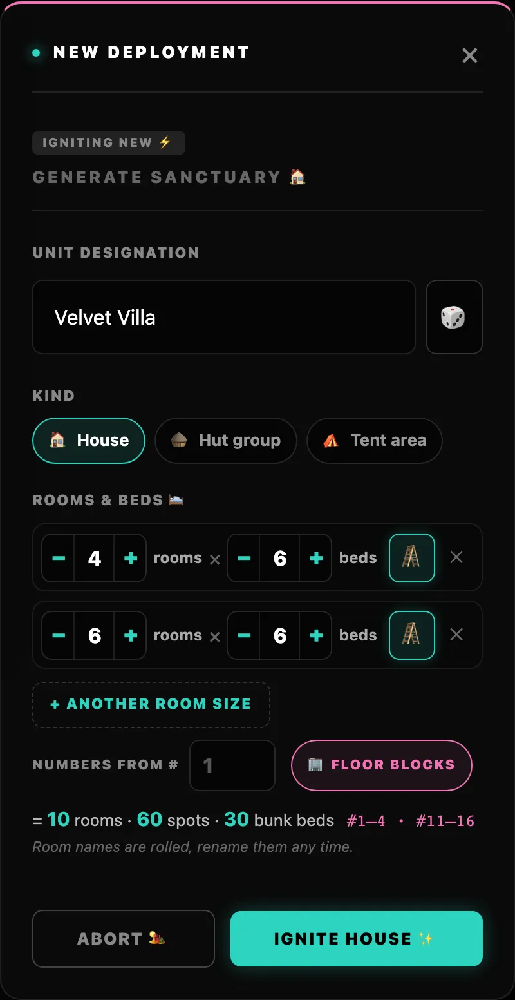
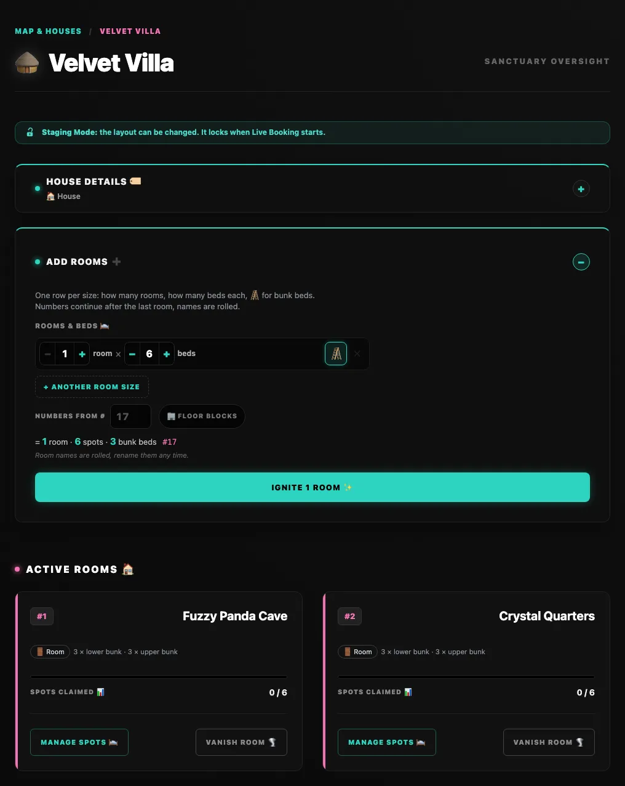
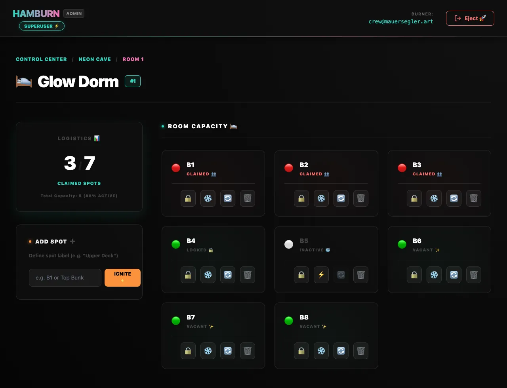

# Houses, rooms & spots

The camp is a simple tree: **houses** on the map contain **rooms**, and rooms contain **spots**, one per bed.

> [!IMPORTANT] Staging only
> All structural changes need Staging Mode. During Live Booking and after booking closed the server refuses them. Only locking/unlocking 🔒, marking spots ♿ special or normal, the **details** below and [bunk beds](#bunk-beds) 🪜 still work. The pages show it: a line on top says whether the layout can be changed, and every locked button or field is greyed out with a padlock and [says why](./index#locked-not-now) when you try it. See [Staging, Live Booking & Closed](../guide/phases).

## Renaming ✏️ {#renaming}

In Staging Mode every name can be changed after it was saved: **click it**. The house's name on its page, the room's name on its page and a spot's label on its card turn into a field with <kbd>✓</kbd> (save) and <kbd>✕</kbd> (cancel); <kbd>Enter</kbd> saves too, <kbd>Esc</kbd> cancels. A faint ✏️ after a name shows that it can be clicked.

| What | Click | Rules |
| --- | --- | --- |
| House | its name on the house page (or the house on the map, see [Move, rename, delete](#move-rename-delete)) | up to 100 characters, each name once in the camp — *Villa* and *villa* count as the same |
| Room | its name on the room page; the field has the **room number** next to it | up to 100 characters; the number is a whole number from 1 to 9999, once per house |
| Spot | its label on its card on the room page | up to 50 characters, each label once per room |

A name that breaks a rule is refused with the reason under the field, and nothing changes. While booking is live or closed the names are plain text: they belong to the layout, and the layout holds the guests' bookings then. A booked spot keeps its guest when it is renamed; the pass and the next messages show the new name. [Templates](./templates) find houses by name, rooms by number and spots by label, so export a fresh one after renaming.

## Houses

### Create a house

- **Map view:** click an empty place on the map. The *GENERATE SANCTUARY* sidebar opens.
- **List view:** click **Ignite New House**. CozyNights switches to the map view and opens the same sidebar. The house starts in the middle of the map; drag it into place afterwards.

The sidebar is a **house generator**: it builds the whole house in one go, rooms and spots included.

| Field | What it does |
| --- | --- |
| UNIT DESIGNATION | The house's name, already rolled for you: *Snoozy Sloth Lodge*, *Velvet Villa*. Keep it, roll again with <kbd>🎲</kbd> or type your own. Every house needs a name of its own. |
| KIND | 🏠 House · 🛖 Hut group · ⛺ Tent area, or none (tap the chosen chip again). It sets the words (*4 huts × 8 beds*), the kind of the new rooms and the pin's icon, and a rolled name follows it (*Marmot Village*). *Other* is in [House details](#house-details). |
| ROOMS & BEDS | One row per room size: **rooms** × **beds**, with <kbd>−</kbd> and <kbd>+</kbd>. The numbers can be typed too; <kbd>↑</kbd> / <kbd>↓</kbd> step by one, with <kbd>Shift</kbd> by five. <kbd>🪜</kbd> makes the rooms of that size bunk-bed rooms. <kbd>+ ANOTHER ROOM SIZE</kbd> adds a row, a copy of the one above (often the next floor); <kbd>✕</kbd> removes one. Without any row the house starts empty, and you add its rooms on its page later. |
| NUMBERS FROM # | The first room number. Empty: 1. |
| 🏢 FLOOR BLOCKS | Every size row starts its own block of numbers: 1–4, then 11–16, then 21–…; from three digits on, blocks of a hundred (101…, 201…). Off: 1, 2, 3 … straight through. |

A line under the rows counts what <kbd>IGNITE HOUSE ✨</kbd> will build, with the room numbers: *= 12 rooms · 76 spots · 20 bunk beds #1–4 · #11–16 · #21–22*. When something is out of range it says what instead, and IGNITE refuses: a house holds up to 50 rooms, a room up to 50 beds, and one go makes at most 500 spots.

- **Beds are sleeping places,** one spot each: a 6-bed room gets the spots **B1 … B6**. With <kbd>🪜</kbd> they are stacked in pairs right away, B1 + B2, B3 + B4, …, as [bunk beds](#bunk-beds); an odd last spot stays on its own. Without it the bed type stays open, as on any new spot, and [SPOT TYPES](#what-kind-of-bed-a-spot-is) sets it later.
- **Every room gets a rolled name,** in the style of the burner names: *Glitter Grotto*, *Snoozy Sloth Suite*; huts *Wobbly Wombat Hideout*, tents *Starry Yurt*. No name twice in a house. Change whatever you like afterwards: click a name ([Renaming](#renaming)), or roll a new one with <kbd>🎲</kbd> in the house's sidebar or in a room's [ROOM DETAILS](#room-details).
- **Every new spot is active right away.**

After IGNITE the new pin stays selected; <kbd>MANAGE ROOMS ⚙️</kbd> in its sidebar leads to the rooms. If the database refuses any part, the half-made house is removed again: nothing is left over. A camp holds up to 200 houses.

### Move, rename, delete

| Task | How |
| --- | --- |
| Move | Drag the pin in map view, or move a selected pin with the arrow keys (<kbd>Shift</kbd> for bigger steps). For an exact place, type the **MAP POSITION 📍** in the sidebar (X 0–1000, Y 0–700) and press <kbd>MOVE PIN</kbd>. Every move is saved right away. Houses keep a small distance from each other. |
| Rename | Click the house's name on its own page (see [Renaming](#renaming)). On *Map & houses*: click the house in map view, or <kbd>RENAME ✏️</kbd> on its card in list view, change the name and press <kbd>SYNC MODULE ✨</kbd>. The same rules apply everywhere. |
| Delete | <kbd>VANISH FROM PLAYA 🌪️</kbd> in the sidebar or <kbd>VANISH 🌪️</kbd> on the card, then confirm. |

> [!CAUTION] Deleting is final
> Deleting a house deletes all its rooms and spots too. Any test bookings on them are released first, and ticket codes stay valid. Not sure? [Export a template](./templates) before you delete.

### House details 🏷️ {#house-details}

**HOUSE DETAILS 🏷️** on the house page says what the place is like. Guests read it when they pick a spot, and the ♿ picker matches [special-needs requests](./special-needs) with it.

The forms on the house and room pages (**HOUSE DETAILS**, **ADD ROOMS**, **ADD SPOT**, **ROOM DETAILS**, **SPOT TYPES**) start folded, so the rooms and spots are right below them, on a phone too. A folded title shows what is set, e.g. *🛖 Hut group · ♿ 🔥 · description*, *3 rooms so far* or *4 × lower bunk · 4 × upper bunk*. Tap the title or <kbd>+</kbd> to open a form, <kbd>−</kbd> to fold it again.

| Field | What it is |
| --- | --- |
| KIND | 🏠 House · 🛖 Hut group · ⛺ Tent area · 📍 Other. A **hut group** keeps one pin on the map and its huts are its rooms: the pin gets the 🛖 icon and the guest page says *Choose a hut*. |
| FEATURES | ♿ Wheelchair accessible · ⬇️ Ground floor · 🚻 Toilets + showers inside · 🔥 Heated · ❄️ No heating · 🤫 Quiet zone. Everything inside the house inherits them: a heated quiet house makes its rooms heated and quiet, and their spots too — except that an [upper bunk](#bunk-beds) never inherits ♿, and a room can switch one of them off for itself (a superuser's call, see [Room details](#room-details)). 🔥 Heated and ❄️ No heating rule each other out: ticking one clears the other (a hint under the boxes says so), and the server refuses a house that claims both. |
| DESCRIPTION | Up to 500 characters of your own, shown to guests: *"Showers and toilets in the wash house, 50 m along the path."* |

Press <kbd>SAVE DETAILS 🏷️</kbd>. Details can be changed **in every phase** — they describe the place, they don't move a booking.

::: tip Say nothing rather than something wrong
An empty field means *not specified*, and the app never guesses. A spot the crew didn't describe never matches a guest's wish and never counts as fitting a ♿ request, so it is worth filling in the details before booking opens.
:::

## Rooms

Open a house with <kbd>MANAGE ROOMS ⚙️</kbd>, by clicking its card, or via <kbd>ADD ROOMS ➕</kbd> in the red alert panel.

### Add rooms

**ADD ROOMS ➕** on the house page has the size rows of the [house generator](#create-a-house): **rooms** × **beds**, <kbd>🪜</kbd> for bunk beds, <kbd>+ ANOTHER ROOM SIZE</kbd>, **NUMBERS FROM #**, **🏢 FLOOR BLOCKS** and the same live count. It starts with one room like the ones the house has most of, in a hut group of 8-bed bunk huts *1 hut × 8 beds* with 🪜 on. A house without rooms opens the form by itself.

- **Numbers** continue after the house's highest room number; with floor blocks at the next block (21 after 1–4 and 11–16). A number typed into NUMBERS FROM # is where they start; numbers the house uses already are skipped. Rooms are sorted by their number.
- **Names** are rolled, never one the house has already. The toast after IGNITE names the new rooms.
- **Spots** are **B1 … Bn**, stacked in pairs with 🪜.

A house holds up to 50 rooms, a room up to 50 spots. In a hut group the form says *ADD HUTS* and <kbd>IGNITE 2 HUTS ✨</kbd>: the house's kind decides the wording. The rooms are created all together or not at all.

> [!NOTE] New spots are active
> Every new spot, whether it comes with a house, with a room or on its own, is **active**: guests can book it as soon as booking opens. Lock 🔒 or deactivate ❄️ the spots that shouldn't be booked, see [Spot actions](#spot-actions).

### Room details 🏷️ {#room-details}

**ROOM DETAILS 🏷️** on the room page works like the house panel, with the room's own list:

| Field | What it is |
| --- | --- |
| NAME | Only in Staging Mode: the name belongs to the layout. The field is gone while booking is live or closed. Clicking the room's name at the top of the page does the same, with the room number next to it (see [Renaming](#renaming)). <kbd>🎲</kbd> next to the field rolls a new name like the generator's (fitting the KIND); <kbd>SAVE DETAILS</kbd> keeps it. |
| KIND | Room · Hut · Tent · Other. A room added to a hut group starts as a **hut** (and in a tent area as a tent), so you rarely have to set it. |
| FEATURES | ♿ Wheelchair accessible · ⬇️ Ground floor · 🛁 Own bathroom · 🔥 Heated · ❄️ No heating · 🤫 Quiet zone. They come **on top of** the house's: a heated room in an unheated hut group counts as heated. 🔥 Heated and ❄️ No heating rule each other out here too, and an [upper bunk](#bunk-beds) never inherits ♿ from its room either. |
| FROM THE HOUSE | The block **From the house** shows, as greyed chips, what the room inherits from its house right now, e.g. *🔥 Heated · 🤫 Quiet zone* — every admin sees it. **Superusers** also get an **off here** box on each chip and <kbd>RESET TO HOUSE</kbd>. Tick *off here* on 🔥 Heated and this room stays cold in a heated house: the chip is gone for the room and its spots, on the guest pages, in the wish chips and in the ♿ picker, while the house and its other rooms keep it. <kbd>RESET TO HOUSE</kbd> clears every *off here* box, so the room inherits everything again. A feature can't be switched off and ticked under FEATURES at the same time: ticking one box clears the other, and the server refuses a room that claims both, also on the records API. Only superusers switch off and reset; an admin's save never changes what is switched off. |
| DESCRIPTION | Up to 500 characters, shown to guests. |

### Room cards

Each card under **ACTIVE ROOMS 🚪** (or *huts*, *tents*, depending on the house's kind) shows the room number, name, its kind and features, what kind of beds it holds and **SPOTS CLAIMED 📊** (taken / active). Click a card or <kbd>MANAGE SPOTS 🛌</kbd> to manage its spots. Below the cards, **🛏️ Who is here** lists the house's bookings room by room: the guest, when they booked, the check-in (see [Bookings & check-ins](./bookings)). <kbd>VANISH ROOM 🌪️</kbd> deletes the room **with all its spots and any bookings on them**; the guests get a *spot was released* message, and their ticket codes stay valid.

## Spots

Open a room by clicking its card on the house page.

**LOGISTICS 📊** counts taken versus active spots. **ADD SPOT ➕** adds a single spot: give it a label such as *B1* or *Top Bunk* (each label only once per room) and press <kbd>IGNITE ⚡️</kbd>.

### What kind of bed a spot is

**SPOT TYPES 🛏️** in the room's sidebar sets every spot of the room at once, in label order:

| Choice | Result |
| --- | --- |
| Bunk beds: B1 + B2 stacked, B3 + B4, … | B1 is the lower bunk, B2 the upper one above it, and the two are stacked as one [bunk bed](#bunk-beds); then B3 + B4, and so on — a room of four bunk beds in one click. With an odd number of spots the last one stays on its own, with no bed type. |
| All single beds | Every spot a single bed. Bunk beds are taken apart. |
| Not specified | Clears the bed type again. Bunk beds are taken apart. |

<kbd>🏷️ DETAILS</kbd> on a spot card opens its own editor: the **BED** (single bed, lower or upper bunk, one half of a double bed, sofa, mattress, camp bed), in Staging Mode its **LABEL** (clicking the label on the card does the same, see [Renaming](#renaming)), and the block **From the room and house**: greyed chips of what the spot inherits, i.e. the house's features minus what the room switched off, plus the room's own. A spot has no features of its own — everything it has comes from its room and house. Superusers get the same **off here** boxes and a <kbd>RESET</kbd> button as on a [room](#room-details) and may switch off anything that comes from the house or the room — say 🤫 Quiet zone on the bed by the door. Admins see the chips, superusers switch off and reset. On an **upper bunk** the room's ♿ Wheelchair accessible chip is struck through and says *never on an upper bunk*, with no *off here* box: the ladder rules it out, whatever the room says. The chip follows the **BED** field as you change it, before you save. Guests see the bed under the spot's label, and the ♿ picker uses it: *a lower bunk or a bed without a ladder* fits every bed but an upper bunk, and an upper bunk is never ♿ wheelchair accessible, whatever its room says (see [Bunk beds](#bunk-beds)). A spot that is part of a [bunk bed](#bunk-beds) gets its bed from the stacking: the **BED** field is greyed out there and says so.

### Bunk beds 🪜 {#bunk-beds}

Two spots of a room can be **stacked** into one bunk bed: a lower bunk and an upper bunk. Both stay spots of their own — each keeps its label, its state and its 🔒 and ♿ marks, and guests book each on its own — they only get a level, and the room page shows the pair as one tile.

**Stack two spots:** press <kbd>🪜 STACK</kbd> on the spot that becomes the **lower** bunk. Its card lights up and asks *Pick the spot that goes on top ▲*; every other spot on its own now offers <kbd>▲ PUT ON TOP</kbd>. Press that on the spot that becomes the **upper** bunk: the card lifts off, the two slide together into one tile, and the ladder between them draws itself. <kbd>CANCEL ✕</kbd>, <kbd>Esc</kbd> or <kbd>🪜 STACK</kbd> again leaves stacking without changing anything. <kbd>🪜 STACK</kbd> is greyed out while fewer than two spots of the room stand alone.

**The tile** shows the upper bunk on top and the lower bunk below inside one turquoise outline, with the ladder, <kbd>⇅ SWAP</kbd> and <kbd>UNSTACK ⤴</kbd> on the strip between them. Each half carries a neutral chip, **▲ UPPER** or **▼ LOWER**, next to its state, and the same buttons as a spot on its own.

| Button | What happens |
| --- | --- |
| <kbd>⇅ SWAP</kbd> | The two levels change places: the upper bunk goes down, the lower one up. Bookings stay on their spots. |
| <kbd>UNSTACK ⤴</kbd> | The bunk bed is taken apart: both spots stand alone again, with no bed type (a *lower bunk* without an upper one would tell the ♿ picker the wrong thing). |
| <kbd>🗑 DELETE</kbd> on one half | Deletes that spot only, in Staging Mode like any other. The other half stays, as a spot on its own with no bed type — the dialog says so: *Its bunk partner "B2" becomes a single spot again.* |

- **A whole room at once:** **SPOT TYPES 🛏️** → *Bunk beds: B1 + B2 stacked, B3 + B4, …* stacks the spots in pairs, in label order (B1 + B2, B3 + B4, …). *All single beds* and *Not specified* take every bunk bed apart again.
- **In every phase.** Stacking, swapping and unstacking work in Staging Mode, during Live Booking and after booking closed, like 🔒 and ♿: they describe the beds and move no booking. A booked spot keeps its guest and simply gets a level.
- **The level is the bed.** A stacked spot's bed type is *Lower bunk* or *Upper bunk*, set by the stacking. In <kbd>🏷️ DETAILS</kbd> the **BED** field is greyed out and reads *Set by the bunk bed: lower bunk, below B2. Unstack it to change.* The label and what the spot switches off can still be changed there.
- **What guests see:** one tile, like yours: the upper bunk's card on top, a short dashed rail with a small turquoise ladder between, the lower bunk's card below. Each half wears its own [state colour](./index#the-state-colours) and has its own booking button, with a coloured chip *Upper bunk* (turquoise) / *Lower bunk* (blue) next to the label and *above B1* / *below B2* under it (see [Booking a bed](../guide/booking#step-by-step)). Their booking pass says *Upper bunk · above B1*.
- **The ♿ picker and the wishes read the levels.** *A lower bunk or a bed without a ladder* fits the lower bunk and marks the upper one as a clear mismatch, and the roulette wish <kbd>🛏️ No ladder</kbd> keeps only the lower one — so a stacked pair needs nothing else filled in (see [Special-needs requests](./special-needs#_1-mark-special-needs-spots)).
- **An upper bunk is never wheelchair accessible — and never step-free.** Whatever its room or house says, an upper bunk loses *♿ Wheelchair accessible* wherever a spot's features are summed up: messages and passes never say ♿ for it, and in a ♿ room its guest card reads *no ♿ Wheelchair accessible*. The ladder is a step, too: the ♿ picker marks an upper bunk `✗` for *step-free access or the ground floor* and the map wish <kbd>⬇️ Step-free</kbd> never offers it, even on the ground floor (⬇️ Ground floor stays true for the spot — it describes the room). In <kbd>🏷️ DETAILS</kbd> the room's ♿ chip is struck through: *never on an upper bunk*. The ♿ *mark* of a special-needs spot is something else and stays.
- **Templates keep the pairing** as `bunk_partner`, the label of the other spot, on both spots (see [Layout templates](./templates#file-format)).

### Spot states

The status of a spot is written in [its state colour](./index#the-state-colours) on both sides, the admin card and the guest's card: green free, red claimed, violet held by the crew, grey inactive or not bookable right now, turquoise the guest's own spot; pink marks ♿ special needs and nothing else. The guest's card also wears the colour as its left edge; on the admin card a claimed spot is dark red and an inactive one dashed.

| Admin card | Guests see |
| --- | --- |
| 🟢 **VACANT ✨** | 🟢 *Available*: they can book it. |
| 🔴 **CLAIMED 👥** | 🔴 *Occupied* with the guest's burner name — 🩵 *Yours* for the guest who holds it. |
| 🟣 **BLOCKED 🛠** | 🟣 *Blocked by admin* · *Not available*: marked 🔄 TAKEN without a ticket. It counts as taken. |
| 🟣 **LOCKED 🔒** | 🟣 *Blocked by admin* · *Not available*. It still counts as a spot, but never as a free one. The label hides whether it is also claimed or inactive; the dot still shows it. |
| 🩷 **SPECIAL NEEDS ♿** | Like a locked spot: 🟣 *Blocked by admin* while it's free, never counted as free. The crew books it for approved [special-needs requests](./special-needs). Once booked, guests see the burner name, not the mark. |
| ⚪️ **INACTIVE 🧊** | 🟣 *Blocked by admin* in its room. It isn't counted in any occupancy numbers (map, Control Center, house pages), the roulette never picks it, and nobody can book it. |

Whatever the crew holds back — 🔄 TAKEN without a ticket, 🔒 locked, ♿ kept for requests, 🧊 inactive — reads the same to guests: *Blocked by admin*.

### Spot actions

| Button | Action | Live Booking or Closed |
| :---: | --- | :---: |
| 🔒 LOCK / 🔓 UNLOCK | Block guests / let them book again | ✓ allowed |
| ♿ SPECIAL / NORMAL | Keep the spot for [special-needs requests](./special-needs), or give it back to all guests | ✓ allowed |
| ❄️ DEACTIVATE / ⚡️ ACTIVATE | Take the spot out of use / back in | ✗ |
| 🔄 TAKEN / FREE | Mark the spot as taken without a ticket (BLOCKED 🛠, *Blocked by admin* for guests), or free it | ✗ |
| 🏷️ DETAILS | Bed type of this spot, inherited features switched off (superusers), its label only in Staging Mode | ✓ allowed |
| 🪜 STACK · ⇅ SWAP · UNSTACK ⤴ | Stack two spots into a [bunk bed](#bunk-beds), swap its levels, take it apart | ✓ allowed |
| 🗑 DELETE | Delete the spot (its bunk partner, if any, stays as a spot on its own) | ✗ |

::: tip Lock or deactivate?
**Lock** a spot that exists but must not be booked by guests: a broken bed, or a bed kept for the crew. Guests see it as *Blocked by admin*. An admin who is signed in can still book a locked (or ♿) spot during Live Booking through the normal booking pages with a ticket code.

**Deactivate** a spot that isn't in use at all (yet). It no longer counts as a spot anywhere, and not even an admin can book it.
:::

::: details Marking a spot as taken without a ticket
🔄 TAKEN marks a free spot as taken without attaching a ticket, for example to hold a bed during testing. The admin card says **BLOCKED 🛠** (violet), the booking lists show *🛠 Blocked · Blocked by admin*, and guests see *Blocked by admin* · *Not available*, like a locked spot. **Clear all bookings** and a superuser's switch back to Staging free these spots too. For beds that should stay unavailable, locking is the better choice.

🔄 FREE on a spot that a guest booked cancels that booking: the dialog *Cancel this guest's booking?* asks first (<kbd>Free the spot</kbd> / <kbd>Keep booking</kbd>), the guest gets a *spot was released* message, and their ticket code stays valid.
:::
