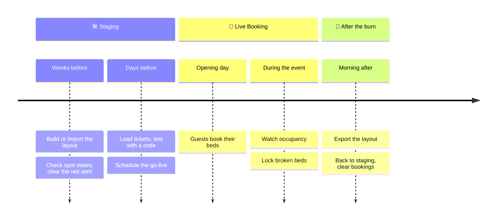

# Event checklist

From an empty map to the morning after: everything the crew does in CozyNights for one burn, in order. Tick the boxes as you go; your browser remembers them.



## Weeks before: build the camp

- [ ] **Admin access sorted.** Everyone on the crew has signed in once and been approved. See [Admin access & roles](./access).
- [ ] **Start from last year.** A superuser imports last year's template, or you build from scratch. See [Layout templates](./templates).
- [ ] **Houses on the map.** Every house is placed where it really is. See [Houses, rooms & spots](./camp-layout).
- [ ] **Rooms and spots complete.** Room names and numbers match the signs on the doors.
- [ ] **Spot states checked.** New spots are active right away. Deactivate ❄️ the ones that aren't in use; after a template import, look for ⚪️ INACTIVE spots that should be bookable.
- [ ] **Red alert gone.** No *NO ROOMS DETECTED* or *EMPTY MODULE* warnings in the Control Center.
- [ ] **Crew beds locked.** Beds that guests shouldn't book are locked 🔒.
- [ ] **Backup.** Export a template of the finished layout.

## Days before: get ready to open

- [ ] **Ticket codes created.** Test codes for a trial run with testers, the real roster for the event. An operator does this on the server, see [Ticket codes](#ticket-codes).
- [ ] **Test run.** Sign in with a real test ticket code in a private browser window. The map shows the countdown, rooms show the right spots.
- [ ] **Test bookings removed.** If you booked in staging, release those spots again.
- [ ] **Go-live scheduled.** Set the timer in the Control Center (Europe/Berlin time) and announce the same time to guests.

> [!TIP] Announce the ticket code, not a password
> Guests only need the link to CozyNights and their ticket code. Nobody needs to register.

## Opening day

- [ ] **Watch the switch.** At the scheduled time the header shows 🎪 LIVE BOOKING ACTIVE on the next reload.
- [ ] **Keep an eye on the Intel panel.** The LOAD chart and the house counters show how fast the camp fills up.
- [ ] **Be reachable.** Typical guest questions are answered in the [FAQ](../guide/faq).

## During the event

- [ ] **Broken bed?** Lock it 🔒 on its room page. That works during Live Booking.
- [ ] **Resist restructuring.** Adding rooms or moving houses means switching back to staging, which freezes all guests' bookings meanwhile. Do it only when really needed, and switch back quickly.

## After the burn

- [ ] **Export the final layout** as a template for next year.
- [ ] **Switch back to staging.** Confirm the dialog.
- [ ] **Clear all bookings** (superuser). Offered right after switching back. Spots become free, burner names are forgotten, ticket codes stay.
- [ ] **Cancel leftover timers**, so booking doesn't open again by accident.
- [ ] **Tidy up admin access.** Remove accounts of people who have left the crew.

## Ticket codes

A ticket code is a guest's whole login, and the list of valid codes lives in the database. CozyNights has no screen for that list. An operator creates the codes **on the server**, with the admin tool that ships with the app, the same one that [manages admin access](./access#managing-admins).

### Codes for a trial run

```bash
./scripts/cozy-admin.sh tickets generate 10 --prefix UT --name "Trial run"
```

This creates ten tickets with random codes like `UT-7F3K9Q` and prints them one per line, ready to paste into a spreadsheet or a message. The codes leave out look-alike characters (no `0` or `O`, no `1`, `I` or `L`). `--name` is a label that tells batches apart later.

### The real roster

```bash
./scripts/cozy-admin.sh tickets add HB-1001 HB-1002 --name "Early bird"  # a few known codes
xargs ./scripts/cozy-admin.sh tickets add < codes.txt                     # a whole list, one code per line
```

Codes may contain letters, digits, `-` and `_`, up to 64 characters. Stick to capitals and digits, because the sign-in field shows every code in capitals. Two codes that differ only in upper and lower case are refused. Codes that already exist are left alone, so the same list can be loaded again after late ticket sales.

### Check and tidy up

```bash
./scripts/cozy-admin.sh tickets list                        # every code: used to sign in? holds a bed?
./scripts/cozy-admin.sh tickets remove UT-7F3K9Q UT-X2M8PD  # delete codes again
```

`remove` refuses a ticket that holds a bed and names the bed. Free that spot first: in staging with 🔄 on its room page, or with **Clear all bookings**.

### Handing codes to testers

- **One code per person, sent privately.** Whoever knows a code can book and cancel with it, so don't post the list in a group chat.
- **Send the link to CozyNights along with the code.** Nothing else is needed, no account and no password.
- **Note who got which code.** Feedback like "my spot disappeared" is much easier to follow up with the code at hand.
- **Open the booking for the trial.** Testers can sign in at any time, but they can only book during 🎪 Live Booking.

### Reset between rounds

Switch **back to staging** in the Control Center, then let a superuser **clear all bookings**. All spots are free again, burner names are forgotten, and **the codes stay valid**, so the same testers can go again with the same codes. When the trials are over, `remove` the test codes before the real roster goes in.
