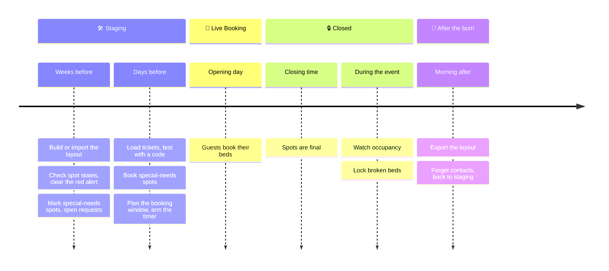

# Event checklist

From an empty map to the morning after: everything the crew does in CozyNights for one burn, in order. Tick the boxes as you go; your browser remembers them.



## Weeks before: build the camp

- [ ] **Admin access sorted.** Everyone on the crew has signed in once and been approved. See [Admin access & roles](./access).
- [ ] **Start from last year.** A superuser drops last year's template on *Compare & Import* and applies it, or you build from scratch. See [Layout templates](./templates).
- [ ] **Map current.** A redrawn site plan for this year goes in first: a developer swaps the map image (see [The map image](../develop/#the-map-image)). The pins keep their positions, so check them afterwards.
- [ ] **Houses on the map.** Every house is placed where it really is. See [Houses, rooms & spots](./camp-layout).
- [ ] **Rooms and spots complete.** Room names and numbers match the signs on the doors.
- [ ] **Spot states checked.** New spots are active right away. Deactivate ❄️ the ones that aren't in use; after a template import, look for ⚪️ INACTIVE spots that should be bookable.
- [ ] **Red alert gone.** The Control Center shows no **RED ALERT: THE CAMP LAYOUT IS INCOMPLETE** panel (no house without rooms, no room without spots). See [Red alert](./index#red-alert-sanity-checks).
- [ ] **Crew beds locked.** Beds that guests shouldn't book are locked 🔒.
- [ ] **Special-needs spots marked.** Spots that suit guests with special needs (lower bunks, step-free, quiet, near a toilet, with a socket) are marked ♿ on their room pages. See [Special-needs requests](./special-needs).
- [ ] **Special-needs requests opened** in the Control Center, once the tickets are loaded, and announced to guests together with the booking date.
- [ ] **Backup.** Export a template of the finished layout.

## Days before: get ready to open

- [ ] **Ticket codes created.** Test codes for a trial run with testers, the real roster for the event, **with the ticket holders' e-mail addresses** for the confirmations. A superuser loads the ticket shop's list on the [Tickets](./tickets) page; test codes come from the server, see [Ticket codes](#ticket-codes).
- [ ] **Notifications checked.** `./scripts/cozy-admin.sh notify test --email you@mauersegler.art` reaches the crew group and your inbox; one booking with a test code brings a confirmation. See [Notifications](./notifications).
- [ ] **Wallet passes checked** (if they are set up): book with a test code, open the pass and add it to a phone's wallet; move the spot in the admin area and watch the pass follow. See [Wallet passes](./passes#wallet-passes-apple-wallet-google-wallet).
- [ ] **Test run.** Sign in with a real test ticket code in a private browser window. The map shows the countdown (once the timer is armed), rooms show the right spots.
- [ ] **Test bookings removed.** Bookings from a trial round go when a superuser switches back to Staging (see [Reset between rounds](#reset-between-rounds)); spots marked 🔄 TAKEN in Staging afterwards are freed with 🔄 FREE on their room page or with <kbd>🧨 Clear all bookings</kbd>.
- [ ] **Legal pages complete.** The legal notice, the privacy policy and the booking rules show no red note. See [Legal pages](./legal).
- [ ] **Special-needs requests decided.** Every request at ♿ **Special needs** is approved with a spot or declined before booking opens. Close requests when you want no more, and switch unneeded ♿ spots back to normal.
- [ ] **Booking window planned.** In the Control Center's 🎟 BOOKING WINDOW panel, set when booking opens and when it closes (Europe/Berlin time), save, and arm the timer. Admins need at least one day ahead and one day open. Announce the same times to guests. See [The booking window](../guide/phases#the-booking-window).

> [!TIP] Announce the ticket code, not a password
> Guests only need the link to CozyNights and their ticket code. Nobody needs to register.

## Opening day

- [ ] **Watch the switch.** At the opening time the panel turns 🎪 LIVE BOOKING by itself, and guests see the countdown to the closing time at the top of every page. The crew group gets *Booking is LIVE now*.
- [ ] **Need more time?** Move the closing time in the panel (at least one day from now for admins; a superuser can do anything).
- [ ] **Keep an eye on the Intel panel.** In *Show Intel*, the chart on <kbd>24 h</kbd> shows how fast bookings come in, *Needs attention* lists requests waiting for a decision and messages that failed, and the house table sorted by *Most free spots* shows where room is left. See [Intel panel](./index#intel-panel-the-live-picture).
- [ ] **Be reachable.** Typical guest questions are answered in the [FAQ](../guide/faq).

## During the event

- [ ] **Check guests in at arrival** with their booking pass: 🎫 **Check-in** in the admin header (type the code, scan with the camera or a USB scanner: a known pass is checked in right away), or the phone camera on the guest's QR code and <kbd>✅ Check in</kbd>. A checked-in guest can't release their spot anymore; a mistake is undone with <kbd>↩️ Undo check-in</kbd>. *Show Intel* counts them per hour, and its house table sorted by *Most still to check in* shows where guests are still missing. See [Booking passes & check-in](./passes).

- [ ] **Broken bed?** Lock it 🔒 on its room page. That works in every phase.
- [ ] **Resist restructuring.** Houses, rooms and spots only change in 🛠 Staging, and a superuser's switch back to Staging **offers to release every guest booking** (the dialog says how many there are and how many guests are checked in; released spots lose their burner names and check-ins, it can't be undone, and those guests book again once booking is Live). Keeping them is the other button — then clear them later with 🧨 *Clear all bookings*. During the event only lock 🔒 spots, mark ♿ spots or book a spot for a special-needs request: those work in every phase. If restructuring is unavoidable, export a template first and expect to re-seat every guest by hand; they get a *spot released* e-mail — the dialog's *Don't notify the guests* box starts unticked while booking is still running, because those guests have to book again. See [After the burn](#after-the-burn).

## After the burn

In this order. Once booking has closed, the switch back to Staging releases the bookings **without telling the guests**: its dialog has a *Don't notify the guests* box, and after the closing time (or while booking is 🔒 Closed) it starts ticked, because a *your spot was released* message only confuses people the day after the burn. The crew alert goes out either way. Forgetting the contacts first is still the safer order: it is part of the wrap-up anyway (the [privacy policy](./legal) promises it), and without addresses nothing can go out even if the box gets unticked by mistake.

- [ ] **Export the final layout** as a template for next year.
- [ ] **Forget the guests' contacts.** `./scripts/cozy-admin.sh tickets forget-contacts --yes` deletes every guest e-mail address, Telegram link, special-needs request and wallet device registration; the ticket codes, the names from the ticket list and the bookings stay. Wallet passes in guests' phones expire by themselves the day after the event.
- [ ] **Switch back to staging** (superuser: ⚡ Switch right now → 🛠 Staging). Leave *Don't notify the guests* ticked and choose <kbd>Switch & release …</kbd>; the timer is paused and **every booking is released**, spots marked 🔄 TAKEN included (spots free, burner names forgotten, ticket codes stay), and every guest's browser is signed out. The confirmation says *guests not notified*. With the requests gone, the spots the crew booked for special-needs requests are ordinary bookings now and go too, so <kbd>🧨 Clear all bookings</kbd> next to the switch stays greyed out: nothing is left to clear.
- [ ] **Delete the ticket list** within the period the [privacy policy](./legal) promises (default: four weeks after the event). An operator removes the codes on the server, see [Check and tidy up](#check-and-tidy-up).
- [ ] **No timer left armed**, so booking doesn't open again by accident: the panel's summary shows NO TIMER or NOT ARMED.
- [ ] **Tidy up admin access.** Remove accounts of people who have left the crew.

## Ticket codes

A ticket code is a guest's whole login, and the list of valid codes lives in the database. The real roster comes from the ticket shop: a superuser loads its CSV export on the [Tickets](./tickets) page, reviews it and picks what to take over. Everything else (test codes, single codes, removing codes) an operator does **on the server**, with the admin tool that ships with the app, the same one that [manages admin access](./access#managing-admins).

### Codes for a trial run

```bash
./scripts/cozy-admin.sh tickets generate 10 --prefix UT --name "Trial run"
```

This creates ten tickets with random codes like `UT-7F3K9Q` and prints them one per line, ready to paste into a spreadsheet or a message. The codes leave out look-alike characters (no `0` or `O`, no `1`, `I` or `L`). Without `--prefix` they start with `TEST-`; a prefix has 1 to 20 capital letters, digits, `-` or `_` and starts with a letter or digit. `--name` is stored as the name of every generated ticket: the Tickets page shows it, and e-mails greet with it (*Hi Trial run,*). Without it, e-mails just say *Hi,*.

### The real roster

The ticket shop's export, with e-mail addresses for the booking confirmations. In the app: 🎟️ **Tickets** → *Load the ticket list*, see [Tickets & e-mail addresses](./tickets#load-the-ticket-list). On the server:

```bash
./scripts/cozy-admin.sh tickets import roster.csv --dry-run   # check first, change nothing
./scripts/cozy-admin.sh tickets import roster.csv
```

The file format and what an import changes: [Notifications](./notifications#ticket-codes-with-e-mail-addresses). The server import refuses a changed address on a ticket that still carries its holder (pass, Telegram, request, burner name, check-in) — hand those over on the [Tickets](./tickets) page, or repeat the import with `--hand-over` to treat every changed address in the file as a new holder. Delete the CSV from the server afterwards.

**Only Indoor memberships.** Load the codes of Indoor memberships only: they include a bed, Camper memberships don't.

**With e-mail addresses.** Confirmations, and messages when the crew has to move somebody, go to the address stored with each ticket. The ticket shop's export brings it along; for a single ticket, add it with `--email`:

```bash
./scripts/cozy-admin.sh tickets add HB-1003 --email linus@example.com --name "Linus"  # one code with its address
```

Codes without addresses work as well, they just get no e-mails:

```bash
./scripts/cozy-admin.sh tickets add HB-1001 HB-1002          # a few known codes
xargs ./scripts/cozy-admin.sh tickets add < codes.txt        # a whole list, one code per line
```

`tickets list` shows the address next to each code. Guests never see it; the privacy policy names it, and it goes after the event (see [After the burn](#after-the-burn)).

Codes may contain letters, digits, `-` and `_`, up to 64 characters. Stick to capitals and digits, because the sign-in field shows every code in capitals. Two codes that differ only in upper and lower case are refused. Codes that already exist are left alone, so the same list can be loaded again after late ticket sales.

### Check and tidy up

```bash
./scripts/cozy-admin.sh tickets list                        # every code: used to sign in? holds a bed?
./scripts/cozy-admin.sh tickets remove UT-7F3K9Q UT-X2M8PD  # delete codes again
```

`remove` refuses a ticket that holds a bed and names the bed. Free that spot first: a superuser's switch back to Staging releases every guest booking, and 🔄 FREE on a room page frees a single spot.

### Handing codes to testers

- **One code per person, sent privately.** Whoever knows a code can book and cancel with it, so don't post the list in a group chat.
- **Send the link to CozyNights along with the code.** Nothing else is needed, no account and no password.
- **Note who got which code.** Feedback like "my spot disappeared" is much easier to follow up with the code at hand.
- **Open the booking for the trial.** Testers can sign in at any time, but they can only book during 🎪 Live Booking.

### Reset between rounds

A superuser switches **back to staging** in the Control Center: every booking of the round is released, spots marked 🔄 TAKEN included (only spots the crew booked for special-needs requests stay), burner names are forgotten, and **the codes stay valid**, so the same testers can go again with the same codes. The testers get a *spot released* message, unless the superuser ticks *Don't notify the guests* in the dialog (it starts unticked while booking hasn't closed yet). When the trials are over, `remove` the test codes before the real roster goes in.

Releasing the bookings also **signs every guest out** of their browser: the next page they open asks for their ticket code again (*A new booking round has started*). That way nobody walks into the new round still signed in on a test ticket, and a code you removed stops working on that device at once. <kbd>🧨 Clear all bookings</kbd> does the same.
