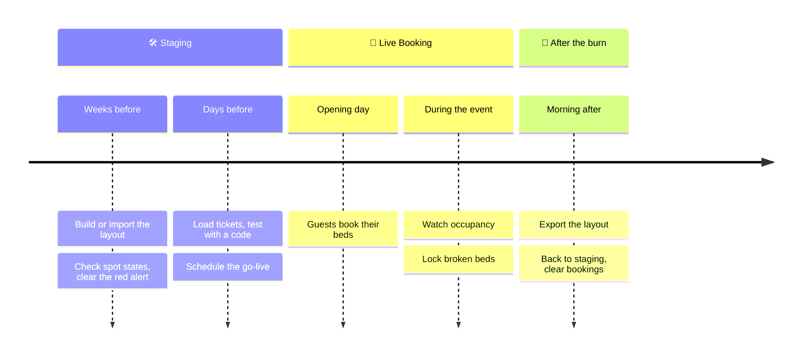

# Event checklist

From an empty map to the morning after: everything the crew does in CozyNights for one burn, in order. Tick the boxes as you go; your browser remembers them.

## Weeks before: build the camp

- [ ] **Admin access sorted.** Everyone on the crew has signed in once and been approved. See [Admin access & roles](./access).
- [ ] **Start from last year.** A superuser imports last year's template, or you build from scratch. See [Layout templates](./templates).
- [ ] **Houses on the map.** Every house is placed where it really is. See [Houses, rooms & spots](./camp-layout).
- [ ] **Rooms and spots complete.** Room names and numbers match the signs on the doors.
- [ ] **Spot states checked.** New spots are active right away. Deactivate ❄️ the ones that aren't in use; after a template import, look for ⚪️ INACTIVE spots that should be bookable.
- [ ] **Red alert gone.** No *NO ROOMS DETECTED* or *EMPTY MODULE* warnings in the Control Center.
- [ ] **Crew beds locked.** Beds that guests shouldn't book are locked 🔒.
- [ ] **Backup.** Export a template of the finished layout.

## Days before: get ready to open

- [ ] **Tickets loaded.** The ticket list is in the database.
- [ ] **Test run.** Sign in with a real test ticket code in a private browser window. The map shows the countdown, rooms show the right spots.
- [ ] **Test bookings removed.** If you booked in staging, release those spots again.
- [ ] **Go-live scheduled.** Set the timer in the Control Center (Europe/Berlin time) and announce the same time to guests.

> [!TIP] Announce the ticket code, not a password
> Guests only need the link to CozyNights and their ticket code. Nobody needs to register.

## Opening day

- [ ] **Watch the switch.** At the scheduled time the header shows 🎪 LIVE BOOKING ACTIVE on the next reload.
- [ ] **Keep an eye on the Intel panel.** The LOAD chart and the house counters show how fast the camp fills up.
- [ ] **Be reachable.** Typical guest questions are answered in the [FAQ](../guide/faq).

## During the event

- [ ] **Broken bed?** Lock it 🔒 on its room page. That works during Live Booking.
- [ ] **Resist restructuring.** Adding rooms or moving houses means switching back to staging, which freezes all guests' bookings meanwhile. Do it only when really needed, and switch back quickly.

## After the burn

- [ ] **Export the final layout** as a template for next year.
- [ ] **Switch back to staging.** Confirm the dialog.
- [ ] **Clear all bookings** (superuser). Offered right after switching back. Spots become free, burner names are forgotten, ticket codes stay.
- [ ] **Cancel leftover timers**, so booking doesn't open again by accident.
- [ ] **Tidy up admin access.** Remove accounts of people who have left the crew.
