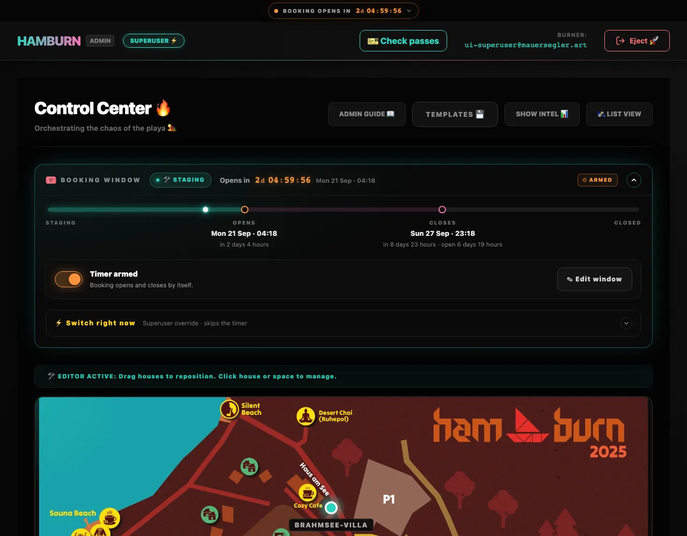
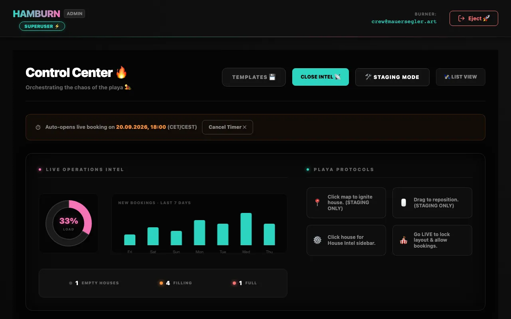
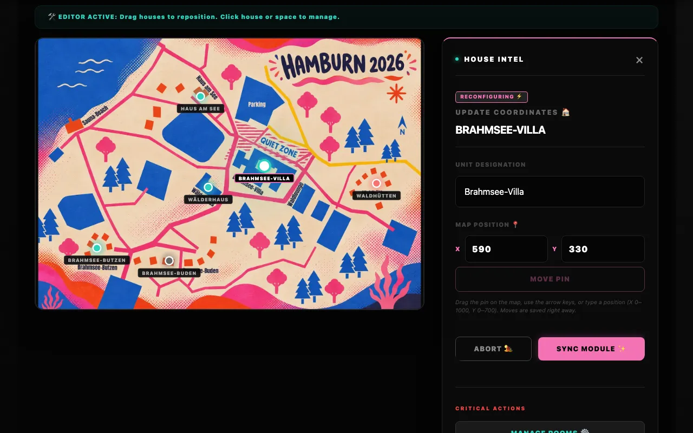
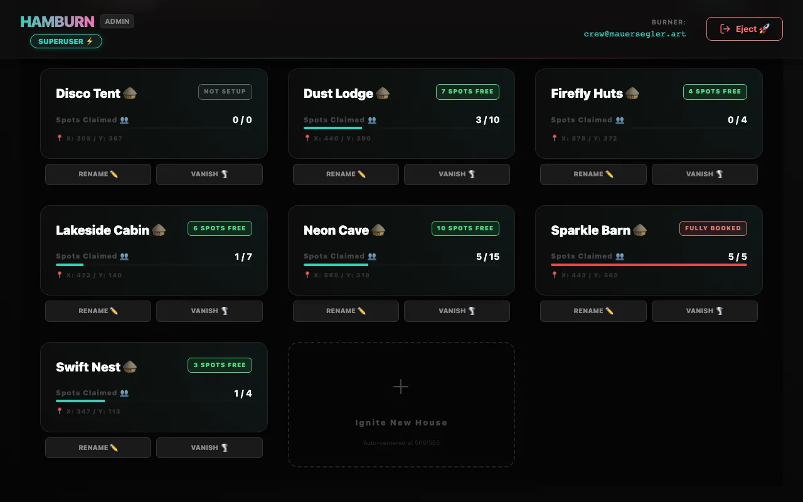
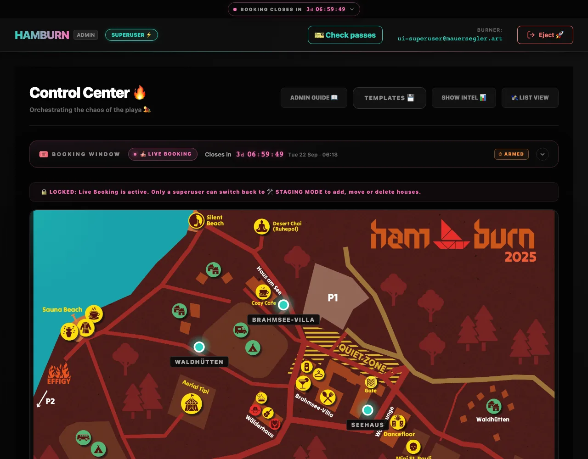

# The Control Center

After signing in you land in the **Control Center** at `/admin`: one page to build the camp, open booking and keep an eye on occupancy. Don't have access yet? Start with [Admin access & roles](./access).

## Header

| Control | What it does |
| --- | --- |
| <kbd>ADMIN GUIDE 📖</kbd> | Opens this documentation in a new tab, admin pages included. |
| <kbd>TEMPLATES 💾</kbd> | Opens the **Burn Template Manager** to export the camp layout, or compare a layout file with the camp and take over what you pick. See [Layout templates](./templates). |
| <kbd>SHOW INTEL 📊</kbd> | Shows or hides the statistics panel. |
| <kbd>🛰️ LIST VIEW</kbd> / <kbd>🗺️ MAP VIEW</kbd> | Switches between the map editor and house cards. |

The top bar on every admin page shows <kbd>🎟️ Tickets</kbd> (find a ticket, change its e-mail address, load the ticket list; see [Tickets & e-mail addresses](./tickets)), <kbd>♿ Special needs</kbd> with the number of requests waiting for a decision (see [Special-needs requests](./special-needs)), <kbd>🎫 Check-in</kbd> (check guests in with their booking pass; see [Booking passes & check-in](./passes)), <kbd>✉️ Messages</kbd> (every text guests get, see [Message texts](./notifications#message-texts)), the account you're signed in with (not on phones), a **SUPERUSER ⚡️** badge if you are one, and <kbd>Eject 🚀</kbd> to sign out. While a countdown runs, a slim bar above it shows when booking opens or closes, the same one guests see.

## Booking window

Right under the header, the **🎟 BOOKING WINDOW** panel holds everything about the phase: the current phase (🛠 Staging, 🎪 Live Booking or 🔒 Closed), the opening and closing time, the timer switch and, for superusers, the switch for *right now*. Its summary line counts down to the next switch; click it to unfold the timeline and the controls.

| You want to … | Do this | Who |
| --- | --- | --- |
| Plan when booking opens and closes | <kbd>＋ Plan window</kbd> / <kbd>✎ Edit window</kbd>, then <kbd>Save window ✨</kbd> | admins: at least one day ahead and one day open |
| Let it run by itself | Flip the switch to **Timer armed** | admins |
| Hold it | Flip the switch back (paused, the times stay) | admins |
| Open, close or go back to Staging now | <kbd>⚡ Switch right now</kbd> | superusers only |
| Release every guest booking | The switch back to Staging asks: <kbd>Switch & release …</kbd> (every guest with an address or Telegram gets a *spot was released* message) or <kbd>Switch & keep the bookings</kbd>; <kbd>🧨 Clear all bookings</kbd> (same place, Staging only, greyed out while no guest booking is left) does it later | superusers only |

Times are Europe/Berlin (CET/CEST). The rules and what each switch does to the timer are in [The booking window](../guide/phases#the-booking-window).

Below it, the row **♿ Special-needs requests: OPEN** (or **CLOSED**, with *· n waiting for a decision* while requests wait) opens or closes requests for guests with <kbd>Open requests</kbd> / <kbd>Close requests</kbd>, independent of the phase. <kbd>Review requests →</kbd> leads to the requests. See [Special-needs requests](./special-needs#_2-open-requests).

## Intel panel

| Widget | Shows |
| --- | --- |
| **LOAD** | Doughnut chart: share of all spots that are taken. |
| **New Bookings · Last 7 Days** | Spots booked per day over the last week, by the day the spot got its ticket (event time). A released spot drops out; a moved booking counts on the day of the move. |
| **EMPTY HOUSES · FILLING · FULL** | How many houses have no bookings yet, some bookings, or no free spot left. |
| **PLAYA PROTOCOLS** | Quick reminders of the editor gestures below. |

## Red alert: sanity checks

When the layout has gaps, a red **RED ALERT: THE CAMP LAYOUT IS INCOMPLETE** panel (with the number of issues) lists them, each with a shortcut to fix it:

| Warning | Fix button | Where it takes you |
| --- | --- | --- |
| **This house has no rooms yet.** | <kbd>ADD ROOMS ➕</kbd> | The house page, to add rooms |
| **This room has no spots yet.** | <kbd>ADD SPOTS 🛌</kbd> | The room page, to add spots |

> [!TIP]
> During Live Booking and after booking closed, houses without any active spot don't appear on the guest map. Clear the red alert before booking opens.

## Map view: the editor

In Staging Mode the map is a live editor. A status bar reads *🛠 EDITOR ACTIVE*; during Live Booking and after booking closed it switches to *🔒 LOCKED* and the map becomes read-only.

Pins are teal while a house has free spots, red when none is left, and grey while it has no active spots at all.

| Gesture | Result |
| --- | --- |
| **Click an empty place** | Sidebar *GENERATE SANCTUARY*: name the new house and set its initial number of beds, then <kbd>IGNITE HOUSE ✨</kbd>. |
| **Drag a house** | Moves it. The new position is saved when you let go. |
| **Arrow keys** on a selected pin | Move it one unit per press (with <kbd>Shift</kbd>: ten), saved when you let go of the key. |
| **Click a house** | Sidebar *HOUSE INTEL*: rename it (<kbd>SYNC MODULE ✨</kbd>), type an exact **MAP POSITION 📍** (X 0–1000, Y 0–700) and press <kbd>MOVE PIN</kbd>, <kbd>MANAGE ROOMS ⚙️</kbd>, or <kbd>VANISH FROM PLAYA 🌪️</kbd> to delete it. Moves are saved right away. |

## List view: house cards

Every house as a card with its occupancy badge (*n spots free*, *Fully booked* or *Not setup*), **Spots Claimed** with a progress bar, and its map coordinates. Locked 🔒 and special-needs ♿ spots never count as free, and deactivated spots don't count at all.

- Click a card to manage its rooms.
- <kbd>VANISH 🌪️</kbd> deletes the house after a confirmation.
- <kbd>RENAME ✏️</kbd> and the **Ignite New House** card switch to the map view and open the editor sidebar there. A new house starts in the middle of the map (or at the nearest free place, if a pin is already there), ready to be dragged into place.

## During Live Booking and after it closed

The Control Center stays fully usable for watching: statistics, occupancy, template export. Structural buttons are greyed out and refused by the server. What you can still change: on the [room page](./camp-layout#spots), lock or unlock single spots and mark spots ♿ special or normal; on ♿ **Special needs**, decide requests and book spots for them.

## Next

- [Houses, rooms & spots](./camp-layout): building the camp in detail
- [Tickets & e-mail addresses](./tickets): find a ticket, fix its address, hand it over, load the ticket list
- [Special-needs requests](./special-needs): mark ♿ spots, decide requests, book spots for guests
- [Layout templates](./templates): export, compare and import
- [Notifications](./notifications): booking e-mails, Telegram for guests and the crew group, [message texts](./notifications#message-texts)
- [Booking passes & check-in](./passes): checking guests in with the QR code, the spot states, undoing a check-in
- [Event checklist](./event-checklist): from the first layout to after the burn
- [Legal pages](./legal): legal notice, privacy policy and booking rules
