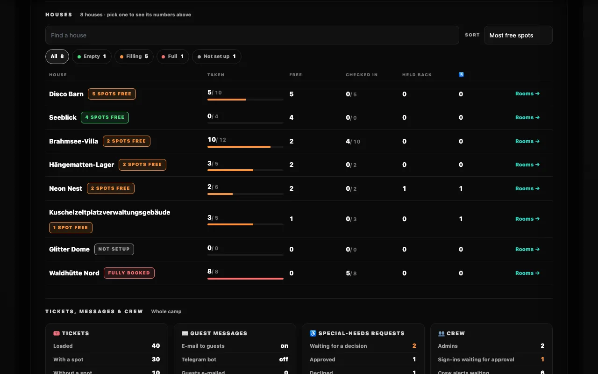

# The Control Center

After signing in you land in the **Control Center** at `/admin`: the booking window, what needs the crew, the latest bookings and check-ins, and the live numbers of the whole camp. The camp itself is built on its own page, [Map & houses](#map-houses-the-camp-editor). Don't have access yet? Start with [Admin access & roles](./access).

## The admin menu

Every admin page has the same menu. On a wide screen (from about 1100 px) it is a **sidebar** on the left; <kbd>« Shrink menu</kbd> at its foot shrinks it to its icons (pointing at an icon names it) and <kbd>»</kbd> brings the names back — the browser remembers your choice. On phones and tablets a slim bar sits on top instead: <kbd>☰</kbd> slides the same menu in, <kbd>✕</kbd>, <kbd>Esc</kbd> or a tap next to it closes it again, and so does following a link.

| Group | Entry | Opens |
| --- | --- | --- |
| **Overview** | <kbd>📊 Control Center</kbd> | This page. |
| **Camp** | <kbd>🗺️ Map & houses</kbd> | The [camp editor](#map-houses-the-camp-editor): the map and the list of houses; the house and room pages belong to it. |
| | <kbd>💾 Templates</kbd> | The **Burn Template Manager**: export the layout, compare a file with the camp, apply it. See [Layout templates](./templates). |
| **Guests** | <kbd>🛏️ Bookings</kbd> | [Who booked which spot](./bookings), who is checked in, who is still to arrive. |
| | <kbd>🎟️ Tickets</kbd> | Find a ticket, change its e-mail address, load the ticket list. See [Tickets & e-mail addresses](./tickets). |
| | <kbd>♿ Special needs</kbd> | The requests. See [Special-needs requests](./special-needs). |
| | <kbd>🎫 Check-in desk</kbd> | Check guests in with their booking pass. See [Booking passes & check-in](./passes). |
| **Crew** | <kbd>✉️ Messages</kbd> | Every text guests get. See [Message texts](./notifications#message-texts). |
| | <kbd>📖 Admin guide ↗</kbd> | This documentation, in a new tab, admin pages included. |

Numbers next to an entry say what waits: at <kbd>♿ Special needs</kbd> the requests waiting for a decision (pink), at <kbd>🛏️ Bookings</kbd> how many spots are booked (grey) — and after booking closed, how many booked guests are still to arrive (pink). Below the entries: the account you're signed in with, a **SUPERUSER ⚡️** badge if you are one, and <kbd>🚀 Eject</kbd> to sign out (on phones: <kbd>Eject 🚀</kbd> in the top bar). While a countdown runs, a slim bar above everything shows when booking opens or closes, the same one guests see.

## What's on this page

From top to bottom: the [🎟 BOOKING WINDOW](#booking-window) with the ♿ requests switch below it, [NEEDS ATTENTION](#needs-attention) — with a red line when the camp layout is incomplete, see [Red alert](#red-alert-sanity-checks) —, [BOOKINGS & CHECK-INS](#bookings-check-ins), and the [Intel panel](#intel-panel-the-live-picture).

## Booking window

Right under the header, the **🎟 BOOKING WINDOW** panel holds everything about the phase: the current phase (🛠 Staging, 🎪 Live Booking or 🔒 Closed), the opening and closing time, the timer switch and, for superusers, the switch for *right now*. Its summary line counts down to the next switch; click it to unfold the timeline and the controls.

| You want to … | Do this | Who |
| --- | --- | --- |
| Plan when booking opens and closes | <kbd>＋ Plan window</kbd> / <kbd>✎ Edit window</kbd>, then <kbd>Save window ✨</kbd> | admins: at least one day ahead and one day open |
| Let it run by itself | Flip the switch to **Timer armed** | admins |
| Hold it | Flip the switch back (paused, the times stay) | admins |
| Open, close or go back to Staging now | <kbd>⚡ Switch right now</kbd> | superusers only |
| Release every guest booking | The switch back to Staging asks: <kbd>Switch & release …</kbd> (every guest with an address or Telegram gets a *spot was released* message, unless *Don't notify the guests* is ticked — it is, once booking has closed) or <kbd>Switch & keep the bookings</kbd>; <kbd>🧨 Clear all bookings</kbd> (same place, Staging only, greyed out while no guest booking is left) does it later | superusers only |

Times are Europe/Berlin (CET/CEST). The rules and what each switch does to the timer are in [The booking window](../guide/phases#the-booking-window).

Below it, the row **♿ Special-needs requests: OPEN** (or **CLOSED**, with *· n waiting for a decision* while requests wait) opens or closes requests for guests with <kbd>Open requests</kbd> / <kbd>Close requests</kbd>, independent of the phase. <kbd>Review requests →</kbd> leads to the requests. See [Special-needs requests](./special-needs#_2-open-requests).

## Bookings & check-ins

Four counts — **booked**, **checked in**, **still to arrive**, **held by the crew** (taken without a ticket, or ♿ assigned to a request) — and below them the five **latest bookings** with guest, spot and how long ago. After booking closed the five **latest check-ins** take their place. Each count opens the [bookings list](./bookings) with that filter; <kbd>All bookings →</kbd> opens it unfiltered. Names show the way the check-in desk shows them: the holder, the burner name, masked e-mail and ticket code. The card updates itself like the Intel panel.

## Intel panel: the live picture

The operations view of the whole camp, always open at the bottom of the
Control Center. Like everything under `/admin` it is only there for approved
admins: a Google sign-in that still waits for approval sees nothing of it, and
neither does anybody without a session. Only numbers leave the server for it —
no guest names, no e-mail addresses, no request texts. Who booked what is on the
[bookings list](./bookings), fetched only when those numbers change.

The panel updates itself. You don't need to reload the page to watch booking
come in: the numbers, the house cards and the map pins follow along every few
seconds, on their own.

### Needs attention

The first block lists what somebody on the crew should act on, most urgent
first, and says *All clear* when nothing is. Red is what went wrong, orange what
waits for someone, grey what is worth knowing. A line only appears while it is
true:

| Line | When | Link |
| --- | --- | --- |
| ✉️ *… guest messages could not be delivered* | A booking message still failed after two days of retries. | [Notifications](./notifications) |
| 📣 *… crew alerts never reached the crew chat* | The crew chat refused alerts five times each, and none got through after them — the chat may be unreachable. The line goes away by itself with the next alert that arrives; the Crew card keeps counting the old failures. | [Notifications](./notifications) |
| ♿ *… special-needs requests wait for a decision* | Requests are waiting. | *Special needs* |
| 🔑 *… admin sign-ins wait for a superuser's approval* | Somebody signed in with Google without an invite. | [Admin access](./access) |
| 🎟 *… tickets have no spot, and booking is closed* | After booking closed: guests with a ticket but no spot. | *Tickets* |
| ⏳ *… guest messages are being retried* | A delivery failed and waits for its next try. | [Notifications](./notifications) |
| 🛖 *… houses have no active spots* | Houses without spots (orange in Staging, where they can still be fixed). | – |
| 🎟 *… tickets have no spot yet* | During Live Booking: guests who still have to book. | *Tickets* |
| 📭 *… tickets have no e-mail address* | E-mail to guests is on, until booking closes. | *Tickets* |
| 🚪 *… booked guests are not checked in yet* | After booking closed, once the first guest was checked in. | *Who* — the [bookings list](./bookings), still to arrive |

### Spots & bookings

Everything in this block follows the two filters above it: **House** (*All
houses* or one of them) and the chart's time range — <kbd>24 h</kbd> (one bar
per hour), <kbd>7 days</kbd> (one per day, where it starts) or <kbd>All</kbd>
(every day since the first booking, every week once that would be more than 45
days). Picking a house in the house table does the same as the House filter;
<kbd>✕ Whole camp</kbd> goes back. <kbd>Who booked →</kbd> next to the block's
title opens the [bookings list](./bookings) for the same house (or the whole camp).

| Widget | Shows |
| --- | --- |
| **TAKEN · FREE · CHECKED IN · HELD BACK · ♿ RESERVED** | The spots in each state. *Taken* adds of how many and the share, *Checked in* how many booked guests are still to come. Click a tile to sort the house table by it; click it again for the names. A line below counts spots marked as taken without a ticket and switched-off spots, when there are any. |
| **LOAD** | The ring: how the active spots are split between taken, free, held back 🔒 and reserved ♿; the slices always add up to the spots that exist. The number in the middle is the share that is taken. Point at a slice to read its number, click it to sort the houses like its tile. |
| **Bookings & check-ins** | Bookings (the moment a spot got its ticket, event time) and check-ins per hour or per day. The line above the bars sums up the range and says when the last booking came in; point at a bar, or tab to the chart and use <kbd>←</kbd> <kbd>→</kbd>, to read that hour or day. The two buttons switch a series off and on. <kbd>Show the numbers as a table</kbd> lists every bar. A released spot drops out; a moved booking counts at the moment of the move. |

### Houses

One row per house: its state, *taken / spots* with a bar in its state colour,
free spots, *checked in / booked*, held back 🔒 and ♿ reserved spots, and
<kbd>Rooms →</kbd> to its house page. *Find a house* searches the names (ü is u),
the chips show only empty, filling, full or not set up houses, and **Sort** puts
the fullest, the most free spots, the most guests still to check in, the most
held back or the most ♿ spots first. Click a house's name to narrow the numbers
above to it, click it again for the whole camp. Ten houses show at first,
<kbd>Show all</kbd> lists the rest; on a phone every house is a small card.

### Tickets, messages & crew

Counts for the whole camp — the House filter doesn't touch them:

| Card | Counts |
| --- | --- |
| 🎟 **Tickets** | Loaded, with a spot, without a spot, with an e-mail address, Telegram linked. |
| ✉️ **Guest messages** | Whether e-mail and the Telegram bot are on; guests e-mailed; messages waiting to go out, being retried, failed for good. |
| ♿ **Special-needs requests** | Waiting for a decision, approved, declined. |
| 👥 **Crew** | Admins, sign-ins waiting for approval, crew alerts waiting and failed (red only while no alert has got through since). |

A number the server could not read right now shows as —; the rest of the panel
still works.

### Are these numbers current?

The chip next to **LIVE OPERATIONS INTEL** answers that, always:

| Chip | Meaning |
| --- | --- |
| 🟢 **Live · last change 12 s ago** | The page is talking to the server. The time is when a number last *moved*, not when it was last checked — "last change 2 h ago" on a quiet morning is normal. |
| 🟠 **Catching up…** | An answer is overdue. The page keeps trying. |
| 🔴 **No connection** | Several attempts failed. The numbers on screen are the last ones that arrived, so treat them as old. |
| 🔴 **Signed out** | Your session ran out (it does once a week). Sign in again — until then nothing updates. |

<kbd>↻</kbd> fetches immediately, for when you don't want to wait for the next
round. A tab in the background stops asking altogether and catches up the
moment you come back to it, so leaving the Control Center open on a second
screen all weekend is fine.

If another admin adds or deletes a *house* while your page is open, an orange
line offers a reload: spot numbers update by themselves, the camp layout does
not.

### The state colours

The same colour means the same thing everywhere on this page — on the ring, on
the tiles, on the house cards, on the map status bar. Anything in a state
carries a slowly breathing border in its colour, so a glance at the screen is
enough.

| Colour | State |
| --- | --- |
| 🟢 Green | **Open** — spots are free, nothing booked yet |
| 🟠 Orange | **Filling** — booked and free spots side by side |
| 🔴 Red | **Full** — nothing left to book |
| 🟣 Violet | **Held back** — locked 🔒 by the crew, not bookable |
| 🩷 Pink | **Reserved ♿** — kept for special-needs requests, and the colour of Live Booking |
| 🩵 Turquoise | **Checked in**, and the colour of Staging Mode |
| ⚪️ Grey | **Not set up** — no active spots at all |

> [!NOTE]
> A house with nothing but locked or ♿ spots left counts as **full**: a guest
> has nothing to book there. The tiles tell you why.

If animations bother you, the browser setting *reduce motion* (macOS: System
Settings → Accessibility → Display; Windows: Settings → Accessibility → Visual
effects) stops the breathing — the colours stay.

## When something is refused

Every form in the admin area — a new house, a room, a spot, a ticket's address,
the ticket search, message texts — says no the same way:

- the field to fix gets a **red border**, one soft ping and a short sideways
  nudge, and the cursor jumps into it (the first one, if several are wrong);
- the reason stands **right under the field**, starting with ⚠️;
- a refusal about the whole form (the server couldn't be reached, the layout is
  locked) appears as a **red box** above the buttons;
- a dialog that says no — *Switch not changed*, *House not deleted* — rings a
  few times in red or orange before it holds still. Dialogs that only ask
  (*Delete this house?*) stay calm.

The red disappears the moment you start correcting the field. Clicking the
button again with the same mistake nudges the field again — it never fails
silently.

### Locked: not now

During Live Booking and after booking closed, everything that changes the camp
layout is locked (see [below](#during-live-booking-and-after-it-closed)). Those
buttons and fields don't disappear: they stay where they are, **greyed out with
a small padlock**, and they still answer. Click one or type into the field and
it shakes its head once, the padlock rattles, and a small bubble next to it says
why and who can lift the lock — for example *Locked during Live Booking: … To
delete spots, a superuser has to switch back to Staging Mode first.* Spot
buttons add what works instead (*lock it 🔒*). The bubble goes away by itself
after a few seconds, with <kbd>Esc</kbd> or a click elsewhere. Hovering a
locked control shows the same title.

> [!TIP]
> On a ticket, a half-typed e-mail address isn't an error yet: the field only
> turns red once you leave it or press <kbd>Save</kbd>. <kbd>Save</kbd> stays
> clickable and tells you what's missing instead of greying out.

## Red alert: sanity checks

When the layout has gaps, [Map & houses](#map-houses-the-camp-editor) shows a red **RED ALERT: THE CAMP LAYOUT IS INCOMPLETE** panel (with the number of issues) above the map, and the Control Center a red line *The camp layout is incomplete* under *Needs attention*. The panel lists the gaps, each with a shortcut to fix it:

| Warning | Fix button | Where it takes you |
| --- | --- | --- |
| **This house has no rooms yet.** | <kbd>ADD ROOMS ➕</kbd> | The house page, to add rooms |
| **This room has no spots yet.** | <kbd>ADD SPOTS 🛌</kbd> | The room page, to add spots |

> [!TIP]
> During Live Booking and after booking closed, houses without any active spot don't appear on the guest map. Clear the red alert before booking opens.

## Map & houses: the camp editor

<kbd>🗺️ Map & houses</kbd> in the menu (`/admin/camp`) shows the camp as a map or as a list of houses: <kbd>🗺️ MAP</kbd> / <kbd>🛰️ LIST</kbd> on top switches (the list can also be opened directly as `/admin/camp?view=list`). <kbd>TEMPLATES 💾</kbd> and <kbd>BOOKINGS 🛏️</kbd> next to them lead to the template manager and the bookings list. Adding, moving, renaming and deleting houses happens here — in Staging Mode; the switch back to Staging is on the Control Center.

### Map view

In Staging Mode the map is a live editor. A status bar reads *🛠 EDITOR ACTIVE* next to an open padlock, and while an opening time is armed it says when the layout will lock. During Live Booking and after booking closed the padlock swings shut, the bar switches to *LOCKED* and the map becomes read-only: a dragged pin shakes its head and stays put, a click on an empty place starts no new house, and the *HOUSE INTEL* sidebar turns *VIEW ONLY* — name, position, <kbd>MOVE PIN</kbd> and <kbd>SYNC MODULE</kbd> greyed out, <kbd>CLOSE</kbd> instead of *ABORT*. Each of them [says why](#locked-not-now) when you try it. If the phase changes while the page is open (the timer opens booking, a superuser switches), the page locks or unlocks in place.

Pins are teal while a house has free spots, red when none is left, and grey while it has no active spots at all.

| Gesture | Result |
| --- | --- |
| **Click an empty place** | Sidebar *GENERATE SANCTUARY*: name the new house and set its initial number of beds, then <kbd>IGNITE HOUSE ✨</kbd>. |
| **Drag a house** | Moves it. The new position is saved when you let go. |
| **Arrow keys** on a selected pin | Move it one unit per press (with <kbd>Shift</kbd>: ten), saved when you let go of the key. |
| **Click a house** | Sidebar *HOUSE INTEL*: rename it (<kbd>SYNC MODULE ✨</kbd>), type an exact **MAP POSITION 📍** (X 0–1000, Y 0–700) and press <kbd>MOVE PIN</kbd>, see **WHO IS HERE 🛏️** (the house's bookings room by room, see [Bookings & check-ins](./bookings)), <kbd>MANAGE ROOMS ⚙️</kbd>, or <kbd>VANISH FROM PLAYA 🌪️</kbd> to delete it. Moves are saved right away. |

### List view: house cards

Every house as a card with its occupancy badge (*n spots free*, *Fully booked* or *Not setup*), **Spots Claimed** with a progress bar, and its map coordinates. The card's border breathes in [the colour of its state](#the-state-colours). Locked 🔒 and special-needs ♿ spots never count as free, and deactivated spots don't count at all. These numbers update live, the same way the Intel panel does.

- Click a card to manage its rooms. **Latest Booking 🎟** says how long ago its newest booking came in.
- <kbd>BOOKINGS 🛏️</kbd> (while something is booked) opens the [bookings list](./bookings) for that house.
- <kbd>VANISH 🌪️</kbd> deletes the house after a confirmation.
- <kbd>RENAME ✏️</kbd> and the **Ignite New House** card switch to the map view and open the editor sidebar there. A new house starts in the middle of the map (or at the nearest free place, if a pin is already there), ready to be dragged into place.

## During Live Booking and after it closed

The Control Center, the camp editor and the bookings list stay fully usable for watching: statistics, occupancy, who is where, template export. Structural buttons and fields stay in place, greyed out with a padlock, and [explain themselves](#locked-not-now) when you try them; the server refuses those changes too. The house, room and new-house pages say at the top whether the layout can be changed right now. What you can still change: on the [room page](./camp-layout#spots), lock or unlock single spots and mark spots ♿ special or normal; on ♿ **Special needs**, decide requests and book spots for them.

## Next

- [Bookings & check-ins](./bookings): who booked which spot, who is still to arrive, check-in without the pass
- [Houses, rooms & spots](./camp-layout): building the camp in detail
- [Tickets & e-mail addresses](./tickets): find a ticket, fix its address, hand it over, load the ticket list
- [Special-needs requests](./special-needs): mark ♿ spots, decide requests, book spots for guests
- [Layout templates](./templates): export, compare and import
- [Notifications](./notifications): booking e-mails, Telegram for guests and the crew group, [message texts](./notifications#message-texts)
- [Booking passes & check-in](./passes): checking guests in with the QR code, the spot states, undoing a check-in
- [Event checklist](./event-checklist): from the first layout to after the burn
- [Legal pages](./legal): legal notice, privacy policy and booking rules
