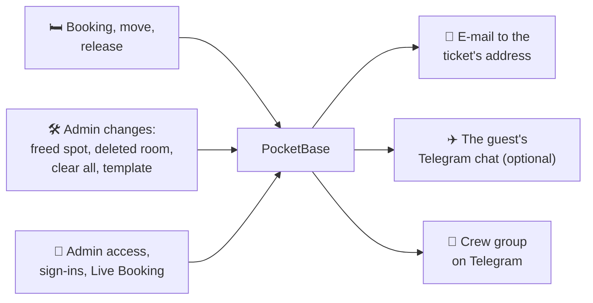
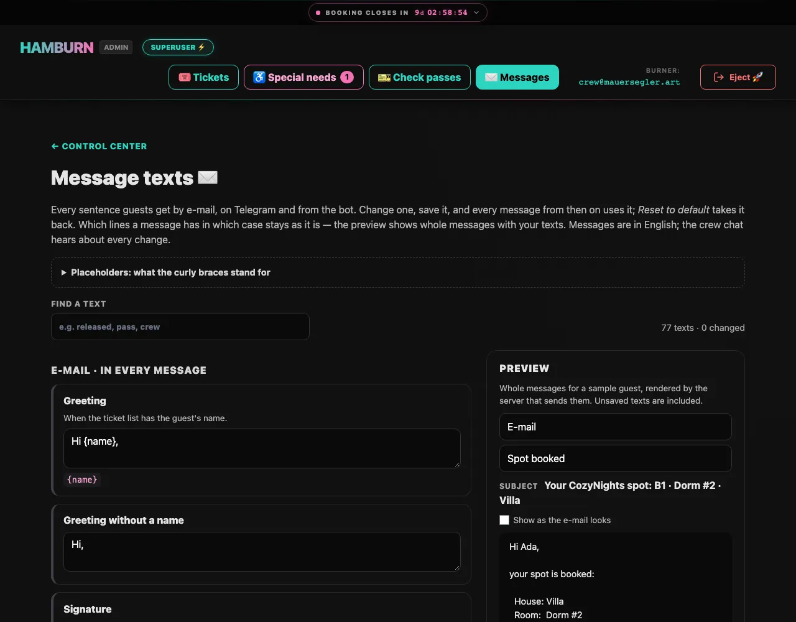

# Notifications

CozyNights can tell **guests** about their booking by e-mail and, if they want, on Telegram, and it keeps the **crew** in the loop through a Telegram group. Everything is optional: without mail or Telegram settings nothing is sent and the app works as before.

## Who talks to the bot

One Telegram bot per environment, two kinds of chats:

| Chat | Who is in it | What happens there |
| --- | --- | --- |
| **Crew group** (private) | the admins | The bot **reports**: access requests, approvals, sign-ins, phase switches, bulk actions, special-needs requests (never who or what they wrote), failed guest messages. It takes no commands. Nobody can approve or change anything from Telegram. |
| **A guest's own chat** | one guest and the bot, nobody else | Only if the guest connects it themselves: the booking confirmation, every change of their spot, their [booking pass](./passes) with its QR code as a picture, and the crew's decision on their request. Guests never join a group and see nothing about other guests. |

::: tip Why approvals stay on the server
A Telegram account isn't your Google Workspace account: it has no enforced 2-Step Verification and could be lost or taken over. Approving admins therefore stays where the Google identity is checked: `./scripts/cozy-admin.sh approve <email>` on the server. The group message tells you who is waiting and shows the command.
:::

## At a glance



## Guests: booking confirmations

A guest hears from CozyNights when their spot changes:

| When | Message |
| --- | --- |
| A spot is booked | **Your CozyNights spot:** house, room and spot, with links to the room and to the [booking pass](./passes) |
| The ticket was [passed on](./tickets#a-ticket-passed-on-to-someone-else) and holds a spot | **A CozyNights spot came with your ticket:** the spot and the new pass — not a confirmation of a booking the new holder never made. Only to the new address; the old one hears nothing. |
| The spot changes (the guest moves, or the crew moves them) | **Your CozyNights spot changed**, with the old and the new spot and the pass link |
| The spot is gone (released by the guest, freed by an admin, its room or house deleted, **Clear all bookings**, a template import, the switch back to Staging) | **Your CozyNights spot was released**, with a link to the map. Not when a superuser switches back to Staging with *Don't notify the guests* ticked (the default once booking has closed): then the release is accepted in silence, and a booking later on is news again (*booked*, not *changed*) |
| A [special-needs request](./special-needs) arrives · is approved · is declined | **We got your special-needs request** · **…was approved** · **About your special-needs request**. Approved and booked at once: one message, **Your special-needs spot:** with the pass. What the guest wrote is never in a message. |

- **One message per change.** A move is one "changed" message, never "released" plus "booked". Changes within about ten seconds are combined, and two messages about the same ticket are at least two minutes apart. A guest who gives up their spot on the roulette (✨ *Leave No Trace & Respin*) keeps that message back for up to ten minutes, so the new spot arrives as one **changed** message; if they leave without booking a new one, the release is sent after all. A switch back to Staging with *Don't notify the guests* ticked silences the tickets whose spots it releases, a held message included. A ticket that already has no spot is not part of that release: its held message still reports the release when the hold runs out.
- **E-mail goes to the address of the ticket.** Guests never type an address: it comes with the [ticket import](#ticket-codes-with-e-mail-addresses). On their room page they see where confirmations go, shortened to `m•••@example.com`. Every e-mail that shows the spot offers what this server can do on top: **Telegram** (until the guest has connected a chat) and, when [wallet passes](./passes#wallet-passes-apple-wallet-google-wallet) are set up, a line about keeping the pass in Apple Wallet or Google Wallet.
- **Telegram is the guest's choice.** <kbd>Get updates on Telegram</kbd> is offered wherever a booking is confirmed: on the room page, on the roulette's *Destiny Fulfilled* card, on the booking pass and on the page **Updates on Telegram** (`/telegram`), which the confirmation e-mail links to. It opens a chat with the CozyNights bot; after <kbd>START</kbd> the bot confirms the current spot and sends every change from then on. <kbd>Turn off</kbd> there or `/stop` in the chat ends it. The link works once and for 30 minutes, and it always needs the ticket code first — a pass link is not enough, because the messages also tell the crew's decision on a special-needs request.
- **The pass rides along.** Every Telegram message that shows the spot carries the pass's QR code as a picture, with buttons to the pass page and, if they are set up, to [the wallets](./passes#wallet-passes-apple-wallet-google-wallet). At arrival the guest can show the code straight from the chat. If Telegram can't fetch the picture, the message goes out as plain text instead — it is never lost.
- **The bot talks to guests, nobody else.** Guests see three commands in its menu: `/pass` sends the booking pass again, `/stop` ends the updates, `/help` explains the bot. Any other message (a question, a sticker) gets the help text. `/start` with a used or expired link answers *⌛ This link has expired or was already used…*; `/stop` answers *🔕 Disconnected…*, or *This chat is not connected to a ticket.*; `/pass` without a connected chat answers the same way, and without a spot it points to the map.
- **No secrets in messages.** They show the spot and a link, never the ticket code. Messages are in English. On staging every subject and message starts with `[STAGING]`.
- **The wording is yours.** Every sentence of these messages can be changed on <kbd>✉️ Messages</kbd>, see [Message texts](#message-texts).
- **At most 20 e-mails a minute** (the server setting `COZY_MAILS_PER_MINUTE`). On opening day, when many guests book at once, the rest wait their turn, so confirmations can lag a few minutes.
- **Delivery problems are retried** for about two days (after 1, 5 and 15 minutes, then after 1, 4, 12 and 24 hours), so a daily sending limit on opening day only delays messages. After that the crew group gets 📭 *Could not notify ticket …* with the reason.

## Crew group

Every message here is also kept in the audit log (collection `admin_events` in the PocketBase dashboard); `./scripts/cozy-admin.sh notify status` shows the latest entries.

| Message | Sent when |
| --- | --- |
| 🛎️ Admin access request | Someone signs in to `/admin` for the first time, with the command to approve them |
| ✉️ Admin invited · ✅ approved · 🔁 role changed · 🚫 removed | Access changes, with `cozy-admin` or in the PocketBase dashboard |
| 🔐 Admin sign-in | An approved admin signs in with Google (at least once a week, see [Sessions](./access#sessions)) |
| 🎪 LIVE BOOKING switched ON · 🔒 Booking CLOSED · 🛠 Back to STAGING MODE | The phase changed right now (a superuser's switch), with their e-mail address |
| ⏰ Booking timer armed · window changed · ⏸️ paused · removed | With the opening and closing time and who did it |
| 🎪 Booking is LIVE now · 🔒 Booking is CLOSED now | The armed timer reached the opening or the closing time |
| 🧨 All bookings cleared | With the number of released spots, and of special-needs spots kept |
| 🗺️ Layout template applied | What was created, changed and removed, released bookings and the backup |
| 🎟️ Ticket changed | A new address, a new name or a hand-over on the Tickets page, with the code and addresses shortened (`H•••`, `a•••@example.org`) |
| 📥 Ticket list imported | A superuser loaded the list on the Tickets page: how many tickets were created, updated and handed over |
| 🏚️ House deleted | Every deletion, with the number of bookings released |
| 🧡 New special-needs request | With the number waiting for a decision and a link to ♿ **Special needs**; never the guest's name or text |
| 🧡 A guest withdrew their special-needs request | With what it was in words (*was still waiting for a decision*, *had been approved*, *had been declined*); never the guest's name or text |
| ✅ approved · ✋ declined · ♿ spot booked · ♿ spot released | An admin decided on a [special-needs request](./special-needs), with their e-mail address |
| 🧡 Special-needs requests OPENED · closed | Somebody flips the requests switch, with their e-mail address |
| ✏️ Message text changed · ↩️ reset to its default | An admin changed a [message text](#message-texts) or took it back, with their e-mail address and the text's key |
| 📭 Could not notify ticket | A guest message failed for good. The ticket is named by its shortened code (*Ticket H•••*), never by its holder: this line can stand right next to 🧡 *New special-needs request*, and the two must not add up to a person. |

If Telegram is down, a crew message is tried again after 1, 5, 15 and 60 minutes; after the fifth failed attempt it is marked *failed* in the audit log (`notify status` shows it). Guest messages keep being retried for about two days, see above.

## Message texts

Every sentence guests get — by e-mail, on Telegram and from the bot — can be changed on <kbd>✉️ Messages</kbd> in the admin header. Each text has a box with the text in use; change it, and <kbd>Save</kbd> and <kbd>Undo</kbd> appear. After saving, every message from then on uses it, and the box notes *Changed by … · Default: …*. <kbd>Reset to default</kbd> takes it back; saving the default text counts as a reset too. The preview next to the boxes shows whole messages for a sample guest, rendered by the same code that sends them, with unsaved texts included: pick e-mail, Telegram or the bot's replies, and the situation; *Show as the e-mail looks* switches to the formatted e-mail. **Find a text** filters the boxes (e.g. *released*, *pass*), next to a counter of all texts and the changed ones.



- **Placeholders** in curly braces are filled in when the message is sent: `{name}`, `{spot}`, `{before}`, `{roomUrl}`, `{mapUrl}`, `{requestUrl}`, `{passCode}`, `{passUrl}`, `{appUrl}`, `{telegramUrl}`, `{status}`. Each box lists the ones its text may use; a text with any other placeholder can't be saved. Anything else in curly braces is sent as written.
- **The shape of a message stays.** Which lines a message has in which case (a spot booked by the crew, a request declined while the guest keeps their spot, …) is decided by the app; the texts are the sentences it puts together. That's why some sentences exist twice, for example *The crew could not offer you a special-needs spot* with and without *you keep this spot*.
- **Line breaks stay**, in e-mails and Telegram messages alike. Texts are plain: no HTML, no Markdown, no links other than the placeholders. A text has at most 2,000 characters and can't be empty.
- **English only, `[STAGING]` stays.** The label in front of subjects and messages is a server setting (`COZY_ENV_LABEL`), not a text.
- **The crew group hears about every change** (✏️ *Message text changed*, ↩️ *reset*), with the admin's name and the text's key; the audit log keeps it. Changed texts live in the collection `message_texts`, so they are in every backup; *Reset* deletes the record.
- **Not here:** the crew group's own alerts (log lines with names and counts) and the labels of the buttons under a Telegram message. Both are fixed in the code.

## Ticket codes with e-mail addresses

Confirmations need the ticket holders' addresses, and they come with the ticket list. Export the list from the ticket shop as a CSV file. A superuser loads it on the **Tickets** page, sees what is new or changed and picks what to take over; single addresses are fixed there as well, also when a ticket was passed on. See [Tickets & e-mail addresses](./tickets).

Operators can load the same file on the server:

```bash
./scripts/cozy-admin.sh tickets import roster.csv --dry-run   # check the file, change nothing
./scripts/cozy-admin.sh tickets import roster.csv             # create and update the tickets
```

A ticket whose address **changes** while it still carries something of its holder (a booking pass, a Telegram chat, a special-needs request, a burner name or a check-in) is refused, and nothing is imported: such a ticket changed hands, and the server import can't decide that per row. Hand it over on the [Tickets](./tickets#a-ticket-passed-on-to-someone-else) page, or repeat the import with `--hand-over` for a file where every changed address is a new holder. A ticket's first address is never a hand-over.

The file needs a header row with a **code** column and an **email** column; a **name** column is optional. Other spellings work too (`Order code`, `Ticket`, `E-Mail`, `Attendee name`, …), and so do commas, semicolons or tabs between the columns:

```csv
code;email;name
HB-1001;ada@example.com;Ada Lovelace
HB-1002;grace@example.org;Grace Hopper
```

- **The whole file is checked first.** One broken line, and nothing is imported; the tool lists what's wrong.
- **Existing codes are updated.** A new address replaces the old one; an empty cell keeps the stored value. If the ticket already holds a spot, the new address gets a confirmation right away.
- **No hand-overs.** The tool only changes addresses and names. A ticket that changed hands keeps the old holder's Telegram link, booking pass and special-needs request, and the new address hears about all of them. Load such lists on the [Tickets](./tickets) page, where 🔁 *New holder* hands the ticket over. The server import also sends no 📥 message to the crew group.
- **Nothing is deleted.** Tickets that aren't in the file stay; the tool says how many.
- **Several tickets may share one address,** for example when one person bought for friends. Each ticket gets its own messages.

A single ticket: `./scripts/cozy-admin.sh tickets add HB-1003 --email linus@example.com --name "Linus"` (`--name` is the name e-mails greet with). `tickets list` shows the address per ticket and whether a Telegram chat is linked (`tg=yes` / `tg=no`). More on codes: [Ticket codes](./event-checklist#ticket-codes). To change one address, search the ticket on the Tickets page instead.

## Setting it up

Operators put the settings into the server's `.env` (the template `deploy/staging.env.template` describes each value) and deploy again. Two rules:

- **One Telegram bot per environment.** The server reads the bot's messages itself (no public webhook), and two servers can't read the same bot. Add the bot to a **private** crew group, and turn off "Allow groups" for it in @BotFather afterwards, so nobody can add it elsewhere.
- **E-mail through a sending service, from a crew address.** Recommended: a Google group of the Workspace (for example `cozynights@mauersegler.art`, anyone on the web may post, members are the crew) as the sender, so guests' replies reach the crew; sending through a transactional mail service such as SMTP2GO with its **own SMTP user per environment** (send-only, revocable without touching other apps), the sender domain verified there (DKIM), open and click tracking off. Avoid a personal mailbox with an app password: that password would open the whole mailbox.

Step by step:

<div class="steps">

1. **Create the bot** with @BotFather in Telegram, one per environment (for example *CozyNights Staging*).
2. **Create the crew group** as a private group, add the crew and the bot. The bot needs no admin rights.
3. **Find the group's id.** Send `/start@<your bot>` in the group, then read the chat id from the Bot API's `getUpdates`. Group ids are negative; bigger groups start with `-100`. Do it before the server uses the bot: from then on the server fetches the updates itself. If the group later becomes a supergroup (for example when you turn on topics), its id changes; for a topic, also set `TELEGRAM_THREAD_ID`.
4. **Close the bot for other groups:** @BotFather → *Bot Settings* → *Allow Groups?* → *Turn groups off*.
5. **Fill in `.env`:** bot token and group id, the mail settings, and `LEGAL_MAIL_PROVIDER` so the privacy policy names the mail service (see [Legal pages](./legal)). Then deploy.
6. **Check** it on the server, as below.

</div>

Then check on the server:

```bash
./scripts/cozy-admin.sh notify status                            # what is on, queued, the latest events
./scripts/cozy-admin.sh notify test --email you@mauersegler.art  # test message to the group + a test e-mail
```

## After the event

```bash
./scripts/cozy-admin.sh tickets forget-contacts --yes
```

Deletes every guest address, every Telegram link and every [special-needs request](./special-needs). The ticket codes and bookings stay, and so does the audit log.

## When something doesn't arrive

| What you see | Why | What to do |
| --- | --- | --- |
| `notify test`: *crew chat: FAILED — 401* | The bot token is wrong. | Check the token in `.env`. |
| `notify test`: *403* or *chat not found* | The bot isn't in the group, or the group id is wrong. | Add the bot to the group; group ids are negative numbers. |
| `notify status`: *WARNING: this bot has a webhook* | Something else registered a webhook for the bot, so the server can't read its messages. | Remove the webhook, or give this environment its own bot. |
| Guests see no <kbd>Get updates on Telegram</kbd> | No bot is set up, or `TELEGRAM_GUEST_UPDATES=off`. The button also only shows once the guest holds a spot (room page) or has sent a special-needs request. | `notify status`. |
| A guest sees *⌛ This link has expired or was already used* in Telegram | The link works once and for 30 minutes. | Press <kbd>Get updates on Telegram</kbd> on the room page again. |
| The room page shows no address | E-mail isn't set up, or the ticket has no address. | `notify status`, `tickets list`. |
| 📭 *Could not notify ticket* in the group | The mail server refused the address on every attempt for about two days. A bounce that only comes back later by e-mail never reaches CozyNights. | The group names the ticket only shortened (*Ticket H•••*, `b•••@example.com`). Which one it is shows in the PocketBase dashboard: collection `guest_notify`, the entry with `attempts` > 0 and a `last_error`, links to the ticket. Fix its address on the [Tickets](./tickets) page. |
| Nothing at all | Look at the queue, then at the server log. | `notify status` (queued / retrying), PocketBase log lines with `[cozy-notify]`. |
