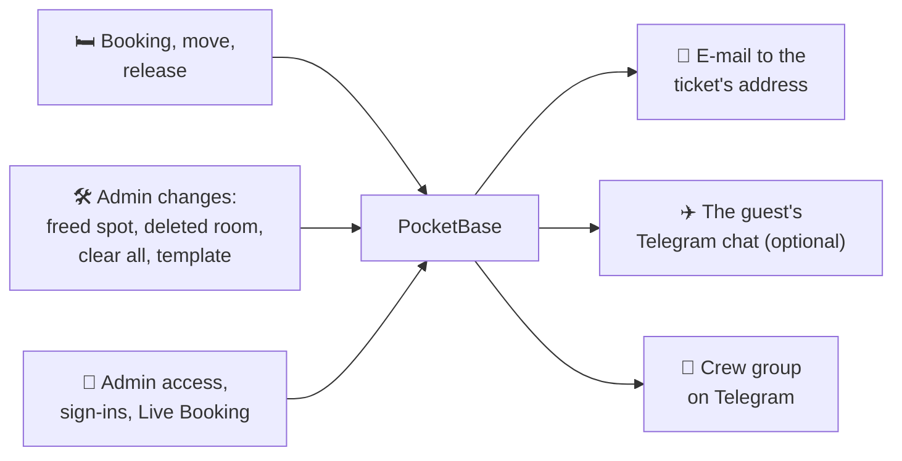

# Notifications

CozyNights can tell **guests** about their booking by e-mail and, if they want, on Telegram, and it keeps the **crew** in the loop through a Telegram group. Everything is optional: without mail or Telegram settings nothing is sent and the app works as before.

## Who talks to the bot

One Telegram bot per environment, two kinds of chats:

| Chat | Who is in it | What happens there |
| --- | --- | --- |
| **Crew group** (private) | the admins | The bot **reports**: access requests, approvals, sign-ins, phase switches, bulk actions, failed guest messages. It takes no commands. Nobody can approve or change anything from Telegram. |
| **A guest's own chat** | one guest and the bot, nobody else | Only if the guest connects it on their room page: the booking confirmation and every change of their spot. Guests never join a group and see nothing about other guests. |

::: tip Why approvals stay on the server
A Telegram account isn't your Google Workspace account: it has no enforced 2-Step Verification and could be lost or taken over. Approving admins therefore stays where the Google identity is checked: `./scripts/cozy-admin.sh approve <email>` on the server. The group message tells you who is waiting and shows the command.
:::

## At a glance



## Guests: booking confirmations

A guest hears from CozyNights when their spot changes:

| When | Message |
| --- | --- |
| A spot is booked | **Your CozyNights spot:** house, room and spot, with links to the room and to the [booking pass](./passes) |
| The spot changes (the guest moves, or the crew moves them) | **Your CozyNights spot changed**, with the old and the new spot and the pass link |
| The spot is gone (released by the guest, freed by an admin, its room or house deleted, **Clear all bookings**, a template import) | **Your CozyNights spot was released**, with a link to the map |

- **One message per change.** A move is one "changed" message, never "released" plus "booked". Changes within about ten seconds are combined, and two messages about the same ticket are at least two minutes apart.
- **E-mail goes to the address of the ticket.** Guests never type an address: it comes with the [ticket import](#ticket-codes-with-e-mail-addresses). On their room page they see where confirmations go, shortened to `m•••@example.com`.
- **Telegram is the guest's choice.** On their room page, <kbd>Get updates on Telegram</kbd> opens a chat with the CozyNights bot. After <kbd>START</kbd> the bot confirms the current spot and sends every change from then on. <kbd>Turn off</kbd> on the room page or `/stop` in the chat ends it. The link works once and for 30 minutes.
- **No secrets in messages.** They show the spot and a link, never the ticket code. Messages are in English. On staging every subject and message starts with `[STAGING]`.
- **Delivery problems are retried** for about two days (after 1, 5 and 15 minutes, then after 1, 4, 12 and 24 hours), so a daily sending limit on opening day only delays messages. After that the crew group gets 📭 *Could not notify ticket …* with the reason.

## Crew group

Every message here is also kept in the audit log (collection `admin_events` in the PocketBase dashboard); `./scripts/cozy-admin.sh notify status` shows the latest entries.

| Message | Sent when |
| --- | --- |
| 🛎️ Admin access request | Someone signs in to `/admin` for the first time, with the command to approve them |
| ✉️ Admin invited · ✅ approved · 🔁 role changed · 🚫 removed | Access changes, with `cozy-admin` or in the PocketBase dashboard |
| 🔐 Admin sign-in | An approved admin signs in with Google (at least once a week, see [Sessions](./access#sessions)) |
| 🎪 LIVE BOOKING switched ON · 🛠 Booking closed | Somebody flips the phase switch, with their name |
| ⏰ Go-live timer set · removed | With the opening time and who set it |
| 🎪 Booking is LIVE now | The go-live timer fired |
| 🧨 All bookings cleared | With the number of released spots |
| 🗺️ Layout template applied | What was created, changed and removed, released bookings and the backup |
| 🎟️ Ticket changed | A new address, a new name or a hand-over on the Tickets page, with the code and addresses shortened (`H•••`, `a•••@example.org`) |
| 📥 Ticket list imported | How many tickets were created, updated and handed over |
| 🏚️ House deleted | Only when bookings went with it |
| 📭 Could not notify ticket | A guest message failed for good |

If Telegram is down, the messages wait and go out later.

## Ticket codes with e-mail addresses

Confirmations need the ticket holders' addresses, and they come with the ticket list. Export the list from the ticket shop as a CSV file. A superuser loads it on the **Tickets** page, sees what is new or changed and picks what to take over; single addresses are fixed there as well, also when a ticket was passed on. See [Tickets & e-mail addresses](./tickets).

Operators can load the same file on the server:

```bash
./scripts/cozy-admin.sh tickets import roster.csv --dry-run   # check the file, change nothing
./scripts/cozy-admin.sh tickets import roster.csv             # create and update the tickets
```

The file needs a header row with a **code** column and an **email** column; a **name** column is optional. Other spellings work too (`Order code`, `Ticket`, `E-Mail`, `Attendee name`, …), and so do commas, semicolons or tabs between the columns:

```csv
code;email;name
HB-1001;ada@example.com;Ada Lovelace
HB-1002;grace@example.org;Grace Hopper
```

- **The whole file is checked first.** One broken line, and nothing is imported; the tool lists what's wrong.
- **Existing codes are updated.** A new address replaces the old one; an empty cell keeps the stored value. If the ticket already holds a spot, the new address gets a confirmation right away.
- **Nothing is deleted.** Tickets that aren't in the file stay; the tool says how many.
- **Several tickets may share one address,** for example when one person bought for friends. Each ticket gets its own messages.

A single ticket: `./scripts/cozy-admin.sh tickets add HB-1003 --email linus@example.com --name "Linus"`. `tickets list` shows the address and a Telegram link per ticket. More on codes: [Ticket codes](./event-checklist#ticket-codes). To change one address, search the ticket on the Tickets page instead.

## Setting it up

Operators put the settings into the server's `.env` (the template `deploy/staging.env.template` describes each value) and deploy again. Two rules:

- **One Telegram bot per environment.** The server reads the bot's messages itself (no public webhook), and two servers can't read the same bot. Add the bot to a **private** crew group, and turn off "Allow groups" for it in @BotFather afterwards, so nobody can add it elsewhere.
- **E-mail through a sending service, from a crew address.** Recommended: a Google group of the Workspace (for example `cozynights@mauersegler.art`, anyone on the web may post, members are the crew) as the sender, so guests' replies reach the crew; sending through a transactional mail service such as SMTP2GO with its **own SMTP user per environment** (send-only, revocable without touching other apps), the sender domain verified there (DKIM), open and click tracking off. Avoid a personal mailbox with an app password: that password would open the whole mailbox.

Step by step:

<div class="steps">

1. **Create the bot** with @BotFather in Telegram, one per environment (for example *CozyNights Staging*).
2. **Create the crew group** as a private group, add the crew and the bot. The bot needs no admin rights.
3. **Find the group's id.** Send `/start@<your bot>` in the group, then read the chat id from the Bot API's `getUpdates`. Group ids are negative; bigger groups start with `-100`. Do it before the server uses the bot: from then on the server fetches the updates itself. If the group later becomes a supergroup (for example when you turn on topics), its id changes; for a topic, also set `TELEGRAM_THREAD_ID`.
4. **Close the bot for other groups:** @BotFather → *Bot Settings* → *Allow Groups?* → *Turn groups off*.
5. **Fill in `.env`:** bot token and group id, the mail settings, and `LEGAL_MAIL_PROVIDER` so the privacy policy names the mail service (see [Legal pages](./legal)). Then deploy.
6. **Check** it on the server, as below.

</div>

Then check on the server:

```bash
./scripts/cozy-admin.sh notify status                            # what is on, queued, the latest events
./scripts/cozy-admin.sh notify test --email you@mauersegler.art  # test message to the group + a test e-mail
```

## After the event

```bash
./scripts/cozy-admin.sh tickets forget-contacts --yes
```

Deletes every guest address and Telegram link. The ticket codes stay, and so does the audit log.

## When something doesn't arrive

| What you see | Why | What to do |
| --- | --- | --- |
| `notify test`: *crew chat: FAILED — 401* | The bot token is wrong. | Check the token in `.env`. |
| `notify test`: *403* or *chat not found* | The bot isn't in the group, or the group id is wrong. | Add the bot to the group; group ids are negative numbers. |
| `notify status`: *WARNING: this bot has a webhook* | Something else registered a webhook for the bot, so the server can't read its messages. | Remove the webhook, or give this environment its own bot. |
| Guests see no <kbd>Get updates on Telegram</kbd> | No bot is set up, or `TELEGRAM_GUEST_UPDATES=off`. | `notify status`. |
| The room page shows no address | E-mail isn't set up, or the ticket has no address. | `notify status`, `tickets list`. |
| 📭 *Could not notify ticket* in the group | The address bounced or the mail server refused. | Fix the address in the ticket list and import it again. |
| Nothing at all | Look at the queue, then at the server log. | `notify status` (queued / retrying), PocketBase log lines with `[cozy-notify]`. |
