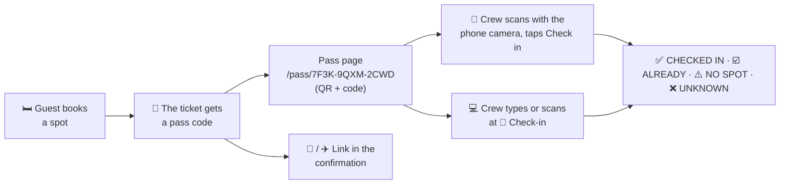

# Booking passes & check-in

Every guest who holds a spot has a **booking pass**: a page with a QR code and a short code like `7F3K-9QXM-2CWD`. It confirms which spot the ticket holds. At arrival the crew checks the pass, and that **checks the guest in**: the spot goes from *booked* to *checked in*.

## At a glance

## A spot's states

| State | What it means | How it gets there |
| --- | --- | --- |
| 🟢 **Free** | No ticket holds the spot. | Released by the guest (Live Booking), freed by the crew, or released by a superuser when switching back to Staging Mode or with *Clear all bookings*. |
| 🔴 **Booked** | A ticket holds the spot; the guest hasn't arrived (or wasn't checked yet). | The guest books it, or the crew books it for a [special-needs request](./special-needs). |
| ✅ **Checked in** | The crew checked the guest's pass at arrival. The spot shows *when* and *which admin* did it. | Only an admin or superuser, at 🎫 **Check-in** or with the **Check in** button on the pass. |

Locked 🔒, deactivated ❄️ and special-needs ♿ are marks on a spot, not states: a booked or checked-in spot can carry them too.

The rules that keep the states consistent:

- **Checked in only while booked.** A check-in belongs to its booking: when the spot is released or gets another ticket, the check-in is gone. PocketBase enforces this, whoever does the writing.
- **Once checked in, the guest can't release the spot.** Their room, house and roulette pages say *"The crew has checked you in, so your spot is final."* They can still change their burner name while booking is live. Only the crew changes the spot: [special-needs requests](./special-needs) can move the guest (the check-in moves along), and in Staging Mode the crew can free it.
- **A ticket handed over to a new holder** ([Tickets](./tickets#a-ticket-passed-on-to-someone-else)) keeps its spot but loses the check-in: the new holder checks in with the new pass.
- **Releasing a booking takes its check-in with it.** Going back to Staging Mode asks a superuser whether the guest bookings are released or stay; *Clear all bookings* releases them in Staging. Both dialogs say how many spots are checked in, so nobody frees the spots of guests who are on site by accident.
- **The check-in sends the guest nothing.** Messages only follow changes of the spot.

## What the guest gets

- **On their room page:** <kbd>🎫 Show booking pass</kbd>, as soon as they hold a spot.
- **On every other house and room page:** a small ticket with their spot in the *You already have a spot* note; tapping it opens the pass. After booking closed, the map's panel shows the same ticket.
- **In every confirmation:** the e-mail and the Telegram message link to the pass and show its code.
- **The pass page** shows house, room, spot and burner name, the QR code and the code. <kbd>Save QR code</kbd> stores the QR code as an image (it goes to the photos on a phone); a screenshot works just as well.
- **One pass per ticket.** It stays the same when the guest moves to another spot or releases theirs: the check always shows the spot the ticket holds *right now*.

## Checking guests in

Choose whatever is at hand; all of them check the guest in the same way.

| How | What you do |
| --- | --- |
| **🎫 Check-in** (admin header) | Type the code (upper or lower case, dashes don't matter) and press <kbd>Enter</kbd>, or <kbd>Check in</kbd>. A pass whose ticket holds a spot **is checked in right away**. The field is ready for the next code; the last checks stay listed below. |
| **Camera on the check-in page** | <kbd>📷 Scan with camera</kbd> reads the QR code with the phone's or laptop's camera, in any current browser. Same as typing the code. |
| **USB barcode scanner** | Plug it in, click into the field on **Check-in**, scan. Scanners type the link and press <kbd>Enter</kbd>, like a keyboard. |
| **Phone camera** | Open the camera app, point it at the QR code, tap the link. If you are signed in to the admin area in that browser, the pass opens with the booking on top and a big <kbd>✅ Check in</kbd> button. Opening the pass alone changes nothing. |

### What the result means

| Result | Meaning | What to do |
| --- | --- | --- |
| ✅ **CHECKED IN** | The ticket holds a spot and is checked in now: shown with house, room, spot, burner name, the ticket's name and its e-mail (shortened). | Welcome them. **open room** jumps to the room in the admin area. |
| ☑️ **ALREADY CHECKED IN** | The pass was checked in before; the card says when and by whom. Nothing changed. | If it's the same person, fine. If not, the pass may have been passed on: compare the name on the ticket. |
| ⚠️ **NO SPOT** | The ticket exists but holds no spot right now (released, or freed by the crew). Nothing is checked in. | Help them book a free spot, then check again. |
| ❌ **UNKNOWN** | No ticket has this pass code. | Check the code for typos. A ticket handed over to a new holder has a new pass; the old one is unknown. |

A note like *This spot is deactivated* means the booking still stands, but the crew has taken the spot out of service meanwhile; the guest is checked in anyway.

### Undoing a check-in

Checked in the wrong pass? The newest result on **Check-in** has <kbd>↩️ Undo check-in</kbd>; so has the pass page for signed-in admins. The spot stays booked, only the check-in goes. Every undo lands in the audit log and the crew chat (*Check-in undone by …: spot B1 · Blue Room #2 · Villa*). Check-ins themselves are not posted to the chat; the spot keeps who did them.

### Where the crew sees check-ins

- **Room page:** a checked-in spot shows **CHECKED IN ✅** with the time (hover for the admin), and the room counts them.
- **House page and Control Center:** *Checked in* per room and per house, and **SPOTS CHECKED IN** in *Show Intel*.
- **Tickets:** a checked-in ticket shows **✅ Checked in** with the time.

## Who can check guests in

Admins and superusers, nobody else. A ticket code never can, whoever holds it:

- The check-in page and its actions (check in, undo) live in the admin area. Every request there without an approved admin session is refused before anything runs, and each action checks the session again.
- The check-in is written with the admin's own PocketBase session. PocketBase only accepts it from approved admins and superusers; guests have no PocketBase session at all, and spots aren't readable for them.
- The pass page shows the booking state and the buttons only to signed-in admins. The buttons post to the admin area, so they don't work without an admin session either.
- Guests never see who checked them in or when: not on the pass, not on the map. Their own pages only say that their spot is final.

## Privacy and security

- **The pass code is not the ticket code.** The ticket code signs in and can change or release bookings; the pass code can only *show* a booking, and lets an admin check it in. It is random (12 characters), unrelated to the ticket code and can't be guessed.
- **What the pass page shows:** to anyone with the link, the spot and the burner name — what other guests see on the room page anyway. Never the ticket code, the name on the ticket, the e-mail address or the check-in.
- **What the crew sees:** the check result with the name on the ticket, the shortened address and the check-in (time, admin), only when signed in to the admin area.
- **What is stored:** the time of the check-in and the e-mail of the admin, on the spot. Both go with the booking.
- **The link stays private:** pass pages aren't indexed, aren't cached and don't send the link on to other sites. Many unknown codes from one connection are blocked for a while.

## Wallet passes (Apple / Google)

Not built on purpose, for now. A real Wallet pass needs an Apple developer account (yearly fee) and a signing certificate, or a Google Wallet issuer account — accounts to run and renew for a nice-to-have. The pass page does the same job: save the QR code or take a screenshot. If it's wanted later, a Wallet pass can carry the same QR code, so the check stays the same.
