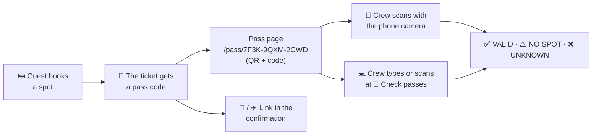

# Booking passes

Every guest who holds a spot has a **booking pass**: a page with a QR code and a short code like `7F3K-9QXM-2CWD`. It confirms which spot the ticket holds, and the crew can check it at arrival with a phone or a computer.

## At a glance

## What the guest gets

- **On their room page:** <kbd>🎫 Show booking pass</kbd>, as soon as they hold a spot.
- **In every confirmation:** the e-mail and the Telegram message link to the pass and show its code.
- **The pass page** shows house, room, spot and burner name, the QR code and the code. <kbd>Save QR code</kbd> stores the QR code as an image (it goes to the photos on a phone); a screenshot works just as well.
- **One pass per ticket.** It stays the same when the guest moves to another spot or releases theirs: the check always shows the spot the ticket holds *right now*.

## Checking a pass

Choose whatever is at hand; all three show the same result.

| How | What you do |
| --- | --- |
| **Phone camera** | Open the camera app, point it at the QR code, tap the link. If you are signed in to the admin area in that browser, the pass opens with the check result on top. |
| **🎫 Check passes** (admin header) | Type the code — upper or lower case, dashes don't matter — and press <kbd>Enter</kbd>. The field is ready for the next code right away; the last checks stay listed below. |
| **Camera on the check page** | <kbd>📷 Scan with camera</kbd> reads the QR code with the phone's or laptop's camera, in any current browser. |
| **USB barcode scanner** | Plug it in, click into the field on **Check passes**, scan. Scanners type the link and press <kbd>Enter</kbd>, like a keyboard. |

### What the result means

| Result | Meaning | What to do |
| --- | --- | --- |
| ✅ **VALID** | The ticket holds a spot: shown with house, room, spot, burner name, the ticket's name and its e-mail (shortened). | Welcome them. **open room** jumps to the room in the admin area. |
| ⚠️ **NO SPOT** | The ticket exists but holds no spot right now (released, or freed by the crew). | Help them book a free spot. |
| ❌ **UNKNOWN** | No ticket has this pass code. | Check the code for typos. |

A note like *This spot is deactivated* means the booking still stands, but the crew has taken the spot out of service meanwhile.

## Privacy and security

- **The pass code is not the ticket code.** The ticket code signs in and can change or release bookings; the pass code can only *show* a booking. It is random (12 characters), unrelated to the ticket code and can't be guessed.
- **What the pass page shows:** to anyone with the link, the spot and the burner name — what other guests see on the room page anyway. Never the ticket code, the name on the ticket or the e-mail address.
- **What the crew sees:** the check result with the name on the ticket and the shortened address, only when signed in to the admin area.
- **The link stays private:** pass pages aren't indexed, aren't cached and don't send the link on to other sites. Many unknown codes from one connection are blocked for a while.

## Wallet passes (Apple / Google)

Not built on purpose, for now. A real Wallet pass needs an Apple developer account (yearly fee) and a signing certificate, or a Google Wallet issuer account — accounts to run and renew for a nice-to-have. The pass page does the same job: save the QR code or take a screenshot. If it's wanted later, a Wallet pass can carry the same QR code, so the check stays the same.
