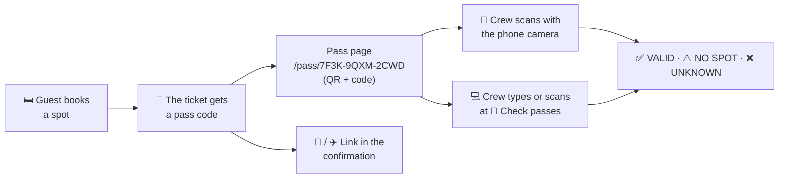

# Booking passes

Every guest who holds a spot has a **booking pass**: a page with a QR code and a short code like `7F3K-9QXM-2CWD`. It confirms which spot the ticket holds, and the crew can check it at arrival with a phone or a computer.

## At a glance

## What the guest gets

- **On their room page:** <kbd>🎫 Show booking pass</kbd>, as soon as they hold a spot.
- **In every confirmation:** the e-mail and the Telegram message link to the pass and show its code.
- **The pass page** shows house, room, spot and burner name, the QR code and the code. <kbd>Save QR code</kbd> stores the QR code as an image named `cozynights-pass-<code>.gif` (on a phone it goes to the photos); a screenshot works just as well. A link typed without dashes or in lower case works too. If the ticket holds no spot right now, the page says so instead: *This ticket holds no spot right now. Pick one on the map while booking is open.*
- **One pass per ticket.** It stays the same when the guest moves to another spot or releases theirs: the check always shows the spot the ticket holds *right now*.

## Checking a pass

Choose whatever is at hand; all three show the same result.

| How | What you do |
| --- | --- |
| **Phone camera** | Open the camera app, point it at the QR code, tap the link. If you are signed in to the admin area in that browser, the pass opens with the check result on top. |
| **🎫 Check passes** (admin header) | Type the code — upper or lower case, dashes don't matter — and press <kbd>Enter</kbd>. The field is ready for the next code right away; the last six checks stay listed below, newest on top, each with the time it was checked (Europe/Berlin). |
| **Camera on the check page** | <kbd>📷 Scan with camera</kbd> reads the QR code with the phone's or laptop's camera, in any current browser over HTTPS. It tries the rear camera first and falls back to the front one; a recognised code is checked right away, without pressing anything. <kbd>Close camera</kbd> stops it. The first time, the browser asks whether this site may use the camera. |
| **USB barcode scanner** | Plug it in, click into the field on **Check passes**, scan. Scanners type the link and press <kbd>Enter</kbd>, like a keyboard. |

### What the result means

| Result | Meaning | What to do |
| --- | --- | --- |
| ✅ **VALID** | The ticket holds a spot: shown with house, room, spot, burner name, the ticket's name and its e-mail (shortened). | Welcome them. **open room** jumps to the room in the admin area. |
| ⚠️ **NO SPOT** | The ticket exists but holds no spot right now (released, or freed by the crew). | Help them book a free spot. |
| ❌ **UNKNOWN** | No ticket has this pass code. | Check the code for typos. |

Two notes can come with ✅ VALID. *This spot is deactivated. The booking still stands.* means the crew has taken the spot out of service meanwhile; *This spot is locked for guests. The booking still stands.* means it is locked 🔒. Either way the guest keeps the spot: the note tells you to look at the room page, not to turn anyone away.

Opened with a phone camera while you are signed in, the pass page shows the same result on top, plus **Booked** with the date and time the spot got its ticket, and the links **Check another pass** and **Open the room**.

## When something doesn't work

| What you see | Why | What to do |
| --- | --- | --- |
| *That isn't a pass code. Codes look like 7F3K-9QXM-2CWD.* | The field holds something other than twelve letters and digits: a ticket code, an order number, or a scanner that typed only part of the link. | Type the code from the pass, or scan again. |
| *The booking system is not reachable right now. Try again.* · *We could not reach the server. Check the connection and try again.* | The app can't reach its database, or your phone has no connection. | Try again in a moment. Meanwhile the pass page itself shows the spot. |
| *The camera could not be opened. Allow camera access for this site, or type the code.* | The browser wasn't allowed to use the camera, another app holds it, or the page isn't served over HTTPS. | Allow the camera in the browser's site settings, or use the phone's own camera app: it opens the pass link. |
| *Only admins can check passes.* | Your admin session ended while the page was open. | Sign in again at `/admin/login`. |
| A guest's pass link says *This booking pass is unknown. Check the code, or ask the crew.* | No ticket has this pass code: an old link after a [hand-over](./tickets#a-ticket-passed-on-to-someone-else), or a typo in the link. | Look the ticket up on the [Tickets](./tickets) page; its room page shows the spot. |
| A guest's pass link says *Too many unknown passes from your connection. Please wait a few minutes.* | More than 30 unknown codes came from that network within ten minutes, for example a whole venue behind one Wi-Fi. | Wait a few minutes, or check the code on **Check passes**: signed-in admins are never blocked. |
| *This ticket holds no spot right now. Pick one on the map while booking is open.* on a pass page | The guest released the spot, or the crew freed it. | Same as ⚠️ NO SPOT: help them book a free spot. |

## Privacy and security

- **The pass code is not the ticket code.** The ticket code signs in and can change or release bookings; the pass code can only *show* a booking. It is random (12 characters), unrelated to the ticket code and can't be guessed.
- **What the pass page shows:** to anyone with the link, the spot and the burner name — what other guests see on the room page anyway. Never the ticket code, the name on the ticket or the e-mail address.
- **What the crew sees:** the check result with the name on the ticket and the shortened address, only when signed in to the admin area.
- **The link stays private:** pass pages aren't indexed, aren't cached and don't send the link on to other sites. After 30 unknown codes from one connection within ten minutes, that connection is blocked for a while (requests for the QR image count too); signed-in admins are never blocked.

## Wallet passes (Apple / Google)

Not built on purpose, for now. A real Wallet pass needs an Apple developer account (yearly fee) and a signing certificate, or a Google Wallet issuer account — accounts to run and renew for a nice-to-have. The pass page does the same job: save the QR code or take a screenshot. If it's wanted later, a Wallet pass can carry the same QR code, so the check stays the same.
