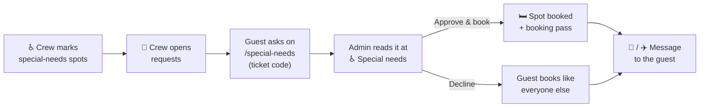

# Special-needs requests

Some guests need a particular kind of spot: a lower bunk, step-free access, a place close to a toilet, a quiet room, a socket for a medical device, or something else. They can **ask the crew for one with their ticket code, even before booking opens**. Admins read the request, approve or decline it, and **book a spot for the guest** — the only way a spot gets booked while booking is closed.

## At a glance

## 1. Mark special-needs spots

On a room page, <kbd>♿ SPECIAL</kbd> marks a spot as a special-needs spot; <kbd>♿ NORMAL</kbd> turns it back into a normal one. Works in Staging Mode, during Live Booking and after booking closed.

- **Guests can't book it.** They see it like a locked spot, as *Not available · Reserved by the crew*, and never learn why. Once a guest has it, it shows as an ordinary occupied spot with their burner name: nobody can tell who has special needs.
- **It never counts as free**, like a locked spot.
- **It comes first** in the list when you book a spot for a request.
- **Templates keep it** (`"is_special": true` on the spot, see [Layout templates](./templates#file-format)).

Mark the spots before booking opens. Special-needs spots that nobody needs at the end: switch them back to <kbd>♿ NORMAL</kbd> one by one, and guests can book them.

## 2. Open requests

Requests have their **own switch**, independent of Staging Mode and Live Booking: the row *♿ Special-needs requests: OPEN / CLOSED* right under the [🎟 BOOKING WINDOW](./#booking-window) panel in the Control Center, or the same switch on the requests page.

- **Open:** guests see a link on the map (*Need a special-needs spot? Ask the crew now*) and can send or change a request.
- **Closed:** no new requests. Waiting requests stay, guests still see theirs and can withdraw it.

Every switch goes to the crew group with the name of the admin.

## 3. Decide and book

<kbd>♿ Special needs</kbd> in the admin header, with the number of requests waiting for a decision. Each request shows:

- the **ticket holder** from the ticket list (name and e-mail address), when it was sent and changed;
- what the guest **ticked** (a lower bunk or a bed without a ladder · step-free access or the ground floor · close to a toilet · a quiet room · a power socket for a medical device · something else) and **wrote** (5 to 500 characters), and a burner name if they chose one;
- who **decided** and when, and the **spot** the ticket holds right now: *booked by the crew* (through this page) or *booked by the guest*.

If a guest sends the form again right when you decide, the card says so: read it once more. Cards are colour-coded: **waiting** orange, **approved** green, **declined** grey and dimmed.

| Button | What happens |
| --- | --- |
| <kbd>Approve</kbd> | The request is approved. A guest without a spot hears that the crew picks one; a guest who booked a spot themselves hears they keep it until you book a more fitting one. |
| <kbd>Approve & book</kbd> · <kbd>Book</kbd> | Pick a free spot from the list (special-needs spots first, 🔒 locked ones included) and book it for the guest, right away, also in Staging Mode. A waiting request is approved on the way. The guest gets one message with the spot and the booking pass. |
| <kbd>Move</kbd> | Books another spot for the guest; the old one becomes free. |
| <kbd>Release spot</kbd> | The spot becomes free again (a special-needs spot stays one); the request stays approved, so book another one. The guest gets a message. |
| <kbd>Decline</kbd> | The guest gets a message that the crew can't offer a special-needs spot: they keep a spot they booked themselves, or book like everyone else once booking opens. To decline a request whose spot you booked, release the spot first. |
| <kbd>⋯</kbd> → <kbd>Approve after all</kbd> | On a declined card only, deliberately out of the way: the request is approved after all (the guest gets the *approved* message), and the spot list comes back so you can book one. |

Every decision and booking is in the audit log and goes to the crew group — **without the guest's name or what they wrote**.

## What guests get

| When | Message (e-mail and, if connected, Telegram) |
| --- | --- |
| The request arrives | **We got your special-needs request**, with a link to see, change or withdraw it |
| Approved, no spot yet | **Your special-needs request was approved** — the crew picks a spot (or: they keep the spot they booked until you book a better one) |
| Approved and booked | **Your special-needs spot:** house, room, spot and the [booking pass](./passes) |
| Declined | **About your special-needs request** — book like everyone else when booking opens |

Messages say what the crew decided, never what the guest wrote. On `/special-needs` the guest sees the status, what they sent, the spot and the pass, and can connect Telegram. The wording of every message can be changed on <kbd>✉️ Messages</kbd> (see [Message texts](./notifications#message-texts)).

## Rules the app keeps

- **One request per ticket**, taken from the guest's signed-in ticket code, never from the form. The database refuses a second one.
- **A guest can change a request while it waits**, and **withdraw it at any time**. Once you decided, the request is fixed: a guest who sends the form again reads *The crew has already decided on your request, so it can't be changed anymore. If something changed, please contact the crew.* and sees your decision. Withdrawing deletes it; a spot the crew already booked stays booked, but from then on it is an ordinary booking (the guest can change it, and clear all bookings frees it). The crew group hears about every withdrawal.
- **Ten sends per hour.** A ticket can send or change its request at most ten times within an hour; after that the form says *You sent your request 10 times within an hour. Please wait a while, then try again.*
- **Consent is given with every send.** The checkbox is unticked each time the form opens, and the stored consent time is the time of the last send.
- **A spot the crew booked is fixed.** The guest can rename it, but can't move or release it themselves: they ask the crew. You move or release it here. A spot the guest booked themselves stays theirs to change, also when the request is approved.
- **Going back to Staging Mode (and Clear all bookings) keeps the spots the crew booked**, with their burner names; every other booking is released. The dialog says how many.
- **A template import keeps the spots the crew booked**, like every other booking, as long as the spot stays in the layout (also when its house moves or its room is renamed). Only spots you choose to remove release their booking, crew-booked ones too: the guest gets a *spot was released* e-mail and the burner name is forgotten. Those requests stay approved and show *No spot yet*: book a spot again for them after the import. The confirmation dialog says how many bookings go before anything happens (see [Layout templates](./templates#applying)).

## Privacy

What guests write is often **health data**. The app treats it that way; please do too.

- **Only admins can read it**, here and nowhere else. What guests tick and write is stored encrypted, so the PocketBase dashboard and backups only hold unreadable text. The pages are sent with `Cache-Control: no-store`.
- **It never leaves the admin area:** not in e-mails, Telegram messages, the crew group, logs or the audit log.
- **Don't copy it** into chats, e-mails or spreadsheets. Talk about a request in person, and decide based on what the guest needs, not why.
- **Guests give explicit consent** with a checkbox when they send a request (Art. 9(2)(a) GDPR); the time is stored. The privacy policy (`/privacy`, section *Special-needs requests*) explains it; see [Legal pages](./legal). The checkbox reads: *I agree that the CozyNights crew uses what I write here to find a fitting spot for me. It may include information about my health. Only the crew's admins can read it; it is stored encrypted and deleted after the event at the latest. I can withdraw my request on this page at any time. Details: privacy policy.* (the link opens the policy's section). Keep the text, the policy and this page in step.
- **A ticket passed on** to a new holder (Tickets page, ticket list import) loses its request the same way; a spot the crew booked stays with the ticket as an ordinary booking.
- **It is deleted after the event** together with the contact data: `./scripts/cozy-admin.sh tickets forget-contacts --yes` also deletes every request. See [After the event](./notifications#after-the-event).

## When something doesn't work

| What you see | Why | What to do |
| --- | --- | --- |
| Guests see no link on the map | Requests are closed. | Open them (Control Center or requests page). |
| *Requests are closed right now* for a guest | The switch is off. | Open requests, or book a spot for them another way. |
| *This spot is already claimed. Pick another spot.* | Someone was faster, or the list was old. | Reload the page and pick another spot. |
| *This request does not exist anymore* | The guest withdrew it meanwhile. | Reload the page. |
| *The guest withdrew the request meanwhile. The spot is booked for the ticket anyway; release it on the room page if it should be free.* | The guest withdrew while you were booking. | The ticket keeps the spot as an ordinary booking. Release it on the room page if it should be free. |
| *This request is declined. Approve it first, then assign a spot.* | You pressed Book on a declined request. | <kbd>Approve</kbd>, then <kbd>Book</kbd>. |
| A guest reports *You sent your request 10 times within an hour…* | The form's limit. | Nothing to do: it works again within the hour. |
| *(nothing readable)* instead of the text | The server's encryption key changed since the request was sent. | Ask the guest to send the request again. |
| The guest got no message | No e-mail address on the ticket, and no Telegram connected. | Check the ticket with `tickets list`; see [Notifications](./notifications#when-something-doesn-t-arrive). |
