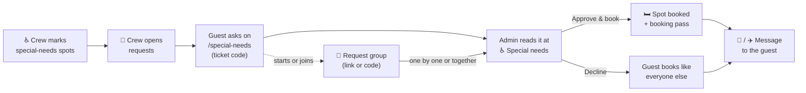
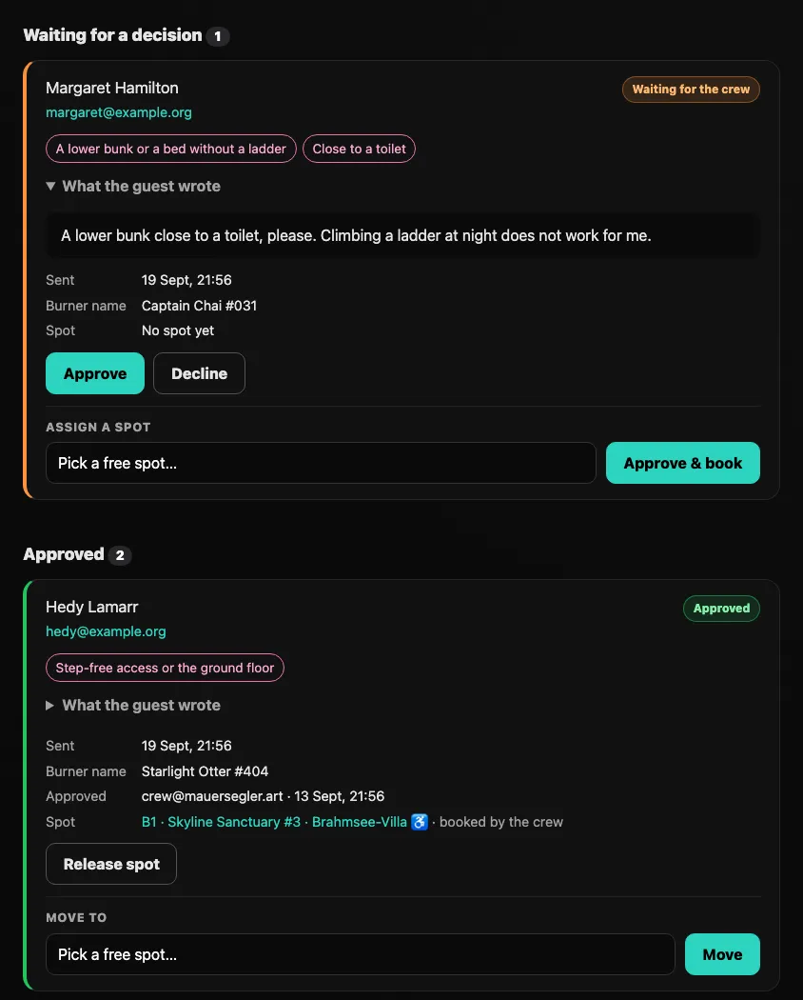

# Special-needs requests

Some guests need a particular kind of spot: a lower bunk, step-free access, a place close to a toilet, a quiet room, or something else. Art projects, workshops, theme camps and crews may want a room of their own or spots close together. All of them **ask the crew with their ticket code, even before booking opens**, with the same form, on their own or **as a group**. Admins read each request, approve or decline it, and **book a spot for the guest** — the only way a spot gets booked while booking is closed, and the only way anyone gets a ♿ spot.

## At a glance

```mermaid
flowchart LR
  mark["♿ Crew marks<br/>special-needs spots"] --> open["🧡 Crew opens<br/>requests"]
  open --> ask["Guest asks on<br/>/special-needs<br/>(ticket code)"]
  ask -.->|starts or joins| group["👥 Request group<br/>(link or code)"]
  ask --> review["Admin reads it at<br/>♿ Special needs"]
  group -->|one by one or together| review
  review -->|Approve & book| booked["🛏️ Spot booked<br/>+ booking pass"]
  review -->|Decline| declined["Guest books like<br/>everyone else"]
  booked --> msg["📧 / ✈️ Message<br/>to the guest"]
  declined --> msg
```

## 1. Mark special-needs spots

On a room page, <kbd>♿ SPECIAL</kbd> marks a spot as a special-needs spot; <kbd>♿ NORMAL</kbd> turns it back into a normal one. Works in Staging Mode, during Live Booking and after booking closed.

- **Nobody books it on the guest pages**, not even admins signed in with a ticket code. Guests see it like a locked spot, as *Blocked by admin* (violet, with *Not available* under it), and never learn why; a booking sent anyway is refused by the server (*This spot is not available.*). Once a guest has it, it shows as an ordinary occupied spot with their burner name: nobody can tell who has special needs.
- **Only the crew books it**, here on the requests page: for one request, or for the members of a group. That is the difference to 🔒 *locked*: an admin with a ticket code can still book a locked spot on the room page, never a ♿ one.
- **It never counts as free**, like a locked spot.
- **It comes first** in the spot list of a request that asks for something the guest needs; for a request that is only about a project or a group it comes last (see [Decide and book](#_3-decide-and-book)).
- **Templates keep it** (`"is_special": true` on the spot, see [Layout templates](./templates#file-format)).

Mark the spots before booking opens. Special-needs spots that nobody needs at the end: switch them back to <kbd>♿ NORMAL</kbd> one by one, and guests can book them. The feature *♿ Wheelchair accessible* of a house or room is something else: it describes the place for guests and keeps no spot free.

**♿ Special-needs spots** — the box right above the requests on ♿ **Special needs** — shows what became of the marked spots, e.g. *2 free · 3 booked through requests · 1 booked otherwise · 1 blocked with TAKEN* (parts with nothing in them are left out, except *free*). <kbd>Show all 7</kbd> lists every marked spot with a link to its room page and its state:

| State | Means | What to do |
| --- | --- | --- |
| *free* (*free 🔒* when also locked) | Offered for requests. | – |
| *booked for … through their request* | The crew booked it for that guest's request. | – |
| *booked by …, not through a request — release it on the room page to offer it here* | A guest held it before it was marked ♿, or their request was withdrawn and the spot stayed as an ordinary booking. | Leave it, or release it on the room page. |
| *blocked with TAKEN — free it on the room page to offer it here* | Marked 🔄 TAKEN without a ticket. | Free it on the room page. |
| *inactive — activate it on the room page to offer it here* | Deactivated. | Activate it (Staging Mode). |

Only *free* spots are offered for requests. With nothing marked yet, the box says *No spot is marked ♿ yet. Mark spots with ♿ SPECIAL on the room pages: no guest can book them, and they are offered first here.*

::: tip Fill in the details first
Which spot fits which need comes from the layout: the **bed type** of a spot and the **features** of its room and house (see [Houses, rooms & spots](./camp-layout#house-details)). A lower bunk in a step-free room with toilets in the building is what a request asking for all three needs; stacked [bunk beds](./camp-layout#bunk-beds) mark their lower and upper level by themselves. Spots nobody described can still be assigned — the list just can't tell you what they answer. What a project asks for — a room of its own, spots close together — is yours to match: the [group planner](#groups) helps with that.
:::

## 2. Open requests

Requests have their **own switch**, independent of Staging Mode and Live Booking: <kbd>Open requests</kbd> / <kbd>Close requests</kbd> in the row *♿ Special-needs requests: OPEN / CLOSED* right under the [🎟 BOOKING WINDOW](./#booking-window) panel in the Control Center, or the same button on the requests page (*Requests from guests: OPEN*).

- **Open:** guests see a link on the map and can send a request, change it while it waits, and start or join a group. Before booking opens the link reads *♿ Special needs or a project? Ask the crew now*; during Live Booking and after it, it is the link *♿ Special-needs spot* in the top bar of every booking page.
- **Closed:** no new requests, no changes, and nobody starts or joins a group. Waiting requests stay; guests still see theirs (the map link then reads *♿ See your special-needs request* or *♿ My request*), can withdraw it and can leave their group. You still decide, book and take members out of groups.

Every switch goes to the crew group with the admin's e-mail address.

## 3. Decide and book

<kbd>♿ Special needs</kbd> in the admin menu, with the number of requests waiting for a decision. On top, the [♿ Special-needs spots](#_1-mark-special-needs-spots) box and the [groups](#groups); below them the requests, grouped into *Waiting for a decision*, *Approved* and *Declined*.

Each request shows:

- the **ticket holder** from the ticket list (name and e-mail address), when it was sent and changed;
- what the guest **ticked** and **wrote** (5 to 500 characters), and a burner name if they chose one. Something they need — a lower bunk or a bed without a ladder · step-free access or the ground floor · close to a toilet · a quiet room · something else — shows as a pink pill; a project wish — 🎨 a room just for our project or crew · 👥 spots close to the people I come with — as a neutral outlined one, because pink stays ♿ only. A guest who asks only as part of a group may tick nothing and write nothing: the card then says *👥 Group only: nothing of their own*. Requests sent before v0.30.0 can still show *A power socket for a medical device (old form)*: the form no longer offers it;
- the **group**, if the request is in one: the chip *👥 group name* jumps to the group's card;
- who **decided** and when, and the **spot** the ticket holds right now: *booked by the crew* (through this page) or *booked by the guest*.

If a guest sends the form again right when you decide, the card says so: read it once more. Cards are colour-coded: **waiting** orange, **approved** green, **declined** grey and dimmed. On decided cards, what the guest wrote is folded away under *What the guest wrote*.

The [guest list](./guests) shows for every ticket only *where* a request stands — ♿ *request waits for a decision*, *request approved*, *request declined*, and ♿ *assigned through a request* on the spot — with <kbd>Requests →</kbd> leading here. Reading and deciding happens on this page.

| Button | What happens |
| --- | --- |
| <kbd>Approve</kbd> | The request is approved. A guest without a spot hears that the crew picks one; a guest who booked a spot themselves hears they keep it until you book a more fitting one. |
| <kbd>Approve & book</kbd> · <kbd>Book</kbd> | Pick a free spot from the list and book it for the guest, right away, also in Staging Mode and after booking closed. For a request that asks for something the guest needs (or *something else*), the list starts with *♿ Special-needs spots (2 free)*, each marked ♿ (and 🔒 when locked), then *Other free spots*; for a request that is only about a project or a group, the ♿ spots come last, as *♿ Special-needs spots (kept for access needs)*. Deactivated spots never appear. Each spot says what it answers of **this** request — `B1 · Room 2 · Wälderhaus — ✓ a lower bunk or a bed without a ladder, ✓ step-free access or the ground floor` — and the best fits come first; `✗` marks a clear mismatch, like an upper bunk for someone who needs a lower one. An upper bunk is never *step-free access*, not even on the ground floor of a ♿ house — the ladder is a step — so it gets `✗` for that need as well. The project wishes, *something else* and the old *power socket* get neither `✓` nor `✗`: nothing in the layout answers them, so read what the guest wrote and pick by hand. A feature the crew switched off for one room or spot (*off here* in the [room editor](./camp-layout#room-details)) no longer counts for that spot either. When no ♿ spot is free, a line under the list says why: *♿ No special-needs spot is free right now: 3 marked — 1 booked by a guest, 1 blocked with TAKEN, 1 inactive. See “♿ Special-needs spots” above.* A waiting request is approved on the way. The guest gets a message with the spot and the booking pass. If the guest already holds a spot, the field reads **Move to** and the dialog *Move the guest?* says which spot becomes free. |
| <kbd>Move</kbd> | Books another spot for the guest; the old one becomes free. |
| <kbd>Release spot</kbd> | The spot becomes free again (a special-needs spot stays one); the request stays approved, so book another one. The guest gets a message. Also offered for a spot the guest booked themselves: the dialog warns that releasing takes it away from them. |
| <kbd>Decline</kbd> | The guest gets a message that the crew can't offer a special-needs spot: they keep a spot they booked themselves, or book like everyone else once booking opens. To decline a request whose spot you booked, release the spot first. |
| <kbd>⋯</kbd> → <kbd>Approve after all</kbd> | On a declined card only, deliberately out of the way (a declined card has no other buttons): the request is approved after all (the guest gets the *approved* message), and the spot list comes back so you can book one. |

With no free spot left, the list says *No free spot left. Free or add one in the room editor.*

### Groups

Guests who ask together share a **request group**: one of them starts it on the request form and shares its link or code, the others join with their own ticket code (see [Asking as a group](../guide/special-needs#asking-as-a-group)). Every member keeps their own request with its own status; the group itself has no status. Decide and book for the whole group on its card, or for each guest on their own card below — both work, and they mix.

The section **Groups 👥** sits above *Waiting for a decision*, one card per group:

- **The header:** *👥 name*, *4 of 12 · code ABCD-EF23 · started …*, and chips for what is in it: *2 waiting*, *1 approved*, *1 declined*, *1 booked by the crew*, ♿ *2 with something they need* (pink, only when someone ticked a need) and 🎨 *project* (when someone asked for a room or for spots together). The card's left edge is orange while someone waits, green when someone is approved and nobody waits, grey otherwise.
- **The members:** the name from the ticket list (or *Ticket without a name*) · 🔥 the burner name, the status, the spot (*booked by the crew* or *booked by the guest*) or *No spot yet*, <kbd>Details ↓</kbd> to the member's own card, and <kbd>⋯</kbd> → <kbd>Take out of group</kbd>.

| Button | What happens |
| --- | --- |
| <kbd>Approve all waiting (2)</kbd> | Every waiting member is approved; each guest gets their own *approved* message. Members you already decided stay as they are. Then book their spots in the planner, or one by one. |
| <kbd>Decline group</kbd> | Every waiting member, and every approved one without a spot the crew booked, is declined; each guest gets the *declined* message. Members whose spot the crew booked stay approved and are counted in the dialog: release their spot first. |
| <kbd>Book 4 spots</kbd> | Books the spots picked in the planner (below). |
| <kbd>⋯</kbd> → <kbd>Take out of group</kbd> | The request stays as it is, without the group. The guest sees that on their request page and gets no message. Their ticket can't join this group again, not even with its code — also not after withdrawing and sending a new request: the form says *You can't join this group. Please contact the crew.* |

Each button asks first, and the group buttons only touch open requests. **Book spots for the group** is the planner at the bottom of the card:

- **Where:** lists the places the group could sleep: *Anywhere: the best free spot for each*, then the rooms that fit everyone, the snuggest first (`Room 2 · Wälderhaus — 6 free (♿ 2) · fits all 5`), then whole houses (`Wälderhaus, whole house — …`), then the rest, the roomiest first (`· too small`). A place that only fits everyone by giving ♿ spots to members who need nothing comes after the places that fit without, marked `· uses ♿`, so the first choice spares the ♿ spots when it can. Picking one fills in a proposal: members with something they need choose first, each gets the best fitting free spot there, a ♿ spot goes to a member who needs something and is avoided for the others, and in a house the group fills as few rooms as it can. The choice needs JavaScript; without it the page shows the proposal for the first place that fits everyone (or *Anywhere*).
- **One row per member** with the same spot list as on the single cards, starting with *Keep as is*. Change any row by hand. A member whose spot the crew already booked shows *Keep … (booked by the crew)* and stays there unless you pick another spot; a declined member shows *Declined — not booked.* When everyone not declined already has a spot the crew booked, the planner says so and has no button.
- <kbd>Book 4 spots</kbd> (the number of rows with a spot) asks *Book 4 spots for the group?* and lists who gets which spot, how many move from a spot they booked themselves and how many waiting requests are approved on the way; it says so when booking is closed. Each guest gets their own message with the booking pass. Rows left on *Keep as is* don't change.

Before anything is booked, the server checks every picked spot once more. A spot taken meanwhile, two members on one spot, a member who left the group or a declined member stop the whole booking, and nothing is booked (see [When something doesn't work](#when-something-doesn-t-work)). Then it books member by member, like <kbd>Book</kbd> on each card, so those spots are fixed like any spot the crew booked. If one fails on the way — a request withdrawn, a spot taken in the very last second — the others stay booked and a warning says *3 of 4 spots booked. Not booked: …* with the name and the reason: book the rest on their own cards.

### What the open requests need

Above the requests, a box compares what the waiting requests (and approved ones without a spot) ticked with the free spots that fit:

> **What the open requests need**
> ♿ Special-needs spots — 3 free for 5 open requests with something they need ⚠️ not enough
> A lower bunk or a bed without a ladder — 4 asked · 6 free spots fit
> Step-free access or the ground floor — 2 asked · 1 free spot fits ⚠️ not enough

The first line counts the free ♿ spots against the open requests that ticked something they need or *something else*; requests that are only about a project or a group don't count. ⚠️ means the camp has fewer fitting spots than requests: free one, mark more spots ♿, or fill in missing details in the room editor. The project wishes, *something else* and the old *power socket* get no line of their own — only a person can answer those. The per-need lines only see what the crew described, so a camp without details shows none of them.

Every decision and booking is in the audit log and goes to the crew group — **without the guest's name, what they wrote, the group's name or its code**. A group step is one line with counts, like *✅ Request group approved by …: 4 request(s)*; a new request that started or joined a group says so in its line. Joining or leaving with a request that already exists is not reported. All lines: [Crew group](./notifications#crew-group).

## What guests get

| When | Message (e-mail and, if connected, Telegram) |
| --- | --- |
| The request arrives | **We got your special-needs request**, with a link to see, change or withdraw it |
| Approved, no spot yet | **Your special-needs request was approved** — the crew picks a spot (or: they keep the spot they booked until you book a better one) |
| Approved and booked | **Your special-needs spot:** house, room, spot and the [booking pass](./passes), when approval and booking go out together. A spot you book after the *approved* message went out comes as **Your CozyNights spot:**, with the line *The crew picked this spot for you, so please contact the crew to change it.* |
| Declined | **About your special-needs request** — book like everyone else when booking opens |

Messages say what the crew decided, never what the guest wrote. A project request gets the same messages. Groups bring no messages of their own: a group step writes each member's own request, so each guest gets the message above about their own request, never about anyone else in the group. Starting or joining with an existing request, leaving, and being taken out of a group send nothing. On `/special-needs` the guest sees the status, what they sent, the spot and the pass, their group, and can connect Telegram. The wording of every message can be changed on <kbd>✉️ Messages</kbd> (see [Message texts](./notifications#message-texts)).

## Rules the app keeps

- **One request per ticket**, taken from the guest's signed-in ticket code, never from the form. The database refuses a second one. **A ticket is in at most one group**: to switch, the guest leaves theirs first.
- **A guest can change a request while it waits** and requests are open, and **withdraw it at any time**. Once you decided, the request is fixed: a guest who sends the form again reads *The crew has already decided on your request, so it can't be changed anymore. If something changed, please contact the crew.* and sees your decision. Withdrawing deletes it (and takes the guest out of their group); a spot the crew already booked stays booked, but from then on it is an ordinary booking (the guest can change it, and clear all bookings frees it). The crew group hears about every withdrawal.
- **At most 12 people in a group.** The 13th reads *This group is full: a group can have at most 12 people. Please contact the crew.*
- **Starting or joining a group** only works while requests are open, with a new request or one that still waits for a decision. A guest whose request you already decided can't join a group anymore; the invite tells them to contact the crew.
- **Joiners may tick nothing and write nothing**, since the one who started the group described it; a joiner who ticks a need still writes a few words. Whoever starts a group fills in the form like anyone asking alone.
- **Leaving works at any time**, also while requests are closed, like withdrawing. A request with nothing ticked is deleted when the guest leaves (a spot the crew booked stays as an ordinary booking); one with needs of its own stays as it is, with its status and spot.
- **A group without members is gone.** PocketBase deletes a group as soon as its last request leaves it, whichever way: leaving, withdrawing, a hand-over, a deleted ticket, `forget-contacts`. A deleted group can't come back; someone starts a new one.
- **Ten sends per hour.** A ticket can send or change its request at most ten times within an hour; after that the form says *You sent your request 10 times within an hour. Please wait a while, then try again.* On top of that, **five wrong group codes** within 15 minutes pause joining: *Too many wrong group codes. Please wait 15 minutes, then try again.*
- **Consent is given with every send.** The checkbox is unticked each time the form opens, and the stored consent time is the time of the last send.
- **A spot the crew booked is fixed.** The guest can give it a new burner name during Live Booking, but can't move or release it themselves: they ask the crew. You move or release it here. A spot the guest booked themselves stays theirs to change, also when the request is approved.
- **The burner name from the request** is used for the spot you book, unless the ticket already has one.
- **Going back to Staging Mode (and Clear all bookings) keeps the spots the crew booked**, with their burner names; every other booking is released. The dialog says how many.
- **A template import keeps the spots the crew booked**, like every other booking, as long as the spot stays in the layout (also when its house moves or its room is renamed). Only spots you choose to remove release their booking, crew-booked ones too: the guest gets a *spot was released* e-mail and the burner name is forgotten. Those requests stay approved and show *No spot yet*: book a spot again for them after the import. The confirmation dialog says how many bookings go before anything happens (see [Layout templates](./templates#applying)).

## Privacy

What guests write is often **health data**. The app treats it that way; please do too. A project request isn't, but outside this page the app doesn't tell the two apart: both are stored the same way, encrypted, and padded to one length, so not even the size of the stored text says which kind a request is.

- **Only admins can read it**, here and nowhere else: the [guest list](./guests) and the bookings list show at most that a request exists and how it was decided, never what was written. What guests tick and write is stored encrypted, so the PocketBase dashboard and backups only hold unreadable text. The pages are sent with `Cache-Control: no-store`.
- **It never leaves the admin area:** not in e-mails, Telegram messages, the crew group, logs or the audit log. Neither do group names and codes.
- **Don't copy it** into chats, e-mails or spreadsheets. Talk about a request in person, and decide based on what the guest needs, not why.
- **Group members see the group, not each other's requests.** A member sees the group's name, *n of 12* and the burner names of everyone in it (the burner name from the request, else *A fellow burner*) — never tickets, e-mail addresses, names from the ticket list, what anyone ticked or wrote, a status or decision, or a spot. Everyone is listed whatever their status, so a decline can't be read off the list; a booked spot only shows the way every booked spot does, with its burner name on the room page. A guest who types a code learns nothing about the group before sending the form. The group's name is stored encrypted; its code — 8 characters from the booking pass alphabet, shown like `ABCD-EF23` — and who is in which group are stored plainly, like a pass code: social ties, not health data, and the privacy policy says so.
- **A code got around?** Anyone with it can join while requests are open, and the members then see a burner name they don't know. Take the stranger out with <kbd>⋯</kbd> → <kbd>Take out of group</kbd>: their ticket can't join this group again, and you decide their request like any other. A group's code can't be changed.
- **Guests give explicit consent** with a checkbox when they send a request (Art. 9(2)(a) GDPR); the time is stored. The same checkbox covers what a group shows its members (Art. 6(1)(a) GDPR). The privacy policy (`/privacy#special-needs`, section *Special-needs requests and groups*) explains it; see [Legal pages](./legal). The checkbox reads: *I agree that the CozyNights crew uses what I write here to find a fitting spot for me. It may include information about my health. Only the crew's admins can read it; it is stored encrypted and deleted after the event at the latest. If I start or join a group, everyone in it sees the group's name and my burner name, never what I ticked or wrote. I can leave the group and withdraw my request on this page at any time. Details: privacy policy.* (the link opens the policy's section). Keep the text, the policy and this page in step.
- **A ticket passed on** to a new holder loses its request the same way, and with it its place in a group, when you hand it over on the [Tickets](./tickets) page (🔁 *Ticket passed on to someone else*, or 🔁 *New holder* in the ticket list review); a spot the crew booked stays with the ticket as an ordinary booking. The server's `tickets import` refuses a changed address on such a ticket unless it is run with `--hand-over`, which deletes the request the same way.
- **It is deleted after the event** together with the contact data: `./scripts/cozy-admin.sh tickets forget-contacts --yes` also deletes every request and every request group. See [After the event](./notifications#after-the-event).

## When something doesn't work

| What you see | Why | What to do |
| --- | --- | --- |
| Guests see no link on the map | Requests are closed. | Open them (Control Center or requests page). |
| *Requests are closed right now* for a guest | The switch is off. | Open requests, or book a spot for them another way. |
| *This spot is already claimed. Pick another spot.* | Someone was faster, or the list was old. | Reload the page and pick another spot. |
| *This request does not exist anymore* | The guest withdrew it meanwhile. | Reload the page. |
| *The guest withdrew the request meanwhile. The spot is booked for the ticket anyway; release it on the room page if it should be free.* | The guest withdrew while you were booking. | The ticket keeps the spot as an ordinary booking. Release it on the room page if it should be free. |
| *This request is declined. Approve it first, then assign a spot.* | Another admin declined the request while you were booking. | Reload the page; on the declined card, <kbd>⋯</kbd> → <kbd>Approve after all</kbd>, then <kbd>Book</kbd>. |
| *This spot is not available. Pick another spot.* · *This spot doesn't exist anymore. Reload the page.* | The spot was deactivated or deleted meanwhile. | Reload the page and pick another spot. |
| A ♿ spot is missing from the list, or *♿ No special-needs spot is free right now: …* | The spot is booked, blocked with 🔄 TAKEN or inactive; the line under the list says how many of each. | Open *♿ Special-needs spots* → <kbd>Show all</kbd>, follow the link to the room and free, release or activate the spot. |
| An admin with a ticket can't book a ♿ spot on the room page | ♿ spots are only booked through requests, by the crew. | Book it here for an approved request, or switch it to <kbd>♿ NORMAL</kbd>. |
| *… is not free anymore, so nothing was booked. Reload the page and pick again.* · *A picked spot doesn't exist anymore, so nothing was booked. …* | A spot in the group planner was taken, deactivated or deleted after the page loaded. | Reload the page and pick again; nothing was booked. |
| *Two members got the same spot. Pick a different one for each.* | Two rows of the planner have the same spot. | Change one of them. |
| *Someone left the group meanwhile, so nothing was booked. Reload the page.* | A member left or was taken out while you planned. | Reload the page. |
| *…'s request is declined: approve it first, or leave their spot on Keep as is.* | A declined member has a spot picked in the planner. | Set their row to *Keep as is*, or approve them after all on their own card. |
| *Nothing to change: no request in this group waits for this. Reload the page.* | Another admin decided the group's requests meanwhile. | Reload the page. |
| Warning *3 of 4 spots booked. Not booked: …* | One member's booking failed on the way, for the reason given; the others are booked. | Book the rest on their own cards. |
| A guest says their group code doesn't work | *No group has this code*: a typo, or the group was deleted when its last member left. *This group doesn't exist anymore*: it went while they were joining. *This group is full*: 12 are in it. *Too many wrong group codes*: five misses within 15 minutes. *You can't join this group*: the crew took this ticket out of the group. | Compare it with the code on the group's card (upper or lower case, spaces and dashes don't matter). A deleted group can't come back: someone starts a new one. For a full group, take someone out or let them start a second group. A ticket taken out stays out of that group; it can start a group of its own. |
| A guest reports *You sent your request 10 times within an hour…* | The form's limit. | Nothing to do: it works again within the hour. |
| *(nothing readable)* instead of the text | The server's encryption key changed since the request was sent. | Ask the guest to send the request again. |
| *Nothing written: they asked as part of a group.* instead of the text | A group member who ticked nothing and wrote nothing of their own: joining a group needs neither. | Nothing to do. |
| The guest got no message | No e-mail address on the ticket, and no Telegram connected. | Check the ticket with `tickets list`; see [Notifications](./notifications#when-something-doesn-t-arrive). |
