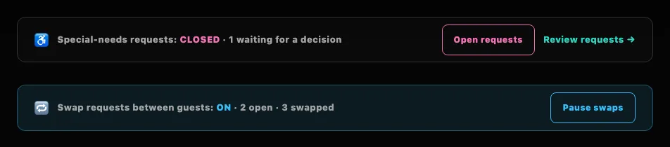
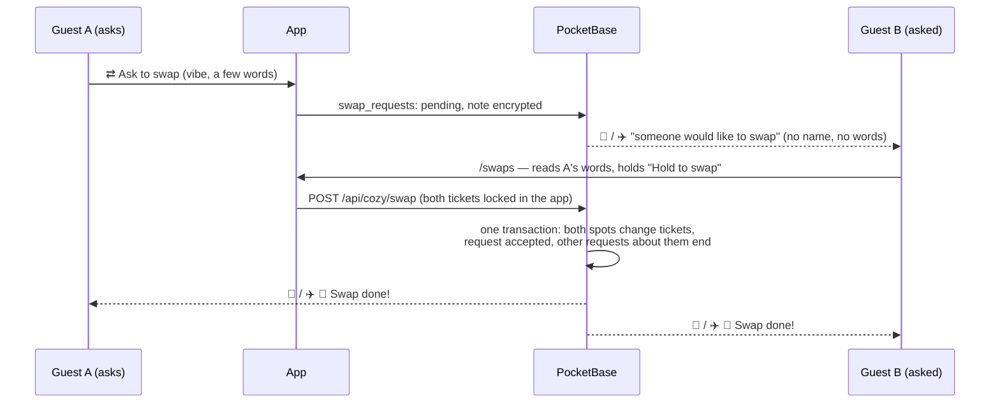

# Swap requests

During **Live Booking** guests can ask each other to swap spots: a guest who holds a spot taps a taken one, sends its guest a request with a vibe and a few words, and the other guest says yes or no on **Swap requests** (`/swaps`). A yes swaps both spots in one step. The crew doesn't have to do anything — this page is about what happens, the one switch you have, and what to answer when guests ask. How it looks for guests: [Swapping spots](../guide/swaps).

## What the crew has

**The switch.** The Control Center has a line under the ♿ switch: **🔁 Swap requests between guests: ON · 3 open · 12 swapped**, with <kbd>Pause swaps</kbd>. Any approved admin can flip it; it only pauses, nothing is lost:

| Switch | Guests |
| --- | --- |
| **ON** (the default) | During Live Booking every taken spot offers *⇄ Ask to swap*, and requests can be answered. Outside Live Booking nothing can be asked or accepted anyway (*ON IN LIVE BOOKING*). |
| **PAUSED** | No new requests, no yes. Waiting requests stay and keep running out; guests read *The crew paused swaps for a moment.* Use it if something goes wrong — spam, a bug, a layout change in the middle of Live Booking. |

Every flip goes to the crew chat: *🔁 Swap requests turned OFF by …* / *turned on again by …*.

**The numbers.** *open* are requests waiting for an answer, *swapped* the swaps that went through. That is all the crew sees on purpose: who asked whom and what they wrote stays between the two guests (see [Privacy](#privacy)). The spots themselves show the result like any booking: [Bookings & check-ins](./bookings) and the room pages name the guest who holds a spot now.

**The messages.** Their wording is on [Messages](./notifications#message-texts), in the groups *E-mail · swap requests* and *Telegram · swap requests*.

## How a swap works

- The asker needs a spot, and both spots must be ones guests could book themselves: not 🔒 locked, not ♿ special, not deactivated, not the spot the crew booked for a [special-needs request](./special-needs), not checked in.
- Up to **3 open requests** per ticket, each open for **72 hours** (or until booking closes), at most 10 new ones a day. A no is final for that pair and spot.
- The swap is one database transaction with its own last checks (both spots still held by the same two tickets, booking live, swaps on). The burner names belong to the tickets and travel along; booking passes keep their codes and show the new spot; wallet passes update; `booked_at` is stamped anew for both spots.
- A yes ends every other open request about either spot or either ticket (*Another swap went through first*).

## When the crew changes things

| Crew action | What happens to swap requests |
| --- | --- |
| Moves or releases a guest, books a ♿ spot for them | Requests that offered or asked for the old spot end: the asker reads *Your spot changed* or *That spot changed hands*. |
| Checks a guest in | Their spot can't be swapped any more: their own requests end (*Your spot can't be swapped any more*), requests to them drop off their page and run out. |
| Locks a spot someone holds | Like a check-in, for that spot. |
| Back to Staging, Closed | Nobody can ask or say yes. Waiting requests run out; released spots end their requests. |
| Hands a ticket over ([Tickets](./tickets)) | Every request by or to that ticket is deleted with what was written, and the pause is reset: the new holder starts fresh. |
| `cozy-admin tickets forget-contacts --yes` after the event | Deletes every swap request ([Event checklist](./event-checklist)). |

## Privacy

Guests' words to each other may say why they want to move ("my knees…"). So:

- The note is **encrypted** (like burner names) and decrypted only for the two guests' own pages. It is never in an e-mail, a Telegram message, the crew chat, the log or the audit log, and no admin page shows it.
- **Every taken spot offers a swap.** If the "Ask to swap" button were missing on some, a guest could tell which spots are ♿ special-needs or crew spots. Instead, a request for a spot that can't be swapped — or to a guest who paused requests — is stored as **quiet**: it is never shown or sent to that guest and simply runs out after 72 hours. The asker sees *Waiting for an answer*, then *No answer — it ran out*, exactly like for a guest who doesn't answer. A yes that fails because the asker's own spot became special meanwhile says only *This swap isn't possible any more*, never which spot or why.
- Guests see each other's burner names and spots, as on the room pages. Ticket codes, names from the ticket list and e-mail addresses never reach the other guest.

## When guests ask

| Question | Answer |
| --- | --- |
| *"I asked days ago and never heard back."* | Requests run out after 72 hours without an answer. Some guests don't answer, some paused requests, and some spots can't be swapped — the app doesn't say which, on purpose. Ask for another spot. |
| *"Why can't I ask anyone?"* | They need a spot of their own, booking must be live and swaps on, and their own spot must be swappable (not checked in, not picked or set aside by the crew — their room page says so). |
| *"The swap button does nothing / it says it isn't possible any more."* | One of the two spots changed hands meanwhile, or booking closed. Reload **Swap requests**. |
| *"Someone keeps asking me."* | <kbd>No thanks</kbd> is final for that spot, and **Pause swap requests to me** stops new ones. A guest can send at most 10 requests a day. |
| *"Someone wrote something nasty."* | The crew can't read notes. Take the complaint as it comes, and pause swaps if needed. |

## Under the hood

Collection `swap_requests`, the app setting `swaps_off` and the ticket field `no_swap_requests`: [Data model](../reference/data-model#swap-requests). The service is `src/lib/server/swaps.ts`, the swap itself `pb_hooks/lib/swap.js` (`POST /api/cozy/swap`), the messages `deliverSwaps` in `pb_hooks/lib/notify.js`.
