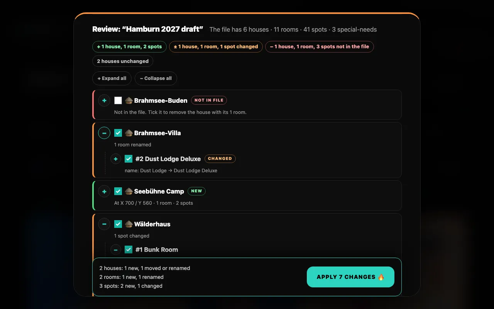
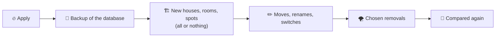

# Layout templates

A template is the camp layout in one JSON file: every house with its position on the map, every room and every spot. Use it as a backup before big changes, to move a layout between installations, or to set up the camp for the next burn.

Open the **Burn Template Manager** with <kbd>TEMPLATES 💾</kbd> in the Control Center header.



## Export <Badge type="tip" text="all admins" />

Press <kbd>DOWNLOAD JSON 💾</kbd>. Your browser saves `cozynights-layout-YYYY-MM-DD.json`.

- Works in every phase: Staging, Live Booking and after booking closed (see [Staging, Live & Closed](../guide/phases#who-can-do-what)).
- Contains **structure only**: no bookings, no ticket codes, no burner names.
- If the camp has something an import would refuse (two houses with the same name, for example), the manager says so right after the download.
- **How to build a starting layout** (unfold it under the button) explains the routine: build the camp in Staging Mode, download it, keep the file safe, and next time drop it on *Compare & Import*. <kbd>Download example template</kbd> there gives you `brahmsee-starter.json`, a small worked example for the Brahmsee site.

## Compare & import

Drop a layout file on <kbd>Compare & Import</kbd>, or tap the field to choose one. CozyNights compares it with the camp right away and shows every difference; nothing changes until you apply.

| Who | Compare | Apply |
| --- | --- | --- |
| Admins | ✓ in every phase | ✗ |
| Superusers | ✓ in every phase | ✓ in Staging Mode only (the layout is locked during Live Booking and after booking closed) |

### How the file is matched

| In the file | Is the same as in the camp when … |
| --- | --- |
| House | the **name** is the same (upper and lower case don't matter) |
| Room | it has the same **room number** in that house |
| Spot | it has the same **label** in that room (upper and lower case don't matter) |

So a house that was renamed shows up twice: as a new house and as a house that is not in the file. Positions, room names, the spot switches (active, locked, special needs ♿) and the **details** of a place (kind, features, description, bed type) are compared.

### The review

The review names the file and counts what is in it (houses, rooms, spots and special-needs spots); chips below sum up what is new, changed and not in the file. The differences are listed as a tree of houses ▸ rooms ▸ spots. Unfold a house or room with <kbd>+</kbd>, fold it with <kbd>−</kbd>, or use <kbd>+ Expand all</kbd>. Unchanged houses are only named at the end.

| Badge | Meaning | Ticked at the start |
| --- | --- | --- |
| **NEW** | In the file, not in the camp | ✓ |
| **CHANGED** | Moved, renamed, or a switch or detail differs (the line says what: `position: 425 / 150 → 455 / 150`, `special needs: off → on`, `bed: Upper bunk → Lower bunk`, `features: Heated → Heated · Quiet zone`, `description: — → Showers in the wash…`) | ✓ |
| **NOT IN FILE** | In the camp, not in the file. ⚠️ marks spots that are booked. | ✗ |

Tick or untick anything. A house's checkbox covers everything inside it; a half-filled box means only part of it is chosen. Two rules keep the choice consistent:

- A new room or spot needs its house or room: choosing it chooses a new house along with it.
- Removing a house or room removes everything inside. Keep one spot, and its room and house stay too.

The bar at the bottom sums up what will happen, including how many bookings would be released, and applies it with <kbd>APPLY n CHANGES 🔥</kbd>.

### Applying



- **Bookings stay** on every spot that is not removed, also on moved houses and renamed rooms.
- **Removing booked spots** releases those bookings. The guests get a *spot was released* e-mail, their burner names are forgotten, and their ticket codes stay valid. You confirm this in a dialog first; without removals, applying needs no extra click.
- **A backup comes first.** Its name is shown afterwards (`pre-import-….zip`); a superuser can restore it in the PocketBase dashboard under Settings → Backups. The ten newest of these backups are kept, older ones are removed. If the backup fails, nothing happens and you may choose to apply without one.
- **One import at a time.** While another import runs, applying is refused with *Another import is running right now. Wait until it has finished, then check the layout before you import again.*
- **New parts are created all or nothing:** if the database refuses one, everything created so far is removed again and the camp is unchanged. Changes and removals that fail afterwards are listed; the rest stays applied.
- **Afterwards the file is compared again,** so you see what is left, for example the houses you chose to keep.

The crew group gets a *🗺️ Layout template applied* message with what changed (see [Notifications](./notifications#crew-group)).

## File format

```json [cozynights-layout-2026-09-21.json]
{
	"format": "cozynights-layout",
	"version": "2.1",
	"name": "CozyNights camp layout",
	"exported_at": "2026-09-21T15:04:05.000Z",
	"map": { "image": "/lageplan-brahmsee-2026.jpg", "width": 1000, "height": 700 },
	"houses": [
		{
			"name": "Neon Cave",
			"x": 412,
			"y": 268,
			"kind": "house",
			"features": ["toilets_inside", "heated"],
			"description": "Stone house by the lake.",
			"rooms": [
				{
					"name": "Bunk Room",
					"room_number": 1,
					"kind": "room",
					"features": ["ground_floor", "power"],
					"beds": [
						{ "label": "B1", "enabled": true, "is_locked": false, "bed_type": "bunk_lower" },
						{ "label": "B2", "enabled": true, "is_locked": true, "bed_type": "bunk_upper" },
						{ "label": "B3", "enabled": false, "is_locked": false }
					]
				}
			]
		}
	]
}
```

| Field | Meaning |
| --- | --- |
| `houses[]` | **Required**, at least one house. |
| `name`, `x`, `y` | House name (unique) and pin position. The map is 1000 × 700 units, `0/0` is the top-left corner. |
| `kind` | What the place is. House: `house`, `hut_group`, `tent_area`, `other`. Room: `room`, `hut`, `tent`, `other`. Optional. |
| `features` | What is true there, as a list. House: `wheelchair`, `ground_floor`, `toilets_inside`, `heated`, `unheated`, `quiet`. Room: `wheelchair`, `ground_floor`, `own_bathroom`, `heated`, `unheated`, `quiet`, `power`. Spot: `power`. `heated` and `unheated` can't both be set. Optional. |
| `description` | Up to 500 characters, shown to guests. Optional. |
| `rooms[]` | `name` and `room_number` (unique in the house; missing numbers are filled in). |
| `beds[]` | Spots: `label` (unique in the room), `enabled` (active, default `true`), `is_locked` (default `false`), `"is_special": true` for a [special-needs spot](./special-needs), `bed_type` (`single`, `bunk_lower`, `bunk_upper`, `double`, `sofa`, `mattress`, `camp_bed`) and `features`. Everything but the label is optional. |

A detail nobody filled in is **left out** of the file, so a layout without details exports exactly as it did before. Files of version `2.0` and `1.0` (older exports, spots only as `amount_beds`) are still read; their places simply carry no details. `name`, `exported_at` and `map` describe the file: `map.image` is the map picture the layout was made for, and a file made for another year's picture imports with a warning to check the pins.

::: tip Hand-editing templates
Templates are plain JSON, so a layout can be prepared in a text editor: copy a house block, change name and coordinates, drop the file on Compare & Import. The whole file is checked first. If anything is wrong, the manager lists every problem with its place in the file (`houses[2] "Neon Cave" > rooms[0]: room_number …`) and nothing changes.
:::
