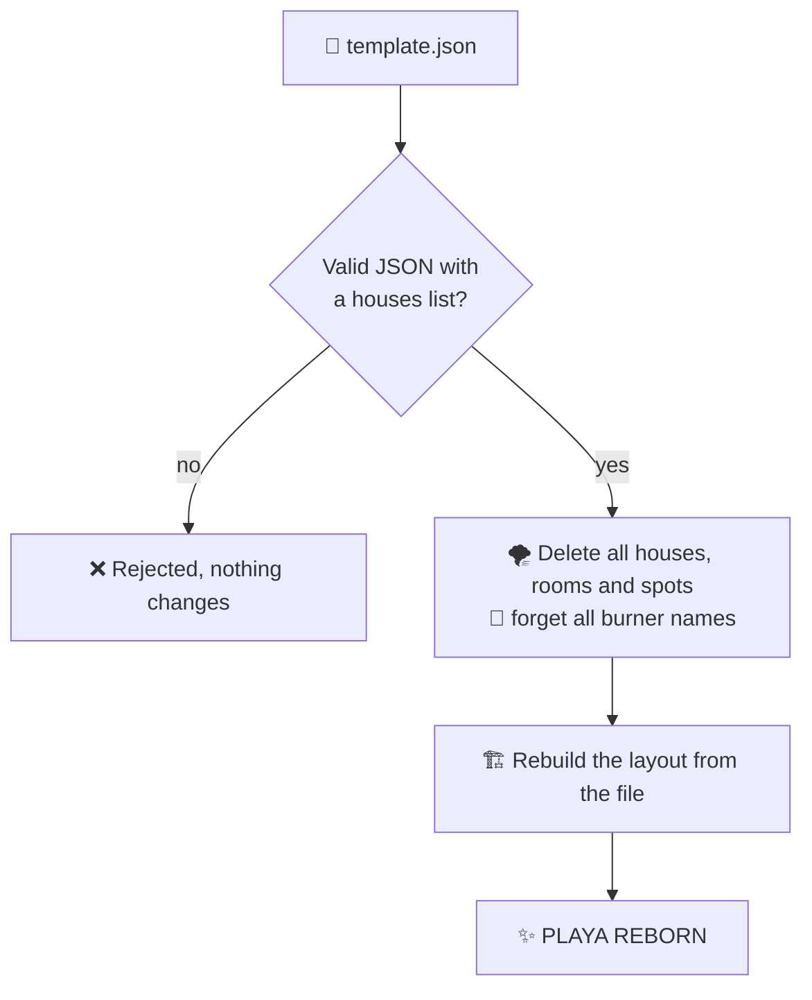

# Layout templates

A template is the whole camp layout in one JSON file: every house with its position, every room and every spot. Use it as a backup before big changes, to move a layout between installations, or to rebuild the camp for the next burn in seconds.

Open the **Burn Template Manager** with <kbd>TEMPLATES 💾</kbd> in the Control Center header.


## Export <Badge type="tip" text="all admins" />

Press <kbd>DOWNLOAD JSON 💾</kbd>. Your browser saves `burn-template-YYYY-MM-DD.json`.

- Works in both phases, also during Live Booking.
- Contains **structure only**: no bookings, no ticket codes, no burner names.

## Import <Badge type="danger" text="superuser · staging only" />

Choose a file with <kbd>CHOOSE TEMPLATE FILE</kbd>, then press <kbd>APPLY TEMPLATE 🔥</kbd> and confirm.



> [!CAUTION] Import replaces everything
> The current layout is deleted and every booking disappears with it. **Ticket codes survive**, so guests can book again in the new layout once booking opens. Export the current layout first if you might want it back.

Importing is refused during Live Booking and for regular admins; they see the import card with a lock 🔒.

## File format

```json [burn-template-2026-09-17.json]
{
	"name": "Burn Location Template",
	"exported_at": "2026-09-17T15:04:05.000Z",
	"version": "1.0",
	"houses": [
		{
			"name": "Neon Cave",
			"x": 412,
			"y": 268,
			"rooms": [
				{
					"name": "Bunk Room",
					"room_number": 1,
					"amount_beds": 3,
					"beds": [
						{ "label": "B1", "enabled": true, "is_locked": false },
						{ "label": "B2", "enabled": true, "is_locked": true },
						{ "label": "B3", "enabled": false, "is_locked": false }
					]
				}
			]
		}
	]
}
```

| Field | Meaning |
| --- | --- |
| `houses[]` | **Required.** Everything else is optional. |
| `name`, `x`, `y` | House name and pin position. The map is 1000 × 700 units, `0/0` is the top-left corner. |
| `rooms[]` | Rooms of the house: `name`, `room_number`, `amount_beds`. |
| `beds[]` | Spots of the room: `label`, `enabled` (active), `is_locked`. |

> [!NOTE]
> Only spots listed in `beds` are created. `amount_beds` is stored as information but does not create spots on import. `name`, `exported_at` and `version` describe the file and are not imported.

::: warning Hand-editing templates
Templates are plain JSON, so you can prepare a layout in a text editor: copy a house block, adjust names and coordinates, import. Houses and rooms need a `name`.

A file that isn't valid JSON or has no `houses` list is rejected before anything changes. But if a single entry inside is broken, for example a room without a name, the import stops halfway, **after** the old layout was deleted. Keep the last good export at hand and import it again to recover.
:::
