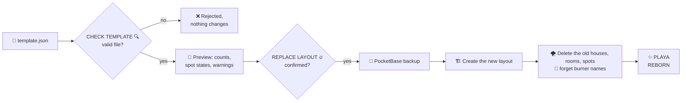

# Layout templates

A template is the whole camp layout in one JSON file: every house with its position, every room and every spot. Use it as a backup before big changes, to move a layout between installations, or to rebuild the camp for the next burn in seconds.

Open the **Burn Template Manager** with <kbd>TEMPLATES 💾</kbd> in the Control Center header.


## Export <Badge type="tip" text="all admins" />

Press <kbd>DOWNLOAD JSON 💾</kbd>. Your browser saves `burn-template-YYYY-MM-DD.json`.

- Works in both phases, also during Live Booking.
- Contains **structure only**: no bookings, no ticket codes, no burner names.

## Import <Badge type="danger" text="superuser · staging only" />

Choose a file with <kbd>CHOOSE TEMPLATE FILE</kbd> and press <kbd>CHECK TEMPLATE 🔍</kbd>. Nothing changes yet: the preview lists the houses, rooms and spots in the file, how many spots are active, locked or deactivated, and any warnings. Then <kbd>REPLACE LAYOUT 🔥</kbd> asks once more (_Replace the whole layout?_) and rebuilds the camp.



> [!CAUTION] Import replaces everything
> The current layout is deleted and every booking disappears with it. **Ticket codes survive**, so guests can book again in the new layout once booking opens. Before anything is deleted the app takes a PocketBase backup (the last ten are kept; an operator restores one in the PocketBase dashboard under _Settings → Backups_). If that backup can't be written, the import stops and offers to go on without one.

The new layout is created first and the old one removed only afterwards. If creating it fails halfway, the new records are removed again and the message says how many are stuck, so nothing is half-built without you knowing. Importing is refused during Live Booking and for regular admins; they see the import card with a lock 🔒.

### Starting from scratch

For a new installation the Template Manager shows _How to build a starting layout_: download the example `brahmsee-starter.json`, adjust names and positions in a text editor, check and import it, then fine-tune on the map. The example is the Brahmsee layout with the houses in place and no bookings.

## File format

```json [burn-template-2026-09-17.json]
{
	"format": "cozynights-layout",
	"version": "2.0",
	"name": "Burn Location Template",
	"exported_at": "2026-09-17T15:04:05.000Z",
	"map": { "image": "/lageplan-brahmsee.jpg", "width": 1000, "height": 700 },
	"houses": [
		{
			"name": "Neon Cave",
			"x": 412,
			"y": 268,
			"rooms": [
				{
					"name": "Bunk Room",
					"room_number": 1,
					"amount_beds": 3,
					"beds": [
						{ "label": "B1", "enabled": true, "is_locked": false },
						{ "label": "B2", "enabled": true, "is_locked": true },
						{ "label": "B3", "enabled": false, "is_locked": false }
					]
				}
			]
		}
	]
}
```

| Field | Meaning |
| --- | --- |
| `format`, `version` | `cozynights-layout` and `2.0` for files the app writes today. Files with `"version": "1.0"` (no `format`, no `map`) are still accepted. |
| `map` | The map image and its size in map units, so a file from another installation shows where its coordinates belong. |
| `houses[]` | **Required.** Everything else is optional. |
| `name`, `x`, `y` | House name and pin position. The map is 1000 × 700 units, `0/0` is the top-left corner. |
| `rooms[]` | Rooms of the house: `name`, `room_number`, `amount_beds`. |
| `beds[]` | Spots of the room: `label`, `enabled` (active), `is_locked`. |

> [!NOTE]
> Only spots listed in `beds` are created. `amount_beds` is stored as information but does not create spots on import. `name`, `exported_at`, `format`, `version` and `map` describe the file and are not imported.

::: warning Hand-editing templates
Templates are plain JSON, so you can prepare a layout in a text editor: copy a house block, adjust names and coordinates, import. Houses and rooms need a `name`.

The check before the import validates every entry (names, numbers, positions, duplicate names), so a broken file is rejected before anything changes. Keep the last good export at hand anyway: it is the quickest way back to a layout you liked.
:::
