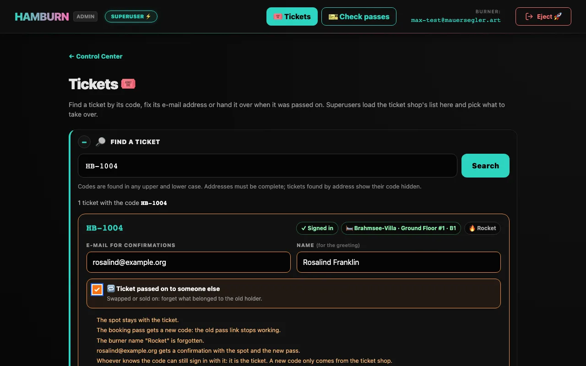
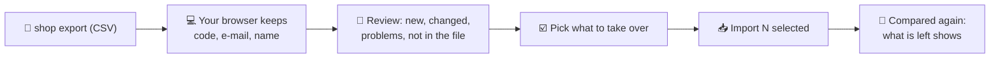
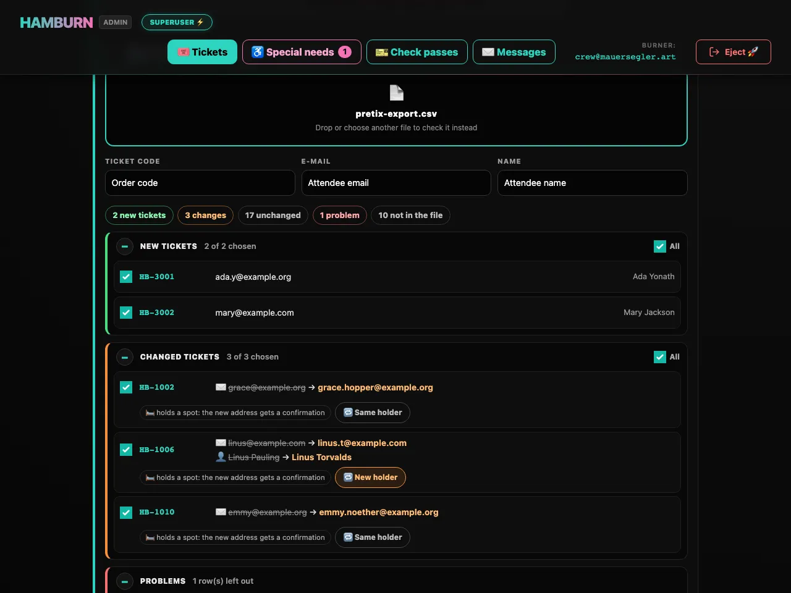

# Tickets & e-mail addresses

A guest's whole login is the code of their ticket, and booking confirmations go to the e-mail address stored with it. The **Tickets** page is where the crew looks a ticket up, fixes its address and hands it over when it changed hands. Superusers also load the ticket shop's list there.

Open it with <kbd>🎟️ Tickets</kbd> in the top bar of every admin page. Both parts fold away with <kbd>+</kbd> / <kbd>−</kbd>.

## Find a ticket <Badge type="tip" text="all admins" />

Type a ticket code or a complete e-mail address and press <kbd>Enter</kbd>.

| You type | You get |
| --- | --- |
| A ticket code, in any upper and lower case | That ticket |
| A complete e-mail address | Every ticket with that address. Their codes are shown shortened (`HB-1001` as `H•••`): an address must not reveal somebody's sign-in. |

Each ticket shows whether its code was used to sign in, its spot (a link to the room page), the burner name, and whether Telegram updates are on. A burner name the server can't decrypt any more shows as *(unreadable)*. A search lists at most 50 tickets and says *(only the first ones are shown)* when there are more: type something narrower. What you type is checked first: a code has at most 64 letters, digits, `-` and `_`; anything with an `@` must be a complete address. Codes and addresses are sent in the request body, never in the page address, so they don't end up in logs or the browser history. The server only ever answers with shortened codes; the full code is shown only where you typed it.

## Change the e-mail address <Badge type="tip" text="all admins" />

Edit the address or the name right in the ticket and press <kbd>Save</kbd>. Changed fields turn orange; <kbd>Undo</kbd> brings back what is stored.

- **A new address on a ticket that holds a spot** gets a confirmation with the spot and the booking pass within a minute. The old address gets nothing.
- **An empty address** means no e-mails for this ticket.
- **The name** is only used for the greeting in e-mails ("Hi Ada,"). Without one, e-mails say "Hi,". It has at most 100 characters.

## A ticket passed on to someone else <Badge type="tip" text="all admins" />

When a ticket was swapped or sold on, tick <kbd>🔁 Ticket passed on to someone else</kbd>, enter the new holder's address and name, and press <kbd>Save & hand over</kbd>. If the address stays the same, no e-mail goes out and later updates would reach the old holder, so the card reminds you to change it. The ticket then forgets what belonged to the old holder:

| | After the hand-over |
| --- | --- |
| Spot | Stays with the ticket. |
| Telegram updates | Stop. The new holder can connect their own chat on the room page. |
| Booking pass | Gets a new code. The old pass link stops working; checking it shows ❌ UNKNOWN. |
| Burner name | Is forgotten. The spot shows as taken without a name. |
| Special-needs request | Is deleted: it holds the old holder's health data. A spot the crew booked for it stays with the ticket as an ordinary booking. |
| E-mail | If the ticket holds a spot, the new address gets a confirmation with the spot and the new pass. |

> [!WARNING] The ticket code stays the same
> The code is the ticket: whoever knows it can still sign in, see the spot and release it. If the old holder must lose access completely, the ticket shop has to issue a new code. Load the new list, then remove the old code on the server (`cozy-admin.sh tickets remove`).

## Load the ticket list <Badge type="warning" text="superusers" />

Export the ticket list from the ticket shop as a CSV file, with the ticket code and the holder's e-mail address; a name column is optional. Load only tickets that include a bed (the Indoor memberships). Then drop the file on the page, or tap the field to choose it. It is checked right away; nothing changes before you press Import.

- **Only three columns leave your browser.** Shop exports also hold addresses, phone numbers and payment details; CozyNights never receives them. A list has at most 5,000 rows, and a file bigger than 2 MB is refused right away (*The file is … KB. A ticket list is far smaller, so this is probably the wrong file.*): a shop export with all its columns is still far below that.
- **Columns are found by their names** (`code`, `Order code`, `Ticket`, `Secret` · `E-mail`, `Attendee email` · `Name`, `Attendee name`, …), with commas, semicolons or tabs between them. If the wrong column was picked, choose another one in the three menus above the review.
- **The review** lists new tickets, changed tickets (old → new address or name), problem rows, addresses shared by several tickets, tickets that are not in the file, and unchanged ones. Everything new and changed starts ticked; <kbd>All</kbd> ticks or clears a whole group. Small groups start unfolded, big ones folded; with more than twelve changes, the field *Filter by code, e-mail or name* narrows every group down to what you are looking for.
- **Changed address = new holder?** Each changed ticket that holds a spot or a Telegram link has a <kbd>🔁 New holder</kbd> / <kbd>Same holder</kbd> switch: a new holder gets the [hand-over](#a-ticket-passed-on-to-someone-else). It starts on *New holder* when both the address and the name changed, the way a ticket transfer in the shop looks.
- **Problem rows are left out,** the rest can be imported: codes with other characters than letters, digits, `-` and `_`, broken addresses, a code that is twice in the file, or a code that differs from a stored one only in upper and lower case (the sign-in could mix them up).
- **Nothing is deleted.** Tickets that aren't in the file stay as they are; the review lists them with shortened codes. Cancelled tickets are removed on the server (`cozy-admin.sh tickets remove`), and only if they hold no spot.
- **Empty cells keep what is stored,** so a list without names never wipes the names.
- **Load the same list again any time,** for example after late ticket sales: the review only shows what changed.
- **One import at a time.** While another superuser's import runs, yours is refused with *Another ticket import is running right now. Wait until it has finished, then check again.* Drop the file again afterwards: the review then shows what is left.

Every change goes to the audit log and the [crew group](./notifications#crew-group), with codes and addresses shortened (`H•••`, `a•••@example.org`).

::: details On the server
Operators can load the same CSV on the server with `cozy-admin.sh tickets import roster.csv` (`--dry-run` first). It checks the same rules, but refuses the whole file when one row is broken and has no per-row choice. It also **never hands a ticket over**: it only updates addresses and names, so a ticket that changed hands would keep the old holder's Telegram link, pass and special-needs request. Load such lists here, with 🔁 **New holder**. See [Ticket codes](./event-checklist#ticket-codes).
:::
