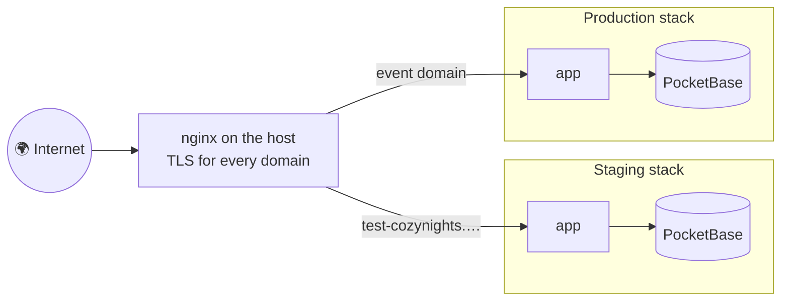

# Environments & deployment

## Environments

| Environment | Address | Purpose | Data |
| --- | --- | --- | --- |
| **Local** | `http://localhost:5173` | Development on your machine | Your own `pb_data/`, never shared |
| **Staging** | [test-cozynights.hamburn.de](https://test-cozynights.hamburn.de) | Testing with real Google sign-ins before anything goes live | Separate and disposable |
| **Production** | the event's address | The live event | Real tickets and bookings |

Staging behaves exactly like production: no extra login gate in front of it, guests use ticket codes, admins use Google.

### How environments stay apart

Even on the same physical server, every environment is a **separate stack**: its own containers, Docker network, database volume, configuration and encryption key. Nothing staging does can touch production data.



- Containers bind to the server's **loopback interface only**; nginx is the single public entry point and terminates TLS.
- **PocketBase is never public.** The app reaches it over the stack's internal network.
- **No secrets in git.** Each environment's `.env` exists only on its server (plus a copy in the team's password manager). The staging layout of that file is described in `deploy/staging.env.template`.

## Deploying to staging

Staging is deployed **on demand** with a button in GitHub Actions. It runs **`integration/staging`** (see [Branches, integration & releases](./integration)): deploying a single feature branch would drop every other feature from the server.

::: code-group

```text [GitHub UI]
Actions → Deploy staging → Run workflow → choose the branch
→ approve the "staging" deployment in the run
```

```bash [gh CLI]
gh workflow run deploy-staging.yml --ref <branch>
gh run watch
```

:::


The old containers keep serving while the new image builds.

- **`verify`** reuses [`.github/workflows/ci.yml`](https://github.com/MorpheusMXML/hamburn-cozynights/blob/main/.github/workflows/ci.yml), the workflow behind the `Verify` check on every pull request, for exactly the commit being deployed. What it runs is described in [Testing & release checks](./testing).
- **`deploy`** waits for approval in the `staging` GitHub environment, then runs the deploy script on the server.
- **`smoke`** runs `npm run smoke:remote` against the live site: pages are served, `/api/health` confirms the service account, a ticket lookup reaches the database, the admin login page offers Google sign-in, the admin area is closed, the security headers are present and PocketBase is not reachable from outside. Read-only, no credentials.
- The script **refuses to deploy** and changes nothing if the server checkout has local changes, the build fails, or the backup can't be written.
- The **PocketBase version** comes from the compose file of the deployed commit. It is pinned and never updated implicitly.
- The **data volume** is pinned by name (`hamburn-cozynights_pb_data_staging`). Without that, its real name would follow `COMPOSE_PROJECT_NAME`, and a deploy run with a different project name would come up with an empty database.
- The **app container** gets only the variables it reads (PocketBase URL and service account, `ENCRYPTION_KEY`, `ORIGIN`, the `LEGAL_*` values). The rest of `.env` — Google client secret, SMTP password, bot token — goes to PocketBase only. A new `LEGAL_*` key has to be added to the compose file too, next to `deploy/staging.env.template`.
- **PocketBase's settings are encrypted** with `PB_ENCRYPTION_KEY` from `.env` (`--encryptionEnv` in the compose file). The value is required: a deploy without it stops at the build step, before anything is touched. See [PocketBase settings key](#pocketbase-settings-key).
- The one-time server setup, restoring a data backup, and maintenance are in the operator runbook [`hamburn-cozynights/deploy/README.md`](https://github.com/MorpheusMXML/hamburn-cozynights/blob/main/hamburn-cozynights/deploy/README.md) (German).

### nginx in front of the app

The vhost in [`deploy/nginx/test-cozynights.hamburn.de.conf`](https://github.com/MorpheusMXML/hamburn-cozynights/blob/main/hamburn-cozynights/deploy/nginx/test-cozynights.hamburn.de.conf) and the host-wide defaults in [`deploy/nginx/10-hardening.conf`](https://github.com/MorpheusMXML/hamburn-cozynights/blob/main/hamburn-cozynights/deploy/nginx/10-hardening.conf) (installed as `/etc/nginx/conf.d/10-hardening.conf`) are applied by hand on the server; the deploy never touches them. Four things in them are load-bearing:

- The header block: `server_tokens off`, HSTS and `X-Robots-Tag`. The post-deploy smoke test expects HSTS on every HTTPS page.
- `proxy_buffer_size 16k`, because a signed-in browser's response headers (session cookie, SvelteKit's `Link` preload header, the CSP headers) exceed nginx's default 4 KB buffer, which shows up as a `502 Bad Gateway` for admins only ("upstream sent too big header" in the error log). The hardening file sets it for every proxied vhost.
- HTTP/2 on the `listen` lines. nginx 1.22 (Debian 12) takes the protocol there; the `http2 on;` directive only exists from 1.25.1.
- The per-address request limit: `location /` allows 20 requests per second with a burst of 60 and answers `429` beyond that, using the zone `perip` declared in the hardening file. The content-hashed build assets under `/_app/` are exempt, so a page load with its roughly 25 files never trips the limit for several guests behind one address. The app's own limits for ticket-code and pass guessing are separate and stricter.

After editing: `nginx -t && systemctl reload nginx`.

### After a deploy

Check that all migrations went through:

```bash
docker compose -f docker-compose.staging.yml logs pocketbase | grep -iE 'failed to (apply|execute)' || echo ok
```

The `smoke` job has already confirmed that pages are served and the app reaches its database. Then sign in to `/admin` once and open the camp map with a test ticket code.

## Versions and releases

Every deploy carries a version in the shape **`0.<deploy number>.<fix>`**: Deploy Nr. 18 is `v0.18.0`, a fix on top of it `v0.18.1`. The version is visible wherever someone might report a bug:

- as a small badge next to the title on the start page, in the footer of every other page and in the admin menu — hover it for the build (commit and day), click it for the release notes on GitHub;
- in `GET /api/health`, as `version` and `commit`, so the runbook can check what the server runs.

The version lives in `package.json` and is baked into the build together with the commit (`build-info.ts`; the deploy script passes the commit as the Docker build argument `GIT_SHA`). Stamp it on the state that is about to be deployed, **before** the deploy run:

```bash
# from hamburn-cozynights/, on integration/staging with a clean tree
scripts/release.sh 0.18.1 "Deploy Nr. 18: admins see who booked each spot"
git push origin integration/staging v0.18.1
```

The script bumps `package.json` and `package-lock.json`, makes a signed commit and a signed tag `v0.18.1`, and pushes nothing; the push is yours. Pushing the tag runs [`.github/workflows/release.yml`](https://github.com/MorpheusMXML/hamburn-cozynights/blob/main/.github/workflows/release.yml), which creates the **GitHub release** with the generated notes since the previous tag. A tag whose commit is not on `main` yet is a **pre-release** — that is every staging deploy. When the release PR lands on `main`, the same workflow turns those pre-releases into releases. The workflow refuses a tag that does not match `package.json`, so the badge, the health check and the release page can never disagree.

Deploy scripts written for a single deploy (`deploy18-….sh` and the like) call `scripts/release.sh` as their last step before the push, with the deploy number as the minor version.

## Backups and where data lives

| What | Source of truth |
| --- | --- |
| Code, schema (`pb_migrations/`), hooks, location templates | Git |
| Secrets (each environment's `.env` with `ENCRYPTION_KEY` and `PB_ENCRYPTION_KEY`) | the server, the team's password manager and an offline emergency sheet |
| Live data (ticket codes, bookings, admins) | the PocketBase volume on the server, plus backups |

The live database stays on the server's local disk. SQLite must not run on a network share: file locking over the network is unreliable and can corrupt the database. A Storage Box is a backup target only.

Backups come in layers. The first two need no setup:

- **Daily ZIPs:** PocketBase writes a ZIP backup into its volume once a day (`pb_hooks/cozy_backups.pb.js`, `PB_BACKUP_CRON` / `PB_BACKUP_KEEP`; default: 03:05 UTC, keep 14, i.e. two weeks; `PB_BACKUP_CRON=off` switches them off). A quick undo from the dashboard; before a bigger change, start one by hand there.
- **Before every deploy:** the deploy script archives the volume.
- **Versioned server backup, once a day (needs the setup below):** `deploy/backup/server-backup.sh` (03:20 UTC) copies all live databases of the server consistently and stores them, together with configuration and certificates, in an encrypted [restic](https://restic.net) repository (14 daily, 8 weekly and 12 monthly snapshots). It alerts on failure and on a disk running full, and test-restores the databases weekly.

The restic repository is set up in two stages that differ by one line of configuration:

| Stage | Repository | Survives |
| --- | --- | --- |
| **1, now** | a root-only directory on the server | mistakes, bad deploys, a broken database |
| **2, later** | a Hetzner Storage Box (off-site) | also losing or compromising the server |

During stage 1 every layer shares the server's disk. Until the Storage Box is there, a weekly pull of the encrypted repository to a laptop and Hetzner's server backups bridge that gap.

Setup, restore, the move to the Storage Box and the emergency sheet are in the operator runbook [`hamburn-cozynights/deploy/backup/README.md`](https://github.com/MorpheusMXML/hamburn-cozynights/blob/main/hamburn-cozynights/deploy/backup/README.md) (German).

::: warning Keep both keys outside the server too
Without an environment's `ENCRYPTION_KEY`, a restored database is useless: burner names can't be decrypted and ticket codes no longer match. Without its `PB_ENCRYPTION_KEY`, PocketBase refuses to start on the restored database until its settings are reset (next section).
:::

## PocketBase settings key

PocketBase keeps its own settings — the SMTP password for booking e-mails, the sender, the backup schedule, S3 credentials if any — in one row of its database. By default that row is plain text, so every database backup carried the SMTP password. Every compose file therefore starts PocketBase with `--encryptionEnv=PB_ENCRYPTION_KEY`: the row is stored AES-256-GCM encrypted with the 32-character key from the environment's `.env` (`openssl rand -hex 16`; optional for local development, required on servers).

What this does and does not cover, verified against PocketBase 0.40.4 with a copy of a real database:

- **Existing databases keep working.** PocketBase reads plain-text settings with or without the key and only encrypts when the row is saved. `pb_hooks/cozy_settings.pb.js` does that save once on the first start with the key (log: `settings were stored in plain text and are now encrypted`, unless another hook's start-up save got there first). Nothing has to be re-entered, and the plain text is gone from the database file after that save; older backups keep the old row.
- **Without the key PocketBase does not start** once the settings are encrypted (`invalid settings db data or missing encryption key`), and neither with a wrong one (`cipher: message authentication failed`). That includes every `pocketbase` command run inside the container: `scripts/cozy-admin.sh` and the test stack pass the flag, a bare `docker compose exec pocketbase /usr/local/bin/pocketbase …` has to add `--encryptionEnv=PB_ENCRYPTION_KEY`. `PB_ADMIN_EMAIL`/`PB_ADMIN_PASSWORD` must never reach the PocketBase container: the image's entrypoint would run a `superuser upsert` without the flag and the container would not come up.
- **The key must be exactly 32 characters.** The hook refuses to start with any other length, before any setting is saved: AES would silently accept 16 or 24 characters (a weaker cipher) and fail every save with any other length, which only shows as "An error occurred while saving the new settings" in the dashboard and as `.env` values that never reach the settings.
- **Losing or changing the key is recoverable.** Everything secret in the settings comes from `.env` and is re-applied by the hooks on start (SMTP, sender, backup schedule, dashboard controls, log retention). With PocketBase stopped, delete the settings row and start with the new key; only values set by hand in the dashboard (rate limits, trusted proxy headers, …) have to be re-entered. The commands are in the runbook, section "PocketBase-Settings-Schlüssel".
- **Not covered: a collection's OAuth2 provider settings.** PocketBase keeps those outside this encryption, so a database backup still holds the admin sign-in's client secret: backups stay secret material, and an exposed one means rotating that secret.
- The key belongs next to `ENCRYPTION_KEY` in the team's password manager and on the emergency sheet (`deploy/backup/README.md`): a restic snapshot includes `.env`, so a restore on the same server has it; a rebuilt server does not.

## Google sign-in per environment

Each environment needs the Google OAuth client to know its address:

- OAuth client type **Web application**, ideally with an **Internal** consent screen in the `mauersegler.art` Google Workspace.
- Authorized redirect URI: `https://<domain>/auth/callback/google`.
- The client ID and secret are part of the environment's server configuration. PocketBase picks up changes on restart.

## Notifications per environment

Booking confirmations and crew alerts are sent by PocketBase (`pb_hooks/cozy_notify.pb.js`); what and when is described in [Notifications](../admin/notifications). All settings are optional values in the environment's `.env`, passed to the PocketBase container by the compose file:

| Setting | For |
| --- | --- |
| `SMTP_HOST`, `SMTP_PORT`, `SMTP_USERNAME`, `SMTP_PASSWORD`, `SMTP_TLS`, `MAIL_FROM_ADDRESS`, `MAIL_FROM_NAME`, `MAIL_REPLY_TO` | E-mail to guests. Applied to PocketBase's mail settings on every start. |
| `TELEGRAM_BOT_TOKEN`, `TELEGRAM_CHAT_ID` (`TELEGRAM_THREAD_ID`) | The crew group, and guests' Telegram updates (off: `TELEGRAM_GUEST_UPDATES=off`). |
| `COZY_ADMIN_WEBHOOK_URL` | Older crew webhook (Slack, Google Chat, Discord, Telegram URL), used when `TELEGRAM_*` are empty. |
| `COZY_APP_URL`, `COZY_ENV_LABEL` | Links in messages and the `[STAGING]` marker. Set in the compose file, not in `.env`. |
| `PB_HIDE_CONTROLS`, `PB_LOGS_DAYS` | PocketBase settings applied on every start (`pb_hooks/cozy_settings.pb.js`): the dashboard's schema editors hidden (`on`, the default on servers), and the request log kept for that many days (default 2, never with IPs). |

- **One Telegram bot per environment.** The server reads the bot's messages by polling; two environments with the same bot would steal each other's messages.
- **The mail password is stored twice.** PocketBase keeps its own copy of the SMTP settings in its database, so it is also in every database backup. Use credentials that can only send mail — an SMTP user of a sending service, one per environment — never the password of a mailbox.
- **Check after setting it up**, on the server: `./scripts/cozy-admin.sh notify status` and `./scripts/cozy-admin.sh notify test --email <you>`.

## Adding an environment

Production, for example:

<div class="steps">

1. **Compose file.** Copy `docker-compose.staging.yml` to `docker-compose.<env>.yml` and give containers, ports, volume and `ORIGIN` their own values, so nothing collides with other environments. Also set `COZY_APP_URL` (the links in guest messages) and `COZY_ENV_LABEL` (empty for production: no `[STAGING]` marker).
2. **Configuration.** Create the environment's `.env` on the server, following `deploy/staging.env.template`. Never commit it. It also holds the operator details for the Impressum and the privacy policy (`LEGAL_*`, see [Legal pages](../admin/legal)).
3. **Domain.** Add an nginx vhost for the domain (see `deploy/nginx/`), issue a certificate, and add the redirect URI to the Google OAuth client.
4. **Pipeline.** Add a workflow mirroring `deploy-staging.yml`, with its own GitHub environment and required approval, and a deploy user scoped to that environment only.
5. **First admins.** Invite the crew with the admin tool, pointed at the new stack: `COZY_COMPOSE_FILE=docker-compose.<env>.yml COMPOSE_PROJECT_NAME=<project of that stack>` (or `COZY_DEPLOY_CONF=/etc/cozynights/<env>.conf`), plus `COZY_ENV_FILE` if that stack's `.env` isn't next to the compose file. The tool refuses to guess the project name (*COZY_COMPOSE_FILE is set but COMPOSE_PROJECT_NAME is not*), because a guess would silently target the staging containers. See [Admin access & roles](../admin/access#managing-admins).
6. **Keep the stacks apart.** Give the new compose file a fixed volume name and its own `container_name`s and ports; the deploy script gets its own config in `/etc/cozynights/` and its own backup folder; the forced-command deploy key is a second key. Both stacks share one Docker daemon, so never prune images while the other stack builds.

</div>

## Documentation site

These docs are built and published by their own workflow. See [Working on these docs](./docs).
