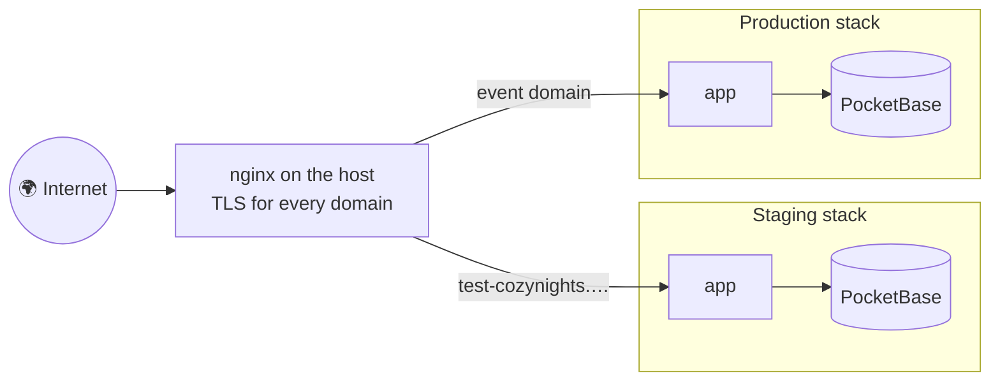
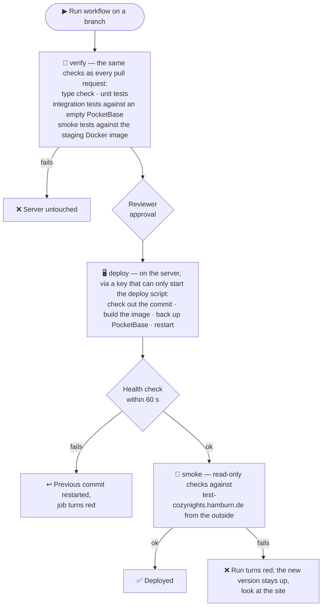

# Environments & deployment

## Environments

| Environment | Address | Purpose | Data |
| --- | --- | --- | --- |
| **Local** | `http://localhost:5173` | Development on your machine | Your own `pb_data/`, never shared |
| **Staging** | [test-cozynights.hamburn.de](https://test-cozynights.hamburn.de) | Testing with real Google sign-ins before anything goes live | Separate and disposable |
| **Production** | the event's address | The live event | Real tickets and bookings |

Staging behaves exactly like production: no extra login gate in front of it, guests use ticket codes, admins use Google.

### How environments stay apart

Even on the same physical server, every environment is a **separate stack**: its own containers, Docker network, database volume, configuration and encryption key. Nothing staging does can touch production data.



- Containers bind to the server's **loopback interface only**; nginx is the single public entry point and terminates TLS.
- **PocketBase is never public.** The app reaches it over the stack's internal network.
- **No secrets in git.** Each environment's `.env` exists only on its server (plus a copy in the team's password manager). The staging layout of that file is described in `deploy/staging.env.template`.

## Deploying to staging

Staging is deployed **on demand**, from any branch, with a button in GitHub Actions.

::: code-group

```text [GitHub UI]
Actions → Deploy staging → Run workflow → choose the branch
→ approve the "staging" deployment in the run
```

```bash [gh CLI]
gh workflow run deploy-staging.yml --ref <branch>
gh run watch
```

:::



The old containers keep serving while the new image builds.

- **`verify`** reuses [`.github/workflows/ci.yml`](https://github.com/MorpheusMXML/hamburn-cozynights/blob/main/.github/workflows/ci.yml), the workflow behind the `Verify` check on every pull request, for exactly the commit being deployed. What it runs is described in [Testing & release checks](./testing).
- **`deploy`** waits for approval in the `staging` GitHub environment, then runs the deploy script on the server.
- **`smoke`** runs `npm run smoke:remote` against the live site: pages are served, a ticket lookup reaches the database, the admin login page offers Google sign-in, the admin area is closed. Read-only, no credentials.
- The script **refuses to deploy** and changes nothing if the server checkout has local changes, the build fails, or the backup can't be written.
- The **PocketBase version** comes from the compose file of the deployed commit. It is pinned and never updated implicitly.
- The one-time server setup, restoring a data backup, and maintenance are in the operator runbook [`hamburn-cozynights/deploy/README.md`](https://github.com/MorpheusMXML/hamburn-cozynights/blob/main/hamburn-cozynights/deploy/README.md) (German).

### After a deploy

Check that all migrations went through:

```bash
docker compose -f docker-compose.staging.yml logs pocketbase | grep -iE 'failed to (apply|execute)' || echo ok
```

The `smoke` job has already confirmed that pages are served and the app reaches its database. Then sign in to `/admin` once and open the camp map with a test ticket code.

## Google sign-in per environment

Each environment needs the Google OAuth client to know its address:

- OAuth client type **Web application**, ideally with an **Internal** consent screen in the `mauersegler.art` Google Workspace.
- Authorized redirect URI: `https://<domain>/auth/callback/google`.
- The client ID and secret are part of the environment's server configuration. PocketBase picks up changes on restart.

Optionally, a crew-chat webhook (Telegram, Slack, Google Chat or Discord) announces new admin access requests.

## Adding an environment

Production, for example:

<div class="steps">

1. **Compose file.** Copy `docker-compose.staging.yml` to `docker-compose.<env>.yml` and give containers, ports, volume and `ORIGIN` their own values, so nothing collides with other environments.
2. **Configuration.** Create the environment's `.env` on the server, following `deploy/staging.env.template`. Never commit it.
3. **Domain.** Add an nginx vhost for the domain (see `deploy/nginx/`), issue a certificate, and add the redirect URI to the Google OAuth client.
4. **Pipeline.** Add a workflow mirroring `deploy-staging.yml`, with its own GitHub environment and required approval, and a deploy user scoped to that environment only.
5. **First admins.** Invite the crew with the admin tool, pointed at the new compose file (`COZY_COMPOSE_FILE=docker-compose.<env>.yml`). See [Admin access & roles](../admin/access#managing-admins).

</div>

## Documentation site

These docs are built and published by their own workflow. See [Working on these docs](./docs).
