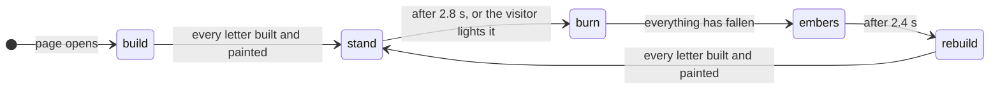

# Landing page title

The title on the start page is a burning effigy. Magic rainbow balls build the letters of HAMBURN COZYNIGHTS: a timber frame for every letter, painted over with a rainbow skin. Then a fire ball sets one letter alight. Its skin burns away, the frame behind it glows, bursts into flames and collapses, and the fire walks on from letter to letter and line to line until everything has burnt down to embers. Then the magic balls come back. The loop never ends and is different every round. Visitors can light the letters themselves with the cursor or a finger.

## The burn cycle

| Phase   | Duration | What happens                                                                                                                                                                                                                 |
| :------ | :------- | :--------------------------------------------------------------------------------------------------------------------------------------------------------------------------------------------------------------------------- |
| build   | ~5 s     | One magic ball flies in per line. Where it lands, that letter's timber frame assembles, and the build runs on to the neighbouring letters. Each finished frame gets its rainbow skin, painted on from where the build began. |
| stand   | 2.8 s    | The finished rainbow title, readable                                                                                                                                                                                         |
| burn    | ~15–25 s | A fire ball lights one letter. The fire walks from letter to letter, about two seconds each, and over to the other line (see below).                                                                                         |
| embers  | 2.4 s    | The piles smoulder and turn to ash                                                                                                                                                                                           |
| rebuild | ~5 s     | The magic balls come back. The beams fly from the piles back into place, glowing in their letter's color, and are painted again.                                                                                             |

## How a letter burns

1. **The skin burns.** From where the fire reached the letter, a ragged front eats the painted skin: a glowing edge, a charred rim ahead of it, low flames and embers along the way.
2. **The frame shows.** Behind the front the timber frame comes to light: pine beams, bolted at the joints.
3. **The frame glows.** A third of a second after a beam is bare, it starts to darken and glow.
4. **Full blaze.** 1.3 to 2.1 seconds after it came to light, the beam catches fire. Flames run along the beams, pass on at the joints and jump across through heat, but only to timber whose skin is already gone.
5. **Collapse.** Burnt-through beams break, braces first. Whatever loses its connection to the ground swings on its last joint and falls. A letter only comes down once its whole skin has burnt.
6. **Embers.** The debris lands on the sill, sets it alight and smoulders out.

When the front reaches the edge of a letter, its neighbour in the line catches fire at the facing edge a moment later. When the skin of the first letter has burnt away completely, the fire jumps to the nearest letter of the other line.

Each round the wind changes and the fire ball hits a different letter. A visitor's torch (cursor or tap) sets a skin burning where it touches it and lights bare timber right away, also in the middle of a burn.

## Where the code lives

| File                                    | Role                                                                                                                                                                                   |
| :-------------------------------------- | :------------------------------------------------------------------------------------------------------------------------------------------------------------------------------------- |
| `src/lib/fx/effigy/glyphs.ts`           | Letter skeletons: centerlines in a unit box; round letters are chamfered like real timber                                                                                              |
| `src/lib/fx/effigy/structure.ts`        | Turns strokes into trusses and their skins, bolts touching strokes together, lays out the lines on their sills, knows each letter's neighbours, checks what still stands on the ground |
| `src/lib/fx/effigy/simulation.ts`       | The cycle without drawing: magic balls and the build, burning skins, fire on the frame, breaking, hinged and falling parts, debris on the pile. Seeded, so tests are reproducible      |
| `src/lib/fx/effigy/renderer.ts`         | Canvas 2D drawing: one pre-rendered rainbow sprite per letter (burnt and painted on a scratch canvas), beams in batches, flames, sparks, smoke and glitter as sprite particles         |
| `src/lib/fx/effigy/effigyBurn.ts`       | Mounting: canvas size, the frame loop, visibility, torch input, particle budget                                                                                                        |
| `src/lib/components/EffigyTitle.svelte` | The heading, the canvas, the pause button, reduced motion and the version badge at the top right (`VersionBadge.svelte`, size `title`; `$lib/version` for the values)                     |

## Accessibility

- **A real heading.** The `<h1>` "Hamburn CozyNights" stays in the page, transparent once the canvas draws. Screen readers and search engines read it; the canvas is `aria-hidden`. Without JavaScript the heading is the visible title, in the same rainbow colors.
- **Reduced motion.** With _reduce motion_ set in the operating system, the title stands still as rainbow letters: no fire, no pause button, and the background video doesn't play.
- **Pause button.** An animation that runs longer than five seconds needs a way to stop it (WCAG 2.2.2). The button next to the title stops the title, the background video and the page's decorative CSS animations (`data-motion="paused"` on `<html>`). The browser remembers the choice (`localStorage`, key `cozynights:title-motion`).
- **The version badge** is a plain link above the effigy's top-right corner: its accessible name is the full "Version 0.18.1 · build …" text, it never overlaps a letter, and it needs no JavaScript.
- **No flashing.** Flames flicker slowly and in small areas (WCAG 2.3.1). The landing of a fire ball or a magic ball is a single soft flash.

## Performance

- The loop only runs while the title is on screen and the tab is visible.
- A letter with an intact skin is a single sprite; its frame isn't drawn at all. Only burning and freshly painted skins go through the scratch canvas.
- The particle pools have fixed sizes; when frames get slow, fewer particles are emitted.
- Nothing is allocated per beam and frame: state lives in typed arrays, beams are drawn as one path per color.

## Tuning

| What                                | Where                                                                                                                       |
| :---------------------------------- | :-------------------------------------------------------------------------------------------------------------------------- |
| Phase durations                     | `HOLD_SECONDS`, `EMBER_SECONDS`, `BURN_ASSIST_AFTER`, `BURN_MAX` in `simulation.ts`                                         |
| How fast the fire walks             | `SKIN_BURN_SPEED` (letter heights per second), `GAP_DELAY`, `CROSS_LINE_DELAY` in `simulation.ts`                           |
| How long bare timber glows          | `GLOW_AFTER`, `BLAZE_AFTER_MIN`, `BLAZE_AFTER_SPREAD` in `simulation.ts`                                                    |
| How fast the build runs             | `BUILD_SPEED`, `BUILD_HOP`, `SKIN_PAINT_SPEED` in `simulation.ts`                                                           |
| How fast the frame burns and breaks | `resetFire()` (speed, burn time, break point per beam kind) and `radiate()` (reach and strength of heat) in `simulation.ts` |
| Colors                              | `letterHue()` and `paintSkin()` for the skins, `WOOD`, `CHAR_STOPS`, `FLAME_STOPS` in `renderer.ts`                         |
| The text                            | `DEFAULT_LINES` in `structure.ts`; every character needs a skeleton in `glyphs.ts`                                          |
| Letter shapes                       | `GLYPHS` in `glyphs.ts`. Strokes that should hold each other up must touch or overlap                                       |

## Tests

- `tests/effigy.test.ts` (Vitest): every title letter exists and stays in its box, the skin hides the whole frame, every letter is one piece standing on the ground, cutting the legs drops the top, the magic balls build letter by letter and only finished frames get painted, the fire burns the skin before the frame and walks from letter to letter and line to line, nothing falls while its letter still has skin, a full cycle burns everything down and rebuilds it exactly, the torch works only on standing letters, reduced motion never lights up, same seed gives the same run.
- `tests/e2e/landing.test.ts` (Playwright): the heading, the pause button and its memory, the torch (mouse and touch) and reduced motion, in Chromium and WebKit. It needs no PocketBase, see [Tests](./#tests).
- The title exposes its phase as `data-phase` on `.effigy` for tests.
