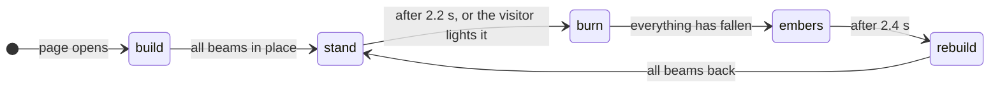

# Landing page title

The title on the start page is a burning effigy. The letters of HAMBURN COZYNIGHTS are built from timber trusses. They catch fire, burn down, collapse into a glowing pile and rise again in neon, in an endless loop that is different every round. Visitors can light the letters themselves with the cursor or a finger.

## The burn cycle

| Phase   | Duration | What happens                                                                                                                                                     |
| :------ | :------- | :--------------------------------------------------------------------------------------------------------------------------------------------------------------- |
| build   | ~2.6 s   | Sparks rise from the sill and grow into beams, letter by letter                                                                                                  |
| stand   | 2.2 s    | The finished title, readable                                                                                                                                     |
| burn    | ~8–10 s  | Fire runs along the beams and jumps across through heat. Braces drop out first, then rails and posts break and whatever lost its connection to the ground falls. |
| embers  | 2.4 s    | The pile smoulders and turns to ash                                                                                                                              |
| rebuild | ~2.5 s   | Every beam flies back to its place in neon ("phoenix") and turns into fresh wood                                                                                 |

Each round the wind changes and one of two ignitions is picked at random: a **fuse** running along the sills, or **burning arrows**, one per line. A visitor's torch (cursor or tap) lights the title right away, also in the middle of a burn.

## Where the code lives

| File                                    | Role                                                                                                                                   |
| :-------------------------------------- | :------------------------------------------------------------------------------------------------------------------------------------- |
| `src/lib/fx/effigy/glyphs.ts`           | Letter skeletons: centerlines in a unit box; round letters are chamfered like real timber                                              |
| `src/lib/fx/effigy/structure.ts`        | Turns strokes into trusses, bolts touching strokes together, lays out the lines on their sills, checks what still stands on the ground |
| `src/lib/fx/effigy/simulation.ts`       | The cycle without drawing: fire, breaking, hinged and falling parts, debris on the pile, rebuild. Seeded, so tests are reproducible    |
| `src/lib/fx/effigy/renderer.ts`         | Canvas 2D drawing: beams in batches, flames, sparks, smoke and neon as sprite particles                                                |
| `src/lib/fx/effigy/effigyBurn.ts`       | Mounting: canvas size, the frame loop, visibility, torch input, particle budget                                                        |
| `src/lib/components/EffigyTitle.svelte` | The heading, the canvas, the pause button and reduced motion                                                                           |

## Accessibility

- **A real heading.** The `<h1>` "Hamburn CozyNights" stays in the page, transparent once the canvas draws. Screen readers and search engines read it; the canvas is `aria-hidden`. Without JavaScript the heading is the visible title.
- **Reduced motion.** With _reduce motion_ set in the operating system, the title stands still: no fire, no pause button, and the background video doesn't play.
- **Pause button.** An animation that runs longer than five seconds needs a way to stop it (WCAG 2.2.2). The button next to the title stops the title, the background video and the page's decorative CSS animations (`data-motion="paused"` on `<html>`). The browser remembers the choice (`localStorage`, key `cozynights:title-motion`).
- **No flashing.** Flames flicker slowly and in small areas (WCAG 2.3.1). The impact of an arrow is a single soft flash.

## Performance

- The loop only runs while the title is on screen and the tab is visible.
- At full blaze a laptop spends about 0.2 ms per frame on the simulation and 2–3 ms on drawing. The particle pools have fixed sizes; when frames get slow, fewer particles are emitted.
- Nothing is allocated per beam and frame: state lives in typed arrays, beams are drawn as one path per color.

## Tuning

| What                           | Where                                                                                                                       |
| :----------------------------- | :-------------------------------------------------------------------------------------------------------------------------- |
| Phase durations                | `HOLD_SECONDS`, `EMBER_SECONDS`, `BURN_ASSIST_AFTER`, `BURN_MAX` in `simulation.ts`                                         |
| How fast things burn and break | `resetFire()` (speed, burn time, break point per beam kind) and `radiate()` (reach and strength of heat) in `simulation.ts` |
| Colors                         | `WOOD`, `CHAR_STOPS`, `FLAME_STOPS`, `NEON` in `renderer.ts`                                                                |
| The text                       | `DEFAULT_LINES` in `structure.ts`; every character needs a skeleton in `glyphs.ts`                                          |
| Letter shapes                  | `GLYPHS` in `glyphs.ts`. Strokes that should hold each other up must touch or overlap                                       |

## Tests

- `tests/effigy.test.ts` (Vitest): every title letter exists and stays in its box, every letter is one piece standing on the ground, cutting the legs drops the top, a full cycle burns everything down and rebuilds it exactly, the torch works only on standing letters, reduced motion never lights up, same seed gives the same run.
- `tests/e2e/landing.test.ts` (Playwright): the heading, the pause button and its memory, the torch (mouse and touch) and reduced motion, in Chromium and WebKit. It needs no PocketBase, see [Tests](./#tests).
- The title exposes its phase as `data-phase` on `.effigy` for tests.
