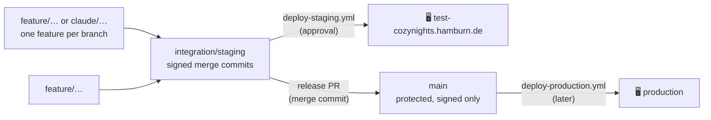

# Branches, integration & releases

CozyNights is built by one maintainer and several Claude sessions at the same time, on a public repository. This page is the contract that keeps that from turning into a mess: where work happens, how it reaches the staging server, and how it becomes a release.

## The branch model

| Branch | What it is | Who writes it | How |
| --- | --- | --- | --- |
| `feature/<topic>`, `claude/<topic>-<id>` | One feature or fix, built and verified on its own | The session that builds it | Normal commits; rebase only before the first push |
| `integration/staging` | Everything that is meant to be tested together on staging | Whoever integrates, one session at a time | Build the state on a `deploy/<n>-<name>` branch, then a pull request — **merge commits, never rebase, never force-push**; a direct push is refused |
| `deploy/<n>-<topic>` | One deploy, ready to land: the features of that deploy plus the release commit and its tag | The session that prepares the deploy | Signed commits, then a pull request against `integration/staging` |
| `main` | Released state; the docs site and the production deploy come from here | Pull requests only | Release PR from `integration/staging`, merged with a merge commit |

Rules that follow from it:

- **`integration/staging` takes pull requests only** (since 2026-09-24, same as `main`). Zero approvals are required and code-owner review is off, so you merge your own deploy PR — but the branch cannot be pushed to directly, and the deploy run must be dispatched **after** the merge, on the merge commit.
- **Staging runs `integration/staging` and nothing else.** Deploying a feature branch alone drops every other feature from the server (it happened on 2026-09-18: notifications and booking passes vanished for an evening). New commits on a feature branch are merged into `integration/staging` and that branch is deployed.
- **Every commit on `integration/staging` and `main` is GPG-signed.** The `main` ruleset refuses unsigned commits, so unsigned local checkpoints are re-signed before they are merged: `git rebase --force-rebase --gpg-sign <base>` on the feature branch, then the merge.
- **Verify before you push** an integration state: `npm run check`, `npm test`, and `npm run verify` (integration, smoke and layout tests on a throwaway Docker stack, see [Testing & release checks](./testing)), plus `npm run build:app` in `docs/`. Before anyone can approve a deploy, exactly the files being deployed have passed the same checks: normally in the pull request's CI run (the deploy's gate then only repeats the secrets scan), otherwise in the deploy's own `verify` job.
- **Conflicts are resolved by hand and explained in the merge commit** when they change behaviour (which side won, what was combined). A trial merge on a throwaway branch is fine for finding them early; the trial branch is never merged.
- **Feature branches stay until their PR or release is merged**, then they are deleted on GitHub. Archive branches from the history rewrite of 2026-09-17 are kept but never merged.

## What a feature branch must bring

- Migrations in `pb_migrations/` that are idempotent and safe on the existing staging database (add fields, never drop or rename; backfills in raw SQL so no hook sends messages). See [Changing the database schema](./#changing-the-database-schema).
- Hooks that never throw into the operation they watch, with their logic in `pb_hooks/lib/` so it can be unit-tested.
- Tests on the layer that fits: unit for rules, integration for migrations and hooks, smoke for a route's authorization. A new admin action gets a refusal test.
- Docs in `docs/` for what admins or guests see, and a line in the README's feature table when it is a feature.
- No secrets, no data, no server findings: the repository is public. Operator secrets live in the server `.env`; security findings about the server go into the crew's private ops list outside this repository, not into `docs/`.

## What went in, and when

The record of what each deployed state brought is the **GitHub release** of its tag (`v0.<deploy>.<fix>`, see [Versions and releases](./deployment#versions-and-releases)) and the merge commits on `integration/staging` themselves: every feature arrived as a signed merge commit whose message names the feature, the migrations it brought and the conflicts it resolved. The first integrated state (2026-09-19) merged app readiness, special-needs requests, the import review, the booking window, the 2026 map and the editable message texts on top of the readiness base `22455bb`; everything since has followed the same path.

When a feature branch and the integration state touch the same files, resolve the conflict in the merge commit and say so in its message; the pull request's CI tests exactly that merged state, and the deploy tests everything again if the files it deploys differ from what CI tested.

### Release to main

After the key-user test: one pull request `integration/staging` → `main` ("Release 2026-10"), merged with a **merge commit** (a squash or rebase would drop the signatures and the merge history). Every deployed state already carries a version tag (`v0.<deploy>.<fix>`, see [Versions and releases](./deployment#versions-and-releases)); once the PR is merged, the pre-releases of those tags become releases on their own. Then update PR #34 (security hardening) and PR #35 (dev tooling) onto the new `main`, close PR #38 (its fixes are in), and delete the merged feature branches.
