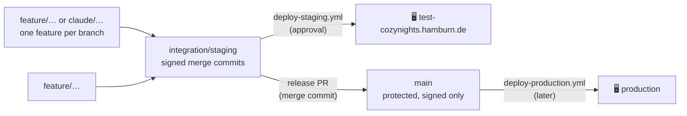

# Branches, integration & releases

CozyNights is built by one maintainer and several Claude sessions at the same time, on a public repository. This page is the contract that keeps that from turning into a mess: where work happens, how it reaches the staging server, and how it becomes a release.

## The branch model

| Branch | What it is | Who writes it | How |
| --- | --- | --- | --- |
| `feature/<topic>`, `claude/<topic>-<id>` | One feature or fix, built and verified on its own | The session that builds it | Normal commits; rebase only before the first push |
| `integration/staging` | Everything that is meant to be tested together on staging | Whoever integrates, one session at a time | `git merge --no-ff -S <branch>` — **merge commits, never rebase, never force-push** |
| `main` | Released state; the docs site and the production deploy come from here | Pull requests only | Release PR from `integration/staging`, merged with a merge commit |

Rules that follow from it:

- **Staging runs `integration/staging` and nothing else.** Deploying a feature branch alone drops every other feature from the server (it happened on 2026-09-18: notifications and booking passes vanished for an evening). New commits on a feature branch are merged into `integration/staging` and that branch is deployed.
- **Every commit on `integration/staging` and `main` is GPG-signed.** The `main` ruleset refuses unsigned commits, so unsigned local checkpoints are re-signed before they are merged: `git rebase --force-rebase --gpg-sign <base>` on the feature branch, then the merge.
- **Verify before you push** an integration state: `npm run check`, `npm test`, and `npm run verify` (integration + smoke on a throwaway Docker stack, see [Testing & release checks](./testing)), plus `npm run build:app` in `docs/`. On the server, the `verify` job runs the same checks again before anyone can approve the deploy.
- **Conflicts are resolved by hand and explained in the merge commit** when they change behaviour (which side won, what was combined). A trial merge on a throwaway branch is fine for finding them early; the trial branch is never merged.
- **Feature branches stay until their PR or release is merged**, then they are deleted on GitHub. Archive branches from the history rewrite of 2026-09-17 are kept but never merged.

## What a feature branch must bring

- Migrations in `pb_migrations/` that are idempotent and safe on the existing staging database (add fields, never drop or rename; backfills in raw SQL so no hook sends messages). See [Changing the database schema](./#changing-the-database-schema).
- Hooks that never throw into the operation they watch, with their logic in `pb_hooks/lib/` so it can be unit-tested.
- Tests on the layer that fits: unit for rules, integration for migrations and hooks, smoke for a route's authorization. A new admin action gets a refusal test.
- Docs in `docs/` for what admins or guests see, and a line in the README's feature table when it is a feature.
- No secrets, no data, no server findings: the repository is public. Operator secrets live in the server `.env`; security findings about the server go into the private Baustellen list, not into `docs/`.

## Integration state of 2026-09-19

The first state that carries every feature built for the key-user test, merged in this order (each a signed merge commit on `integration/staging`, on top of the readiness base `22455bb`):

| Order | Branch | Brings | New migrations |
| --- | --- | --- | --- |
| 1 | `claude/app-readiness-live-prep-a910bf` | Footer credit, security headers, `/api/health`, guest sign-out, lighter animations, repo cleanup | — |
| 2 | `claude/special-needs-bed-requests-258b7e` | Special-needs requests (`/special-needs`, `/admin/requests`), ♿ spots, encrypted requests | `1759200000_special_requests` |
| 3 | `feature/import-review` | `/admin/tickets`, ticket list review, template compare & apply | — |
| 4 | `feature/booking-window` | Booking window with opening and closing time, phase Closed, countdown bar, superuser-only instant switch | `1759300000_booking_window` |
| 5 | fixes on the integrated state | Hand-over deletes the special-needs request (i79); anti-phishing line in guest mails (i12); `beds.booked_at` and a truthful "New Bookings" chart (Q2); one ticket = one spot also on the server (i61, i62); clear-all only in Staging, partial failures reported, every house deletion logged (i63); **going back to Staging releases every guest booking** | `1759400000_booked_at` |
| 6 | `claude/annual-map-update-458d54` | The Hamburn 2026 site map | — |
| 7 | `claude/special-needs-decline-ux-9daa4e` | Declined special-needs requests keep *Approve after all* behind a ⋯ menu, cards coloured by status; **message texts**: every sentence guests get is editable on `/admin/messages` (✉️ Messages), with a preview rendered by PocketBase; changes go to the audit log and the crew group | `1759600000_message_texts` |

Conflicts worth knowing about (all resolved in the merge commits):

- `src/lib/server/settings.ts`: the booking window's phase model plus the special-needs `requestsOpen` flag.
- `src/routes/admin/+page.server.ts` and `+page.svelte`: the booking window panel replaced the header switch and the timer panel; the special-needs switch and the import review's actions live next to it. Template actions check `isLayoutLocked` (live **or closed**), not only "live".
- `pb_hooks/cozy_notify.pb.js`: phase alerts come from `lib/phase.js`, the requests switch alert stayed.
- `pb_hooks/lib/notify.js`: crew texts of every feature, `eventText(ev, cfg)` keeps the links.
- Docs: `admin/index.md`, `admin/notifications.md`, `admin/templates.md`, `guide/phases.md`, `reference/data-model.md` combine all four features.

### Deploying this state

1. Approve the `Deploy staging` run of `integration/staging` in GitHub Actions (the `verify` job must be green first).
2. After the deploy, on the server: check the migrations went through (see [After a deploy](./deployment#after-a-deploy)), reinstall the deploy script from the checkout (it gained the `/api/health` check and the rollback warning), and add the nginx header block from `deploy/nginx/`.
3. Every admin signs in with Google once more (weekly re-sign-in, empty `last_sign_in` counts as expired).
4. In the Control Center: check the 🎟 BOOKING WINDOW panel (an old go-live timer stays armed; there is no closing time yet), and clear the test bookings with <kbd>🧨 Clear all bookings</kbd> so the key-user test starts clean.

### Release to main

After the key-user test: one pull request `integration/staging` → `main` ("Release 2026-10"), merged with a **merge commit** (a squash or rebase would drop the signatures and the merge history). Then update PR #34 (security hardening) and PR #35 (dev tooling) onto the new `main`, close PR #38 (its fixes are in), and delete the merged feature branches.
