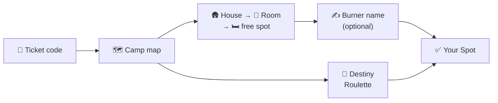
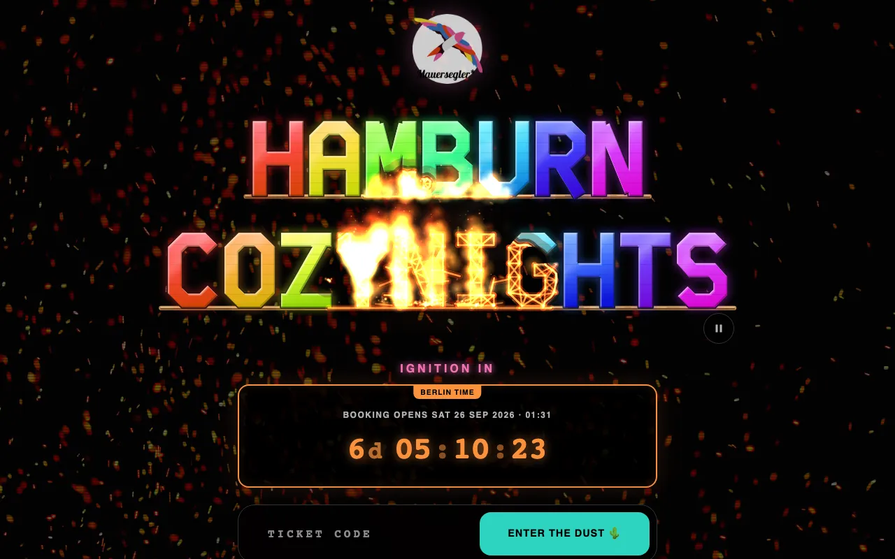
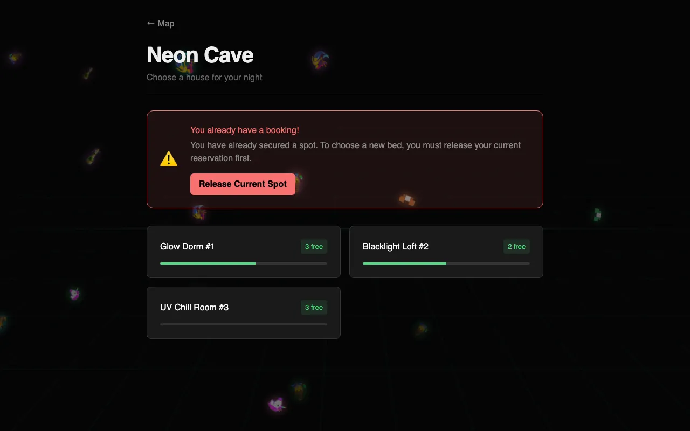
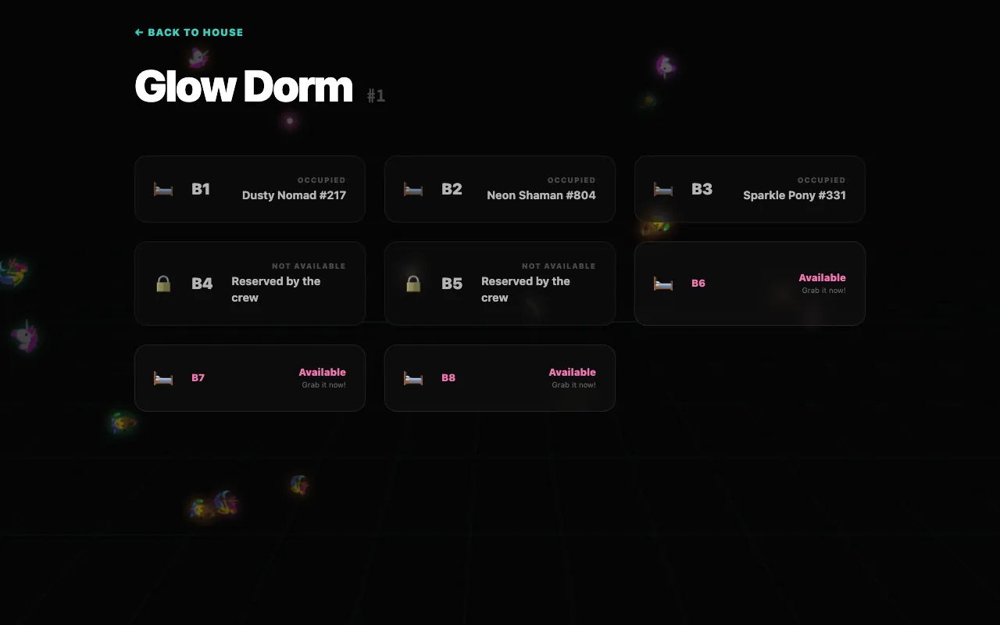
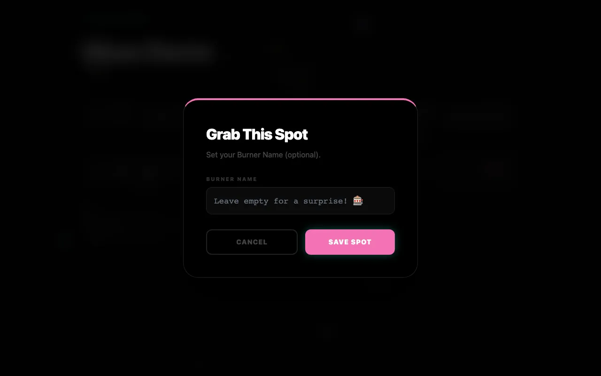
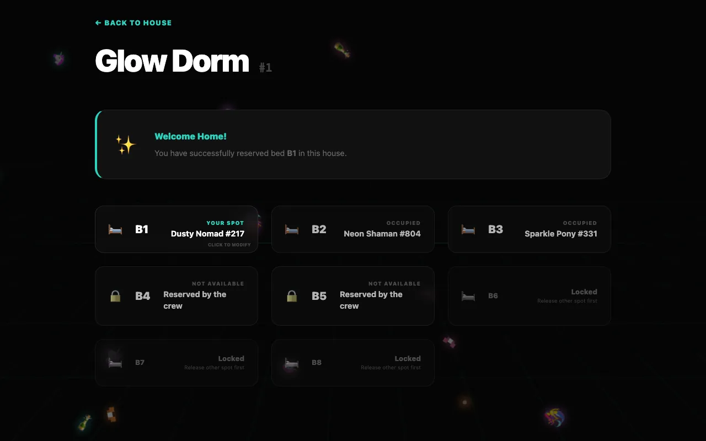
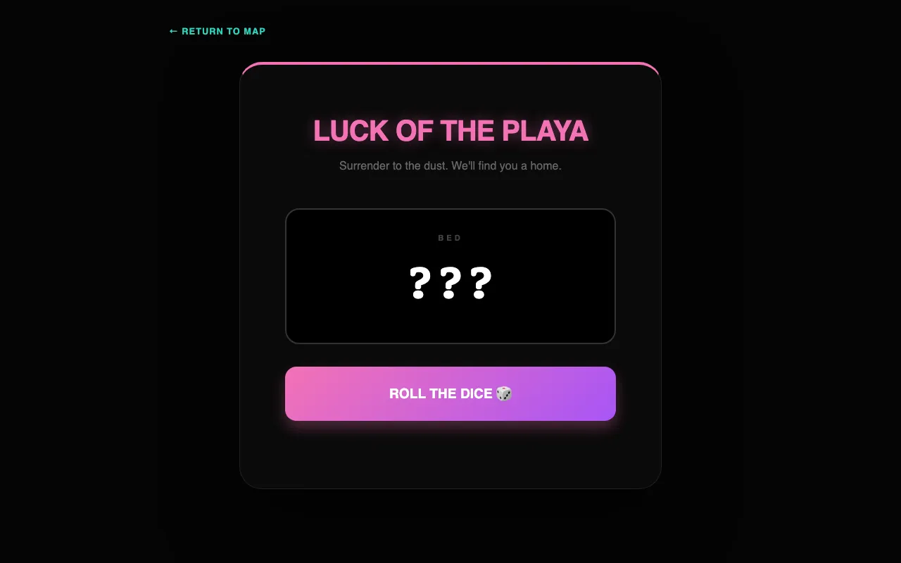
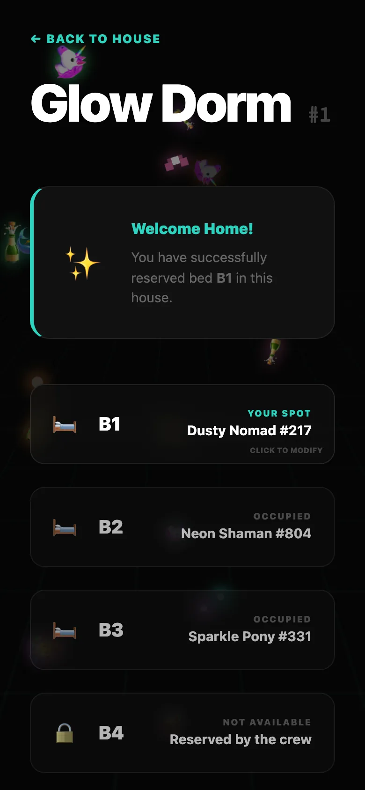

# Booking a bed

All you need is the **ticket code** from your Hamburn ticket. There is no account to create and no password: your ticket code *is* your registration. Confirmations go to the e-mail address that belongs to your ticket.

Beds come with **Indoor memberships** only. Camper memberships (camper or tent) don't include a bed and don't need CozyNights.

> [!NOTE] Booking opens and closes at set times
> Before booking opens, the map stays blurred and a countdown shows when it starts. You can already sign in with your code. While booking is open, a slim countdown at the top of every page shows when it closes; after that, spots are final.

## At a glance

## Step by step

1. **Enter your ticket code**

   Open the CozyNights start page, type your code into the **ACCESS CODE** field and press <kbd>ENTER THE DUST 🌵</kbd>.

   

   Your browser remembers the code for 30 days, so you won't be asked again on this device.

2. **Find a house on the map**

   Every pin is a house. **Teal** pins still have free spots, **red** pins are fully booked. Click a pin to open the house.

   

3. **Choose a room**

   The house page lists its rooms with the number of free spots. Full rooms are marked **Full**.

   

4. **Grab a free spot**

   Inside the room every spot shows its state (see the table below). Click an **Available** spot.

   

5. **Pick a burner name and book**

   Type the name other guests should see on your bed and press <kbd>Save Spot</kbd>. Or leave the field empty and press <kbd>Save Spot</kbd> anyway: a slot machine rolls a burner name for you (something like *Disco Druid #562*). <kbd>New Name 🎲</kbd> rolls again, <kbd>Accept Fate & Book 🌵</kbd> books the spot.

   

That's it: the spot now shows **Your Spot** with your burner name. 🎉

## What the spots mean

| Spot card | Meaning |
| --- | --- |
| **Available** · *Grab it now!* | Free. Click it to book. |
| **Your Spot** · *your burner name* | That's you. Click it to rename or release it. |
| **Occupied** · *a burner name* | Taken by another guest (*Mystery Burner* if they didn't pick a name). |
| **Not available** · *Reserved by the crew* | Held back by the crew, for example a broken bed or a spot that isn't in use. |
| **Locked** · *Release other spot first* | You already have a spot somewhere else. |
| **Not open yet** · *Booking opens soon* | Booking hasn't opened yet. |
| **Booking closed** · *Spots are final* | The booking window is over. |

## Destiny Roulette

Can't decide? On the map press <kbd>🎰 DESTINY ROULETTE</kbd>, then <kbd>ROLL THE DICE 🎲</kbd>. The machine picks a random free spot anywhere in the camp and rolls a burner name to go with it.

- <kbd>New Name 🎲</kbd> keeps the spot and rolls a new name.
- <kbd>Full Respin 🔥</kbd> rolls spot and name again.
- <kbd>Accept Fate & Book 🌵</kbd> books it: *Destiny Fulfilled!*

The roulette only hands out a spot if you don't have one yet. Already booked? The page shows your current spot with <kbd>Visit My Room</kbd> and <kbd>Release This Spot 🔓</kbd>.

## Changing your mind

::: tip Rename
Open your room, click **Your Spot**, change the burner name and press <kbd>Save Spot</kbd>.
:::

::: tip Move to another bed
One ticket holds one spot, so release your current spot first: <kbd>Release</kbd> in the spot dialog, <kbd>Release Current Spot</kbd> on a house or room page, or <kbd>Release This Spot 🔓</kbd> on the roulette page. Then book the new one.
:::

> [!WARNING] Released means free for everyone
> The moment you release a spot, anyone can grab it. There is no undo.

Bookings can only be changed while booking is open. If the crew switches back to staging, your booking stays but is frozen.

## Confirmations

When your spot is booked, changes or is released, CozyNights sends an e-mail to the **address of your ticket**. You don't enter it anywhere; your room page shows where confirmations go, shortened like `m•••@example.com`. If the crew ever has to change the camp layout and your spot goes with it, you hear about it the same way, so you can pick a new one.

### Your booking pass

Once you hold a spot, your room page shows <kbd>🎫 Show booking pass</kbd>, and every confirmation links to it: a page with your spot, a QR code and a short code like `7F3K-9QXM-2CWD`. If the crew asks at arrival, show it — or a screenshot of it. It stays valid when you move to another spot; the crew always sees the spot your ticket holds right now. The pass code is not your ticket code: it can only show your booking, never change it.

::: tip Updates on Telegram
Prefer Telegram? On your room page press <kbd>Get updates on Telegram</kbd>, then <kbd>START</kbd> in Telegram. The CozyNights bot confirms your spot right away and tells you about every change. <kbd>Turn off</kbd> on the room page, or `/stop` in the chat, ends it.
:::

## On your phone

CozyNights works in any mobile browser, no app needed. If you booked on your laptop and now use your phone, enter your ticket code again on the start page.

## Privacy: what others see

- Other guests see **which spots are taken** and the **burner name** on them. Nothing else.
- Other guests never see your ticket code or the e-mail address from your ticket order. The crew only uses that address to reach you about your spot, for example if they have to move you.
- Your burner name is stored encrypted, and your ticket code is never written to logs.
- Your e-mail address is only used for messages about your spot and is deleted after the event. Messages never contain your ticket code.

<!-- audience:admin -->
More details in [Security & privacy](../reference/security).
<!-- /audience -->
The **booking rules**, the privacy policy and the legal notice are linked at the bottom of every CozyNights page.

Something not working? See [FAQ & troubleshooting](./faq).
