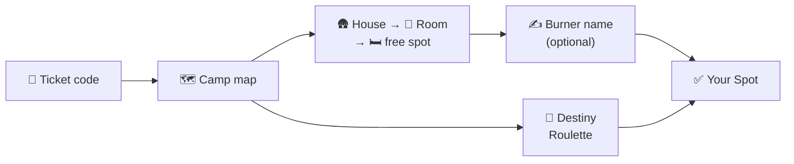

# Booking a bed

All you need is the **ticket code** from your Hamburn ticket. There is no account to create, no password and no confirmation e-mail: your ticket code *is* your registration.

> [!NOTE] Booking opens at a set time
> Before that the map stays blurred and a countdown shows when booking starts. You can already sign in with your code.

## At a glance

## Step by step

1. **Enter your ticket code**

   Open the CozyNights start page, type your code into the **ACCESS CODE** field and press <kbd>ENTER THE DUST 🌵</kbd>.

   

   Your browser remembers the code for 30 days, so you won't be asked again on this device.

2. **Find a house on the map**

   Every pin is a house. **Teal** pins still have free spots, **red** pins are fully booked. Click a pin to open the house.

   

3. **Choose a room**

   The house page lists its rooms with the number of free spots. Full rooms are marked **Full**.

   

4. **Grab a free spot**

   Inside the room every spot shows its state (see the table below). Click an **Available** spot.

   

5. **Pick a burner name and book**

   Type the name other guests should see on your bed and press <kbd>Save Spot</kbd>. Or leave the field empty and press <kbd>Save Spot</kbd> anyway: a slot machine rolls a burner name for you (something like *Disco Druid #562*). <kbd>New Name 🎲</kbd> rolls again, <kbd>Accept Fate & Book 🌵</kbd> books the spot.

   

That's it: the spot now shows **Your Spot** with your burner name. 🎉

## What the spots mean

| Spot card | Meaning |
| --- | --- |
| **Available** · *Grab it now!* | Free. Click it to book. |
| **Your Spot** · *your burner name* | That's you. Click it to rename or release it. |
| **Occupied** · *a burner name* | Taken by another guest (*Mystery Burner* if they didn't pick a name). |
| **Not available** · *Reserved by the crew* | Held back by the crew, for example a broken bed or a spot that isn't in use. |
| **Locked** · *Release other spot first* | You already have a spot somewhere else. |
| **Locked** · *Phase: Staging Mode* | Booking hasn't opened yet. |

## Destiny Roulette

Can't decide? On the map press <kbd>🎰 DESTINY ROULETTE</kbd>, then <kbd>ROLL THE DICE 🎲</kbd>. The machine picks a random free spot anywhere in the camp and rolls a burner name to go with it.

- <kbd>New Name 🎲</kbd> keeps the spot and rolls a new name.
- <kbd>Full Respin 🔥</kbd> rolls spot and name again.
- <kbd>Accept Fate & Book 🌵</kbd> books it: *Destiny Fulfilled!*

The roulette only hands out a spot if you don't have one yet. Already booked? The page shows your current spot with <kbd>Visit My Room</kbd> and <kbd>Release This Spot 🔓</kbd>.

## Changing your mind

::: tip Rename
Open your room, click **Your Spot**, change the burner name and press <kbd>Save Spot</kbd>.
:::

::: tip Move to another bed
One ticket holds one spot, so release your current spot first: <kbd>Release</kbd> in the spot dialog, <kbd>Release Current Spot</kbd> on a house or room page, or <kbd>Release This Spot 🔓</kbd> on the roulette page. Then book the new one.
:::

> [!WARNING] Released means free for everyone
> The moment you release a spot, anyone can grab it. There is no undo.

Bookings can only be changed while booking is open. If the crew switches back to staging, your booking stays but is frozen.

## On your phone

CozyNights works in any mobile browser, no app needed. If you booked on your laptop and now use your phone, enter your ticket code again on the start page.

## Privacy: what others see

- Other guests see **which spots are taken** and the **burner name** on them. Nothing else.
- Other guests never see your ticket code or the name on your ticket.
- Your burner name is stored encrypted, and your ticket code is never written to logs.

<!-- audience:admin -->
More details in [Security & privacy](../reference/security).
<!-- /audience -->
Something not working? See [FAQ & troubleshooting](./faq).
