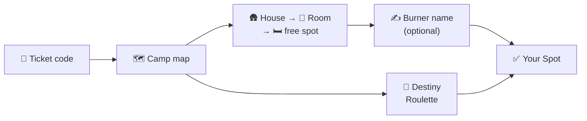
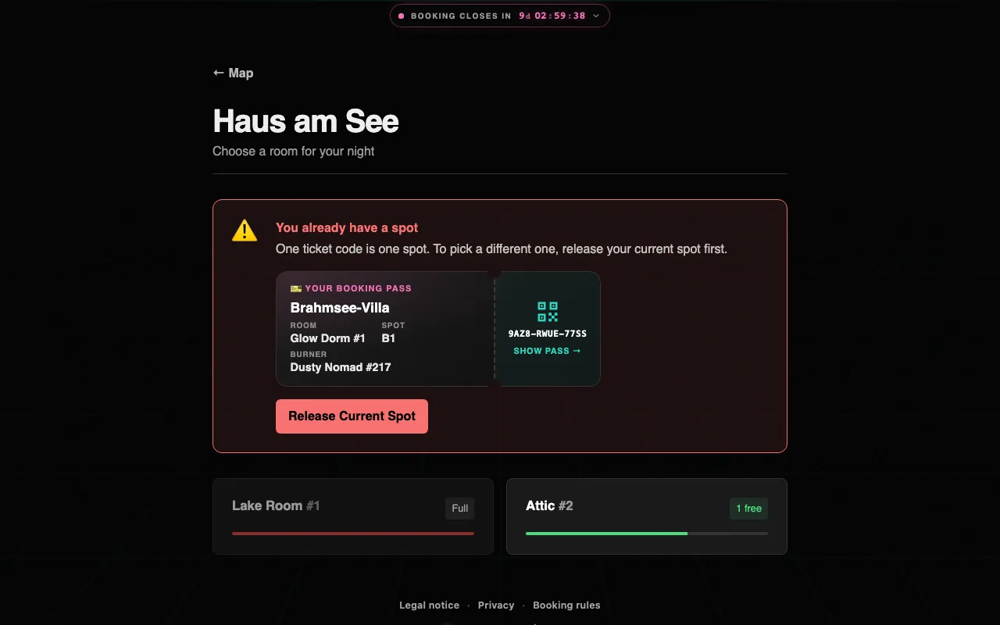
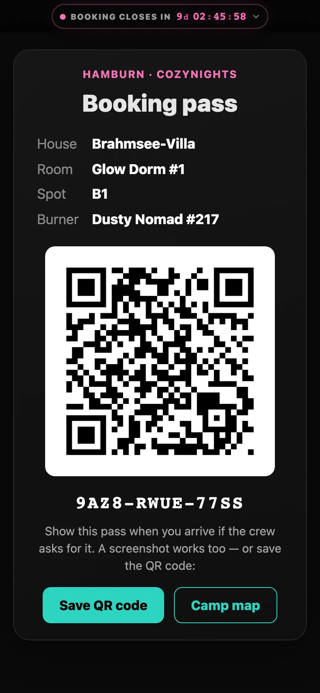

# Booking a bed

All you need is the **ticket code** from your Hamburn ticket. There is no account to create and no password: your ticket code *is* your registration. Confirmations go to the e-mail address that belongs to your ticket.

Beds come with **Indoor memberships** only. Camper memberships (camper or tent) don't include a bed and don't need CozyNights.

> [!NOTE] Booking opens and closes at set times
> Before booking opens, the start page and the (still blurred) map count down to the start. You can already sign in with your code. While booking is open, the top bar of every booking page counts down to the close; after that, spots are final.

## At a glance

## Step by step

1. **Enter your ticket code**

   Open the CozyNights start page, type your code into the **TICKET CODE** field and press <kbd>ENTER THE DUST 🌵</kbd>. (The small `v0.18.1` at the top right of the title is the version you are looking at; it helps when you report a problem.)

   If the code is refused, the box around it turns red and gives a short shake, the reason appears right under it, and the cursor is back in the field — fix the code and press the button again. The [FAQ](./faq#for-guests) explains every message.

   

   Your browser remembers the code for 30 days. Back on the start page later, <kbd>Already signed in on this device? Continue to the map →</kbd> takes you straight to the map, and <kbd>Not your ticket? Sign out</kbd> removes the code from this device (see [Shared devices](#shared-devices)).

2. **Find a house on the map**

   Every pin is a house. **Teal** pins still have free spots, **red** pins have none left that you could book. Click a pin to open the house.

   

   The **top bar** is the same on every booking page. **Hamburn** on the left takes you back to the map. The phase pill — 🛠 STAGING, 🎪 LIVE or 🔒 CLOSED — counts down to the next switch while a timer is armed (*opens in 1d 23:59:57*, *closes in …*, red in the last hour); tap it for the exact Berlin time. In the middle, the wish chips (see [Looking for something special?](#looking-for-something-special)). On the right: ♿ **Special-needs spot** (while the crew takes [special-needs requests](./special-needs)), **Help & FAQ**, <kbd>Sign out</kbd> and the version. On a phone the links shrink to their icons and the chips take a row of their own. <kbd>🎰 DESTINY ROULETTE</kbd> at the bottom picks a spot for you (see [Destiny Roulette](#destiny-roulette)).

3. **Choose a room**

   The house page lists its rooms with the number of free spots. Full rooms are marked **Full**.

   

4. **Grab a free spot**

   Inside the room every spot card says what it is, in bold and in one colour with a dot in front, and wears the same colour on its left edge: **green** it's free, **red** somebody has it, **turquoise** it's yours, **violet** the crew keeps it, **grey** it can't be booked right now (see the table below). Click an **Available** spot.

   A **bunk bed** is one tile: the upper bunk's card on top, a short dashed rail with a small turquoise ladder between, the lower bunk's card below. Each half is a spot of its own, in its own colour and with its own booking button. A coloured chip next to the label says **Upper bunk** (turquoise) or **Lower bunk** (blue), and the line under it where the other level is (*above B1*, *below B2*); the booking dialog repeats it: *Spot B2 — the upper bunk above B1.*

   

5. **Pick a burner name and book**

   Type the name other guests should see on your bed (up to 80 characters), or press <kbd>Roll a name 🎲</kbd> and let the slot machine pick one (something like *Dusty Unicorn, Keeper of the Moop #562*). A rolled name lands in the field, where you can still change it; <kbd>New Name 🎲</kbd> rolls again. Leave the field empty and press <kbd>Save Spot</kbd> and the machine rolls one for you first. <kbd>Save Spot</kbd> books the spot. The same dialog opens when you tap your own spot later to change the name.

   

That's it: fireworks go up from your new spot 🎆, and the spot now shows **Yours** in turquoise, with your burner name. Above the spots, a **Welcome Home!** box holds your [booking pass](#your-booking-pass), the address your [confirmations](#confirmations) go to and the Telegram option.

## What the spots mean

| Spot card | Meaning |
| --- | --- |
| 🟢 **Available** · *Grab it now!* | Free. Click it to book. |
| 🟢 **Available** · *Release your other spot first* | Free, but you already have a spot somewhere else, so it can't be clicked. One ticket code = one spot. |
| 🩵 **Yours** · *your burner name* | That's you. Click it to rename it (any time until booking closes) or to release it (during Live Booking); the line under the name says which of the two it is right now. |
| 🔴 **Occupied** · *a burner name* | Taken by another guest. *Mystery Burner* means the spot has no name: the crew holds it, or its ticket changed hands. |
| 🟣 **Reserved by the crew** · *Not available* | Held back by the crew, for example a broken bed, a spot that isn't in use or one kept for [guests with special needs](./special-needs). |
| ⚪️ **Not open yet** · *Booking opens soon* | Booking hasn't opened yet. |
| ⚪️ **Booking closed** · *Spots are final* | The booking window is over. |

> [!NOTE] One colour, one meaning
> Green, red, turquoise, violet and grey mean the same on every spot card in CozyNights, and the crew sees the same colours on their side. Pink is kept for ♿ special needs alone: the ♿ link on the map, nothing else.

## What a place is like

Houses and rooms can carry a few details, and spots say what kind of bed they are:

| You see | Meaning |
| --- | --- |
| 🏠 House · 🛖 Hut group · ⛺ Tent area | What the place on the map is. A hut group is one pin with several huts; the map pin carries the icon, and the house page then asks you to choose a **hut**. |
| ♿ Wheelchair accessible · ⬇️ Ground floor | A step-free way in with an accessible bathroom, or no stairs to the bed. An upper bunk never shows ♿, however accessible its room is: the ladder is in the way. |
| 🚻 Toilets + showers inside · 🛁 Own bathroom | In the building itself, or in the room. Nothing written means the toilets are somewhere else on the site — the description usually says where. |
| 🔥 Heated · ❄️ No heating | Late October nights are cold; this is worth reading. |
| 🤫 Quiet zone · 🔌 Power socket | A calm corner of the camp; a socket in the room or at the bed. |
| *Lower bunk · Upper bunk · Single bed · Double bed (shared) · Sofa · Mattress · Camp bed* | What you actually sleep in, under the spot's label. In a stacked bunk bed the level is on the chip next to the label, and the line says *above B1* or *below B2* instead. |

A room shows what its house says too, and the crew can add a sentence of their own ("Showers in the wash house, 50 m along the path"). The crew can also switch a feature off for one room or spot — a cold room in a heated house, a bed the room's socket doesn't reach — so a chip the house shows may be missing on one room or spot on purpose.

> [!NOTE] Nothing is invented
> The app only shows what the crew filled in. An empty spot card means *nobody said*, not *no* — ask the crew if a detail matters to you. If you need a particular kind of spot, [ask for a special-needs spot](./special-needs) instead of guessing.

## Looking for something special?

The chips in the top bar of the map turn your wishes on and off: <kbd>🛏️ No ladder</kbd>, <kbd>⬇️ Step-free</kbd>, <kbd>🚻 Toilets inside</kbd>, <kbd>🔥 Heated</kbd>, <kbd>🤫 Quiet</kbd>, <kbd>🔌 Power socket</kbd>. Only wishes some spot of the camp can answer are offered; if the crew described nothing, there is no chip row. On a phone the chips are their icons, and while the map's phase panel is up they wait.

- Houses without a fitting free spot fade back, and the bar says *3 houses have a fitting free spot* — or that no house has one.
- Open a house and each room tells you how many of its free spots fit.
- The wishes are part of the address, so a filtered map can be shared or bookmarked. <kbd>Clear</kbd> next to the chips shows everything again.

Only spots the crew described can match, so a wish never promises more than the crew wrote down. An upper bunk in a ♿ wheelchair-accessible room is not step-free — the ladder is in the way — so <kbd>⬇️ Step-free</kbd> offers it only when the room is on the ⬇️ ground floor, and <kbd>🛏️ No ladder</kbd> never.

## Destiny Roulette

Can't decide? On the map press <kbd>🎰 DESTINY ROULETTE</kbd>. A neon slot machine waits with three reels, **House**, **Room** and **Spot**: grab its lever, pull it down and let go, or press <kbd>SPIN 🎰</kbd>. The reels stop one after the other on a random free spot anywhere in the camp. Every free spot has the same chance; how hard you pull only changes how long the reels run.

The wish chips in the top bar work here too: tap <kbd>🛏️ No ladder</kbd> or <kbd>🔥 Heated</kbd> and only fitting spots go into the drum; the bar says *4 spots in the drum of 12 free*. If none fits, the machine says so and offers <kbd>Spin without wishes</kbd>. The chips show while you can spin: during Live Booking, until your ticket holds a spot.

Then the burner name that goes with the spot:

- If your ticket already has a burner name, it is filled in. Keep it or change it.
- Type your own name into **Your burner name**, or press <kbd>🎲</kbd> to roll one (something like *Cosmic Coyote #562*). A rolled name can still be changed.
- <kbd>SPIN AGAIN 🎰</kbd> spins for another spot and keeps the name.
- <kbd>BOOK IT 🌵</kbd> books the spot. With the name field empty, the first tap rolls a name; the next one books.

*Destiny Fulfilled!* Fireworks go up and your [booking pass](#your-booking-pass) prints out on the card, with <kbd>Visit My Room</kbd> and <kbd>Back to Map</kbd>.

The 🔈 button on the machine turns its sounds on: lever, reels and the jackpot jingle. They are off until you turn them on, and the machine remembers your choice on that device.

The roulette button is only on the map during Live Booking. Opened at another time, the machine rests with its lights down and says *Booking is not open yet. Come back when Live Booking starts.* or *Booking is closed. The roulette is resting until the next burn.*; with every spot taken, it says so and asks you to check back later.

### Already booked? ✨ Leave No Trace & Respin

The machine then shows your spot on its reels, with your booking pass below it, <kbd>Visit My Room</kbd> and <kbd>✨ Leave No Trace & Respin</kbd>. That button opens the Leave No Trace spell: hold the round <kbd>Hold to sweep ✨</kbd> button for two seconds (on a keyboard: hold Space). Letting go early, <kbd>Keep my spot</kbd> or <kbd>Esc</kbd> stops it. The moment the sweep is done, your booking is deleted, a little dust devil blows your spot away in glitter, and the machine spins a new spot for you. Your burner name stays on the name plate: keep it or change it before you book.

> [!WARNING] Swept means gone
> Your old spot is free for everyone the moment the sweep is done, and there is no undo. Until you book a new spot you have none, so don't leave the page halfway. The roulette may even hand you your old spot again.

## Changing your mind

::: tip Rename
Open your room, click **Yours**, change the burner name and press <kbd>Save Spot</kbd>. This works in every phase except Closed: before booking opens too, for example when a ticket was handed to you and its spot shows no name yet.
:::

::: tip Move to another bed
One ticket holds one spot, so release your current spot first: <kbd>Release</kbd> in the spot dialog or <kbd>Release Current Spot</kbd> on a house or room page. Then book the new one. Or leave it to fate: <kbd>✨ Leave No Trace & Respin</kbd> on the roulette page deletes your booking and spins a new spot right away.
:::

> [!WARNING] Released means free for everyone
> Releasing asks first (*Release your spot?* → <kbd>Release spot</kbd> or <kbd>Keep my spot</kbd>). The moment you release a spot, anyone can grab it. There is no undo.

A spot the crew booked for your [special-needs request](./special-needs) can only get a new burner name: to move it or give it back, ask the crew.

Booking, moving and releasing a spot only work during Live Booking; the burner name of your spot can be changed until booking closes. After booking closes your spot is frozen: it stays yours and your booking pass keeps working (see [After booking closed](./phases#after-booking-closed)). Should the crew ever go back to Staging Mode to rebuild the camp, every guest booking is released and you get a *spot was released* e-mail; your ticket code keeps working, so you simply book again once booking reopens. Only spots the crew booked for [special-needs requests](./special-needs) stay.

## Confirmations

When your spot is booked, changes or is released, CozyNights sends an e-mail to the **address of your ticket**. You don't enter it anywhere; your room page shows where confirmations go, shortened like `m•••@example.com`. It usually arrives within a minute; right after booking opens, when many people book at once, it can take a few minutes. If the crew ever has to change the camp layout and your spot goes with it, you hear about it the same way, so you can pick a new one.

**Your room page** is the room that holds your spot: the room link in every confirmation takes you there, and so does <kbd>Visit My Room</kbd> on the roulette page. Every other house and room shows a *You already have a spot* note with your spot as a small ticket; tapping it opens your booking pass.

### Your booking pass

Once you hold a spot, your room page shows <kbd>🎫 Show booking pass</kbd>, every other house and room shows your spot as a small ticket that opens it (so do the roulette page and, once booking has closed, the map), and every confirmation links to it: a page with your spot, a QR code and a short code like `7F3K-9QXM-2CWD`. Show it when you arrive — or a screenshot of it: the crew scans it and checks you in. From then on your spot is final: you can still change your burner name while booking is open, but only the crew can release or move the spot.

<kbd>Save QR code</kbd> stores the QR code as a picture (on a phone it goes to your photos), <kbd>Camp map</kbd> takes you back to the map. Before the check-in the pass stays valid when you move to another spot; the crew always sees the spot your ticket holds right now. Release your spot, and the same link says that your ticket holds no spot at the moment. The pass code is not your ticket code: it can only show your booking, never change it.

### In your wallet

If the crew has set it up, the pass page, your room page and the roulette card also offer <kbd>Add to Apple Wallet</kbd> or <kbd>Add to Google Wallet</kbd> — your phone shows the one it has. The wallet pass carries the same QR code, and it **keeps itself up to date**: if the crew has to move you, the pass in your wallet follows by itself and tells you. It expires the day after the event, and you can delete it any time. If your ticket is passed on to someone else, the old pass says *No longer valid* and the new holder gets their own.

### Updates on Telegram

Prefer Telegram? Press <kbd>Get updates on Telegram</kbd> — on your room page, on the roulette card, on your booking pass, or on the page **Updates on Telegram** that your confirmation e-mail links to — and then <kbd>START</kbd> in Telegram. The CozyNights bot answers with your spot and your pass, QR code included, and tells you about every change from then on. Send <code>/pass</code> in the chat whenever you want the pass again; <code>/stop</code>, or <kbd>Turn off</kbd> on the page, ends it. The button's link works once and for 30 minutes, and it always asks for your ticket code first, so nobody else can subscribe to your booking.

## On your phone

CozyNights works in any mobile browser, no app needed. If you booked on your laptop and now use your phone, enter your ticket code again on the start page.

## Shared devices

Your ticket code stays on a device for 30 days. On a shared computer or somebody else's phone, sign out when you're done: press <kbd>Sign out</kbd> (⏏ on a phone) in the top bar of any booking page, or <kbd>Not your ticket? Sign out</kbd> on the start page. The start page then says *Your ticket code was removed from this device.* Your booking stays; it belongs to the ticket, not to the device. Entering another code on the same device switches it to that ticket.

## Privacy: what others see

- Other guests see **which spots are taken** and the **burner name** on them. Nothing else.
- Other guests never see your ticket code or the e-mail address from your ticket order. The crew only uses that address to reach you about your spot, for example if they have to move you.
- Your burner name is stored encrypted, and your ticket code is never written to logs.
- Your e-mail address is only used for messages about your spot and is deleted after the event. Messages never contain your ticket code.

<!-- audience:admin -->
More details in [Security & privacy](../reference/security).
<!-- /audience -->
The **booking rules**, the privacy policy and the legal notice are linked at the bottom of every CozyNights page.

Something not working? See [FAQ & troubleshooting](./faq).
