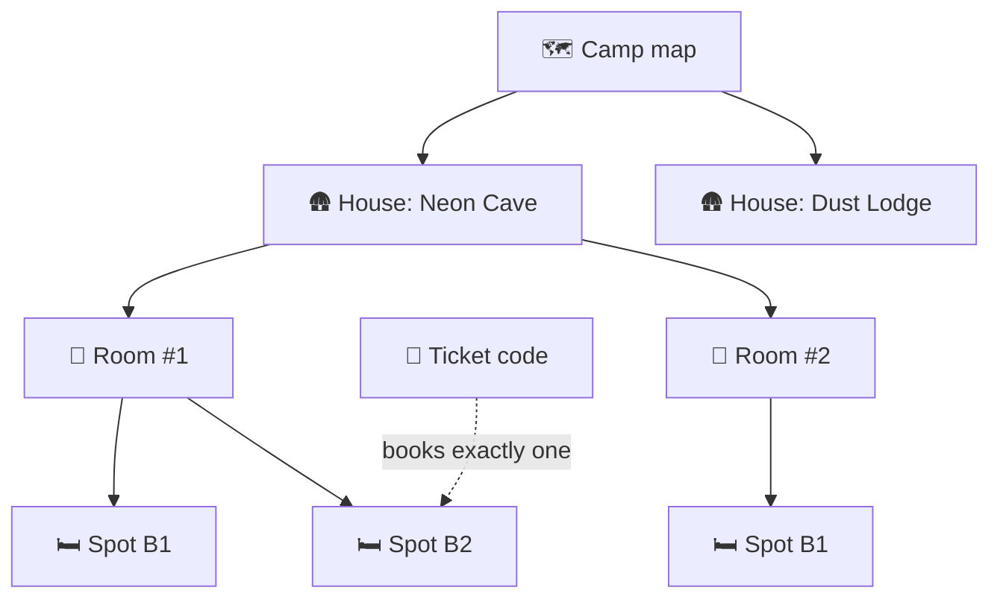

# What is CozyNights?

CozyNights is the bed booking app for **Hamburn**, a regional burn in the spirit of Burning Man. It replaces the spreadsheet that used to decide who sleeps where. Every sleeping spot at the venue lives on an interactive camp map, and guests claim their own bed with the ticket code they already have.

> [!TIP] Just here to book a bed?
> Go straight to [Booking a bed](./booking). It takes about a minute.

## Who uses it

| | Who | What they do |
| --- | --- | --- |
| 🎫 | **Guests** | Everyone with a ticket that includes a bed (the Indoor memberships). They sign in with their ticket code, pick a spot and choose a burner name. |
| 🛠️ | **Admins** | The crew, signed in with their `@mauersegler.art` Google account. They build the camp layout, open booking and look after the spots during the event. |
| ⚡ | **Superusers** | A few admins with extra powers: they approve new admins, switch the phase right away, load the ticket list, clear all bookings and apply layout templates. |

## The building blocks

| Term | Meaning |
| --- | --- |
| **Camp map** | The site plan of the venue. Every house is a pin on it. |
| **House** | A building or sleeping area on the map, such as a lodge, a barn or a big tent. |
| **Room** | A room inside a house, with a name and a room number. |
| **Spot** | A single bed in a room ("B1", "Top Bunk"), or one level of a bunk bed. Its card says what it is, in one colour everywhere: **green** free, **red** taken, **turquoise** yours, **violet** reserved by the crew, **grey** not bookable right now. |
| **Ticket code** | The code on a guest's ticket. It is the guest's key to CozyNights, and it can hold **one** spot at a time. |
| **Burner name** | The optional playa name shown on a booked spot. Other guests see this name, never the name on the ticket. |
| **Phase** | *Staging* (the crew is building, guests can only look), *Live Booking* (guests book, the layout is frozen) or *Closed* (the booking window is over, spots are final). |

> [!NOTE] Where do ticket codes come from?
> The crew loads the ticket shop's list into CozyNights, one entry per ticket with the holder's e-mail address for the confirmations. Admins can fix an address or hand a ticket over to a new holder, but no admin action deletes a ticket: even the most destructive one leaves every ticket code working.

## A season with CozyNights

1. **Build the camp.** In staging, admins place houses on the map and add rooms and spots, or import last year's layout template.
   <!-- audience:admin -->
   See [Houses, rooms & spots](../admin/camp-layout).
   <!-- /audience -->
2. **Load the tickets.** The ticket list goes into the database, so every ticket code can sign in and confirmations reach the right address.
3. **Special needs first.** Guests who need a particular spot ask the crew with their ticket code, and the crew books a fitting spot for them before booking opens. See [Special-needs spot](./special-needs).
4. **Announce the booking window.** An admin plans when booking opens and when it closes, and arms the timer. Guests see a countdown.
5. **Booking opens.** Guests pick their beds; the layout is now frozen. A countdown shows when booking closes: big on the start page, a slim bar on every other page. See [Staging, Live Booking & Closed](./phases).
6. **Booking closes.** At the closing time the spots are final. Guests keep their spot and their booking pass.
7. **During the event.** The crew checks booking passes at arrival where needed, watches occupancy and locks single spots if something breaks.
8. **After the burn.** Export the layout as a template; the guests' contact data is deleted, and a superuser switches back to staging, which frees every spot for next time.

<!-- audience:admin -->
The [event checklist](../admin/event-checklist) walks through all of this in detail.
<!-- /audience -->

## What's under the hood?

A SvelteKit web app backed by a PocketBase database, running in Docker behind nginx. Guests never talk to the database directly, ticket codes are looked up by keyed hashes and never logged, and burner names are encrypted.
<!-- audience:admin -->
Curious? Read [Architecture](../reference/architecture) and [Security & privacy](../reference/security).
<!-- /audience -->
