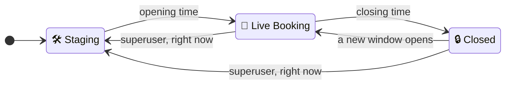
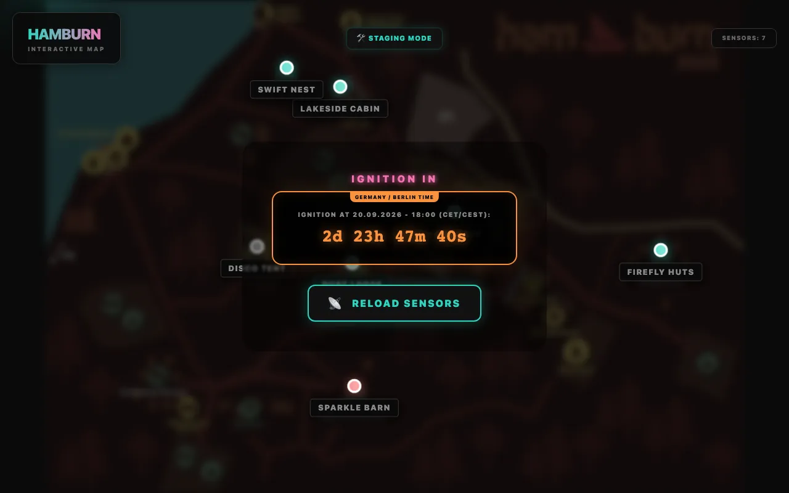

# Staging, Live Booking & Closed

CozyNights is always in one of three phases. The phase decides what guests can do and what admins may change.

- **🛠 Staging** is for building. Admins shape the camp; guests can sign in and look at the (blurred) map, but can't book.
- **🎪 Live Booking** is for booking. Guests claim spots; the camp's structure is frozen so nothing moves under their feet. A slim countdown at the top of every page shows when booking closes.
- **🔒 Closed** follows the booking window. Spots are final: guests still see their spot and their booking pass, but can't book, change or release anything. The layout stays frozen, because it holds the bookings.

## Who can do what

| | 🛠 Staging | 🎪 Live | 🔒 Closed |
| --- | :---: | :---: | :---: |
| Guests: sign in and see the map | ✓ blurred, with countdown | ✓ | ✓ blurred at first, with your booking pass |
| Guests: book, rename, release a spot | ✗ | ✓ | ✗ |
| Guests: ask for a [special-needs spot](./special-needs) | ✓ while requests are open | ✓ while requests are open | ✓ while requests are open |
| Admins: add, rename, move, delete houses | ✓ | ✗ | ✗ |
| Admins: add or delete rooms and spots | ✓ | ✗ | ✗ |
| Admins: activate / deactivate spots, mark as taken | ✓ | ✗ | ✗ |
| Admins: **lock / unlock a spot** | ✓ | ✓ | ✓ |
| Admins: mark special-needs spots ♿, book a spot for a request | ✓ | ✓ | ✓ |
| Admins: export a layout template | ✓ | ✓ | ✓ |
| Superusers: import a layout template | ✓ | ✗ | ✗ |

> [!IMPORTANT] Enforced by the server
> The lockdown is not just hidden buttons. Every structural change is checked on the server against the *current* phase, so an old browser tab can't sneak a change in after going live.

During Live Booking and after booking closed, houses without any active spot don't appear on the guest map.

## The booking window

<!-- audience:public -->
The crew plans when booking opens and when it closes. Guests see both moments as countdowns: **IGNITION IN** on the start page (right above the ticket-code field) and on the map before booking opens, and a slim bar at the top of every other page. Tap the bar for the exact time. While booking is live, the countdown runs to the closing time (big on the start page, slim on every other page), and it turns red in the last hour. When a countdown ends, the page opens or locks by itself; there's no need to reload.
<!-- /audience -->
<!-- audience:admin -->
Everything about the phase sits in one panel of the [Control Center](../admin/), right under the header: **🎟 BOOKING WINDOW**. Its summary line shows the phase, the next switch with a countdown, and whether the timer is armed. Click it to unfold:

- a timeline (before opening → live → closed) with the opening and closing time and a dot for *now*,
- the **timer switch** and <kbd>✎ Edit window</kbd> (<kbd>＋ Plan window</kbd> while nothing is planned),
- for superusers, <kbd>⚡ Switch right now</kbd>.

### Plan the window

<kbd>＋ Plan window</kbd> unfolds two fields, **Booking opens** and **Booking closes**. Under each field you see how far ahead it is and how long booking stays open; problems show up right there, before you save. <kbd>Save window ✨</kbd> stores the times. A new window starts **not armed**: saving and arming are two steps. <kbd>Clear times</kbd> empties both fields, and saving that removes the window.

### Arm or pause the timer

Flip the switch to **Timer armed**. The confirmation repeats both times. From then on booking opens and closes by itself. No background job has to run for that: every page load compares the clock with the window.

Flip it back to pause. The times stay saved and nothing switches until you arm the timer again. Pausing during Live Booking keeps booking open, now without an end.

### Rules for admins

Admins who are not superusers plan ahead:

- Booking opens **at least one day** from now.
- It stays open for **at least one day**. That also applies when you move the closing time during Live Booking.
- Nothing they save or arm may switch the phase **right now**.

Times the armed timer already has don't have to be a day ahead again, so you can still move the closing time when the opening is only hours away. Arming a paused timer checks everything again. A paused window can be saved with any times; the panel says early if it couldn't be armed that way.

### Switch right now (superusers only)

<kbd>⚡ Switch right now</kbd> unfolds 🛠 Staging · 🎪 Live Booking · 🔒 Closed. Every switch asks first and says what happens to the timer:

- **Live Booking:** a planned opening time is dropped (booking opened now). A future closing time stays and closes booking as planned.
- **Closed:** the closing time of the current window is dropped (booking closed now). If the timer had already opened booking, it is paused as well (armed, it would reopen booking at once) and the elapsed opening time stays visible in the panel. For another round, edit the window with new times before arming again.
- **Staging:** the timer is paused, so nothing switches by itself. The dialog then asks what happens to the guest bookings, and says how many there are (and how many guests are already checked in): **release them** — those spots become free again and their burner names and check-ins are forgotten, ticket codes keep working, so the guests book again once booking opens; this can't be undone — or **keep them** while the layout is edited, and clear them later with 🧨 *Clear all bookings*. Spots the crew booked for [special-needs requests](./special-needs) stay either way. Only superusers can do either.

A window planned for later (its opening time still ahead) stays armed when a superuser closes booking or goes back to Staging. The confirmation warns about it.

> [!NOTE] Checked twice
> The Control Center checks these rules, and the server checks them again. PocketBase itself also refuses a change to the booking settings by an admin who isn't a superuser if it would switch the phase at that moment, even when the change comes straight through its API.
<!-- /audience -->

> [!IMPORTANT] Event time
> Opening and closing times are always **Europe/Berlin** time (CET/CEST), no matter which timezone your laptop or the server is in.

## During Live Booking

Almost everything structural is locked. The one exception is **locking and unlocking single spots**, so the crew can take a broken bed out of service mid-event. Guests then see it as *Not available · Reserved by the crew*.

## After booking closed

<!-- audience:public -->
Your spot stays yours, and your booking pass keeps working. Nothing can be booked, changed or released any more. If something has to change, ask the crew.

The map greets you with a panel over the blurred camp, like before booking opened: your spot as a small ticket (tap it for your [booking pass](./booking#your-booking-pass)). <kbd>🗺️ LOOK AROUND</kbd> clears the view; houses and rooms still open, read-only.
<!-- /audience -->
<!-- audience:admin -->
The layout stays locked; locking and unlocking single spots still works. For another booking round, plan a new window: the camp stays closed until its opening time. Only a superuser can switch back to Staging, for example to rebuild the layout.
<!-- /audience -->
