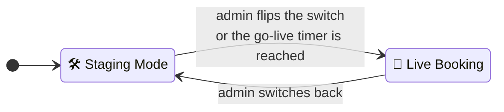

# Staging & Live Booking

CozyNights always runs in one of two phases. The phase decides what guests can do and what admins may change.

- **🛠 Staging Mode** is for building. Admins shape the camp; guests can sign in and look at the (blurred) map, but can't book.
- **🎪 Live Booking** is for booking. Guests claim spots; the camp's structure is frozen so nothing moves under their feet.

## Who can do what

| | 🛠 Staging | 🎪 Live |
| --- | :---: | :---: |
| Guests: sign in and see the map | ✓ blurred, with countdown | ✓ |
| Guests: book, rename, release a spot | ✗ | ✓ |
| Guests: ask for a [special-needs spot](./special-needs) | ✓ while requests are open | ✓ while requests are open |
| Admins: add, rename, move, delete houses | ✓ | ✗ |
| Admins: add or delete rooms and spots | ✓ | ✗ |
| Admins: activate / deactivate spots, mark as taken | ✓ | ✗ |
| Admins: **lock / unlock a spot** | ✓ | ✓ |
| Admins: mark special-needs spots ♿, book a spot for a request | ✓ | ✓ |
| Admins: export a layout template | ✓ | ✓ |
| Superusers: import a layout template | ✓ | ✗ |

> [!IMPORTANT] Enforced by the server
> The lockdown is not just hidden buttons. Every structural change is checked on the server against the *current* phase, so an old browser tab can't sneak a change in after going live.

During Live Booking, houses without any active spot don't appear on the guest map.

## Going live

<!-- audience:public -->
The crew opens booking either by hand or on a timer. With a timer, guests see the moment as a countdown: **IGNITION IN** on the map, and a small timer on house and room pages.
<!-- /audience -->
<!-- audience:admin -->
There are two ways to open booking, both in the [Control Center](../admin/):

### Flip the switch

Press <kbd>🛠 STAGING MODE</kbd> in the header. It turns into <kbd>🎪 LIVE BOOKING ACTIVE</kbd> and guests can book immediately.

### Schedule it

Under the header, next to **Schedule automatic go-live**, pick a date and time and press <kbd>Schedule ✨</kbd>. The panel then reads *Auto-opens live booking on …* with a <kbd>Cancel Timer ✕</kbd> button.

- Guests see the same moment as a countdown: **IGNITION IN** on the map, and a small timer on house and room pages.
- When the time has come, booking is open. No background job needs to run for that: every request compares the clock with the timer.

<!-- /audience -->

> [!IMPORTANT] Event time
> The go-live time is always **Europe/Berlin** time (CET/CEST), no matter which timezone your laptop or the server is in.

## During Live Booking

Almost everything structural is locked. The one exception is **locking and unlocking single spots**, so the crew can take a broken bed out of service mid-event. Guests then see it as *Not available · Reserved by the crew*.

## Switching back to staging

<!-- audience:public -->
The crew can switch back to staging at any time. Guests can then no longer book, rename or release a spot. **Existing bookings stay.**
<!-- /audience -->
<!-- audience:admin -->
Press <kbd>🎪 LIVE BOOKING ACTIVE</kbd>. After a confirmation, guests can no longer book, rename or release. **Existing bookings stay.**

- If you are a **superuser** and there are bookings, a second dialog offers to **clear all bookings**. Every spot becomes free again and all burner names are forgotten. Ticket codes keep working. This can't be undone.
- If the go-live timer had already passed, it is removed as well, otherwise the next page load would open booking again right away. A timer that is still in the future stays scheduled.

> [!CAUTION] Mind the timer
> Switched back to staging but a future go-live timer is still set? Booking will open again at that time. Cancel the timer if that's not what you want.

<!-- /audience -->
