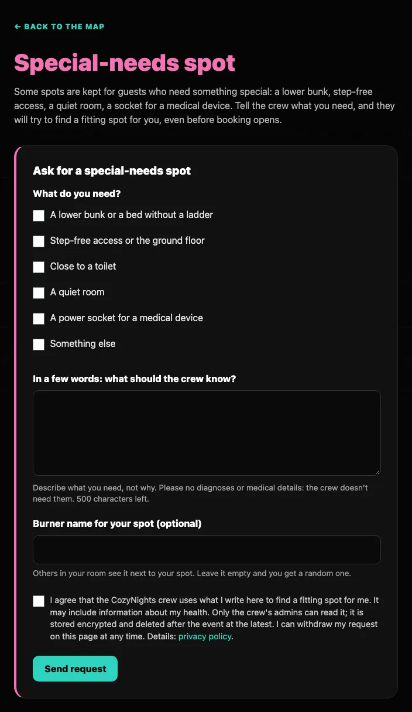
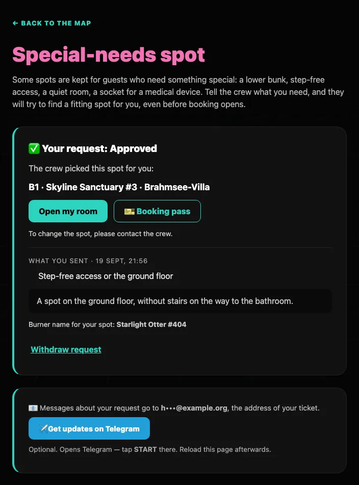

# Special-needs spot

Some spots are kept for guests who need something special: a lower bunk or a bed without a ladder, step-free access, a place close to a toilet, a quiet room, or a power socket for a medical device. If that's you, **ask the crew for such a spot, even before booking opens**.

## Asking for a spot

1. **Sign in** on the start page with your ticket code.
2. **Open the request page from the map.** Before booking opens, the map shows ♿ **Need a special-needs spot? Ask the crew now**. During Live Booking and after it, the button ♿ **Special-needs spot** sits at the top of the map (on a phone it is just ♿). The link is there while the crew accepts requests.
3. **Tick what you need**: a lower bunk or a bed without a ladder (a stacked bunk bed tells the crew by itself which of its two spots is the lower one), step-free access or the ground floor, close to a toilet, a quiet room, a power socket for a medical device, or *something else*. Then tell the crew in a few words what they should know (5 to 500 characters; the form counts for you). Describe *what* you need, not *why*: no diagnoses or medical details, the crew doesn't need them.
4. Optionally enter the **burner name** for your spot (up to 80 characters). The crew's booking uses it unless your ticket already has a burner name; leave it empty and you get a random one.
5. Tick the **consent** box and press <kbd>Send request</kbd>.

If something is missing, the form says so right where it is: the part to fix gets a red border, the reason appears under it, and the cursor jumps to the first one. Tick at least one thing (or *Something else*), write at least a few words, and tick the consent box, because without it the crew may not use what you wrote. Sending the form more than ten times within an hour is refused for a while.

Once it is sent, the page shows your request and its status, where messages about it go (the address of your ticket, shortened like `m•••@example.com`) and <kbd>Get updates on Telegram</kbd>. You get an e-mail that your request arrived, and another one when the crew has decided. The link on the map now reads ♿ **See your special-needs request** or ♿ **My request**, also when the crew no longer takes new requests.

## What happens next

| Status | What it means |
| --- | --- |
| **Waiting for the crew** | The crew hasn't decided yet (before booking opens, they look at it before the opening). While requests are open, <kbd>Change request</kbd> lets you edit it and <kbd>Save changes</kbd> sends it again; tick the consent box again each time. You can withdraw it at any time. |
| **Approved** | The crew picks a fitting spot and books it for you. You get a message with the spot and your [booking pass](./booking#your-booking-pass), and the page shows the spot with <kbd>Open my room</kbd> and <kbd>🎫 Booking pass</kbd>. If you already booked a spot yourself, you keep it until the crew books a more fitting one. |
| **Declined** | The crew can't offer you a special-needs spot. Keep the spot you booked, or book one like everyone else when booking opens. Once booking has closed, no spot can be booked anymore: contact the crew. |

Once the crew has decided, the request can't be changed anymore: <kbd>Change request</kbd> is gone and the page shows the decision. If something changed, contact the crew; withdrawing still works.

A spot the crew booked for you is yours, also while booking is still closed. While booking is open you can give it a new burner name, but **only the crew can move it or release it**: write to them if something doesn't fit.

## Withdrawing

On the same page, <kbd>Withdraw request</kbd> deletes your request and everything you wrote, right away. If your request is approved and your ticket holds a spot, the confirmation says so: *Your spot stays yours, but the crew no longer knows why you have it.* A spot the crew booked for you then becomes an ordinary booking, which you can change or release yourself while booking is open. While requests are open, you can send a new request afterwards.

## Requests are closed?

Then the page says *Requests are closed right now*: the crew isn't taking special-needs requests at the moment, and a request can't be sent or changed. If you need a special spot, contact the crew. A request you already sent stays, and you can still see and withdraw it.

## Who sees what

- **Only the crew's admins** can read what you ticked and wrote. It is stored encrypted and deleted after the event at the latest.
- **Messages never contain it:** e-mails and Telegram messages only say what the crew decided.
- **Other guests can't tell** that your spot is a special-needs spot: they see your burner name, like on any other spot.

More in the privacy policy (the *Privacy* link at the bottom of every CozyNights page), section *Special-needs requests*.
