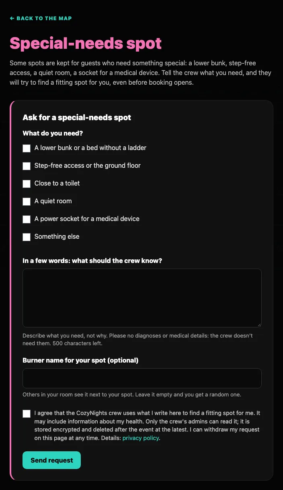
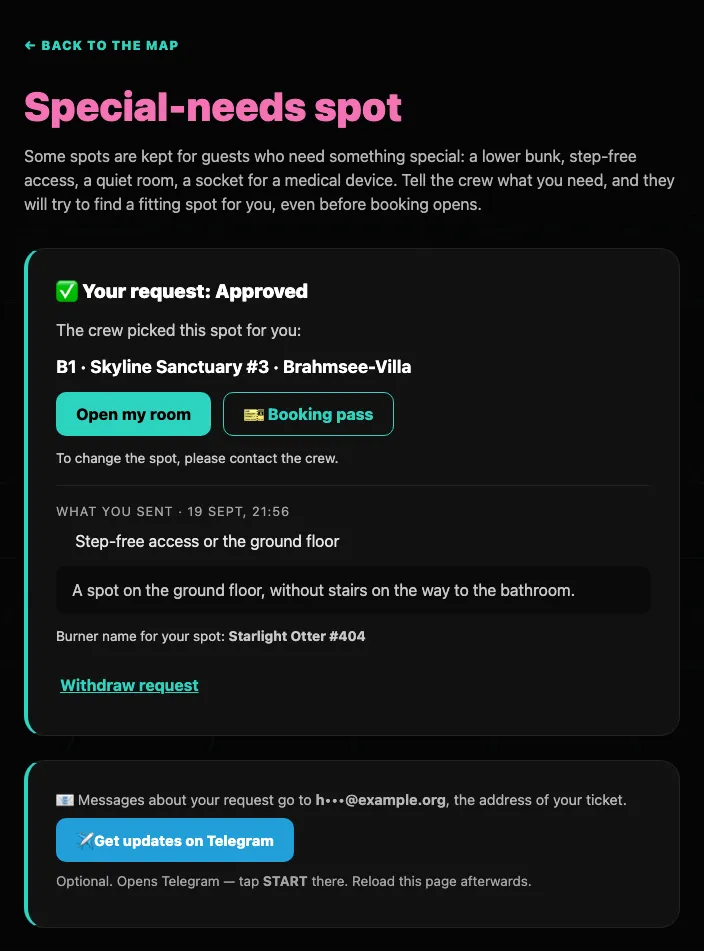

# Special needs & groups

Some spots are kept back for the crew to hand out: for guests who need something special — a lower bunk or a bed without a ladder, step-free access, a place close to a toilet, a quiet room — and for art projects, workshops, theme camps and crews who want a room of their own or spots close together. If that's you, **ask the crew, on your own or as a group, even before booking opens**.

## Asking for a spot

1. **Sign in** on the start page with your ticket code.
2. **Open the request page.** Before booking opens, the map shows ♿ **Special needs or a project? Ask the crew now**. During Live Booking and after it, the link ♿ **Special-needs spot** sits in the top bar of every booking page (on a phone it is just ♿). The link is there while the crew accepts requests.
3. **Tick what your request is about.** The list has two parts, and you can tick in both: *Something I need to sleep well* — a lower bunk or a bed without a ladder (a stacked bunk bed tells the crew by itself which of its two spots is the lower one), step-free access or the ground floor, close to a toilet, a quiet room — and *An art project, a workshop, a theme camp or a crew* — a room just for your project or crew, spots close to the people you come with. *Something else* is for anything that doesn't fit.
4. **Tell the crew in a few words** what they should know (5 to 500 characters; the form counts for you). For a project: what it is, how many of you there are, and a room or house you have in mind. For something you need: describe *what* you need, not *why* — no diagnoses or medical details, the crew doesn't need them.
5. Optionally enter the **burner name** for your spot (up to 80 characters). The crew's booking uses it unless your ticket already has a burner name. Others in your room see it next to your spot, and so does your group if you are in one. Leave it empty and you get a random one.
6. **Asking together with others?** Leave it on *Just for me*, or start or join a group (see [Asking as a group](#asking-as-a-group)).
7. Tick the **consent** box and press <kbd>Send request</kbd>.

If something is missing, the form says so right where it is: the part to fix gets a red border, the reason appears under it, and the cursor jumps to the first one. Tick at least one thing (or *Something else*), write at least a few words, and tick the consent box, because without it the crew may not use what you wrote. Joining a group is the one exception: then ticking and writing are optional. Sending the form more than ten times within an hour is refused for a while.

Once it is sent, the page shows your request and its status, where messages about it go (the address of your ticket, shortened like `m•••@example.com`) and <kbd>Get updates on Telegram</kbd>. You get an e-mail that your request arrived, and another one when the crew has decided. The link now reads ♿ **See your special-needs request** on the map's panel and ♿ **My request** in the top bar, also when the crew no longer takes new requests.

## Asking as a group

An art project, a workshop, a theme camp, a crew, or friends who want to sleep close together can ask as a **group**. Everyone in it asks with their own ticket code and has their own request; the group links them, so the crew looks at all of you together.

1. **One of you starts the group.** On the form, under *Asking together with others?*, choose *Start a group* and give it a name (2 to 40 characters, for example your project's name; only your group and the crew see it). Fill in the rest as usual: tick what the group needs and tell the crew what your project is, so they know what the group is about.
2. **Share the link.** After sending, the card **👥 Your group** shows the link to share (<kbd>📋 Copy link</kbd> copies it) and the group code, like `ABCD-EF23`. Anyone with the link or the code can join and sees the burner names in the group, so share it only with your people.
3. **The others join.** They open the link — after signing in with their own ticket code, if the app asks for it, they land on the form with the code filled in — or they choose *Join a group* and type the code (upper or lower case, with or without the dash; a pasted link works too). Ticking and writing are optional when you join: tick only what you need yourself, and if you tick something, add a few words. In a group, one of you explaining the project is enough.

The group card shows the group's name, how many of you are in it (*3 of 12 people*) and everyone's burner name, yours marked *(you)*; someone who left the burner name empty in their request shows as *A fellow burner*. A request that asks only as part of the group, with nothing ticked, says *Nothing ticked: you asked as part of your group.*

Already sent a request on your own? While it waits for the crew and requests are open, press <kbd>Change request</kbd> (or the line *Asking together with others? Change your request to start or join a group.*) and start or join a group from there.

**What the crew does:** they look at everyone in the group together and try to put you close to each other, but there is no claim to a particular room. The crew still decides on each request on its own, and **each of you gets your own message** about your own request.

**Limits:**

- **One group per ticket.** To switch groups, leave yours first.
- **At most 12 people** in a group. A full group says so; ask the crew if more of you need to come along.
- **Starting and joining** only work while requests are open and your request waits for the crew. Once the crew has decided on your request, it can't join a group anymore: if you'd like to sleep close to that group, contact the crew.
- **Wrong codes:** *No group has this code* means a typo, or the group is gone (it is deleted when its last member leaves). After five wrong codes within 15 minutes the form asks you to wait 15 minutes. *You can't join this group* means the crew took you out of it: contact the crew.

**Leaving:** <kbd>Leave the group</kbd> at the bottom of the group card, at any time, also when requests are closed. If your request was only about the group (nothing ticked), leaving deletes it; a spot the crew already booked for you stays yours, as an ordinary booking. Otherwise your own request stays with the crew, without the group, and the others no longer see your burner name. When the last person leaves, the group is deleted. If someone joins who doesn't belong, tell the crew: they can take them out of the group.

## What happens next

| Status | What it means |
| --- | --- |
| **Waiting for the crew** | The crew hasn't decided yet (before booking opens, they look at it before the opening). While requests are open, <kbd>Change request</kbd> lets you edit it and <kbd>Save changes</kbd> sends it again; tick the consent box again each time. You can withdraw it at any time. |
| **Approved** | The crew picks a fitting spot and books it for you — for a group, often for everyone in one go. You get a message with the spot and your [booking pass](./booking#your-booking-pass), and the page shows the spot with <kbd>Open my room</kbd> and <kbd>🎫 Booking pass</kbd>. If you already booked a spot yourself, you keep it until the crew books a more fitting one. |
| **Declined** | The crew can't offer you a special-needs spot. Keep the spot you booked, or book one like everyone else when booking opens. Once booking has closed, no spot can be booked anymore: contact the crew. |

Once the crew has decided, the request can't be changed anymore: <kbd>Change request</kbd> is gone and the page shows the decision. If something changed, contact the crew; withdrawing still works.

A spot the crew booked for you is yours, also while booking is still closed. While booking is open you can give it a new burner name, but **only the crew can move it or release it**: write to them if something doesn't fit.

## Withdrawing

On the same page, <kbd>Withdraw request</kbd> deletes your request and everything you wrote, right away; if you are in a group, you leave it too. If your request is approved and your ticket holds a spot, the confirmation says so: *Your spot stays yours, but the crew no longer knows why you have it.* A spot the crew booked for you then becomes an ordinary booking, which you can change or release yourself while booking is open. While requests are open, you can send a new request afterwards.

## Requests are closed?

Then the page says *Requests are closed right now*: the crew isn't taking special-needs requests at the moment, and a request can't be sent or changed, and nobody can start or join a group. If you need a special spot, contact the crew. A request you already sent stays: you can still see it, withdraw it and leave your group.

## Who sees what

- **Only the crew's admins** can read what you ticked and wrote. It is stored encrypted and deleted after the event at the latest.
- **Messages never contain it:** e-mails and Telegram messages only say what the crew decided.
- **Other guests can't tell** that your spot is a special-needs spot: they see your burner name, like on any other spot.
- **In a group**, everyone in it sees the group's name and the burner names of the people in it — never your ticket, your e-mail address, what you ticked or wrote, or what the crew decided on your request. Anyone with the group's link or code can join it, so whoever shares it decides who gets it.

More in the privacy policy (the *Privacy* link at the bottom of every CozyNights page), section *Special-needs requests and groups*.
