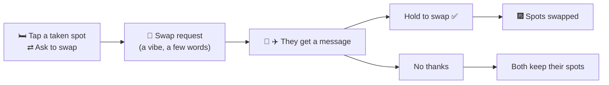
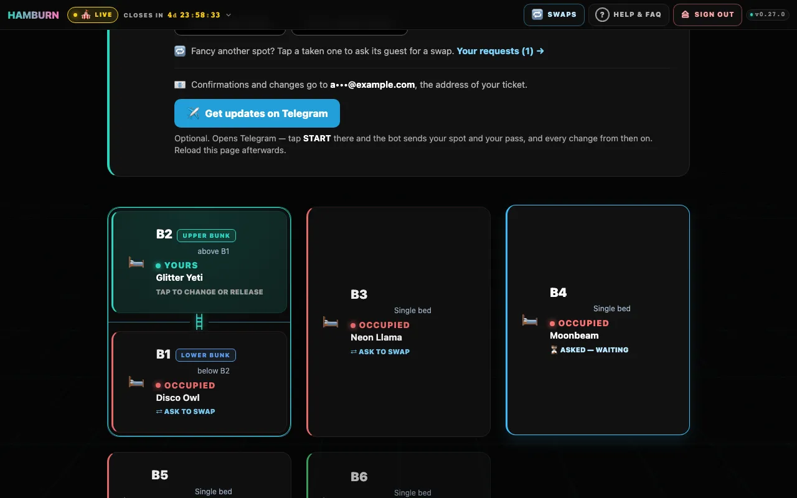
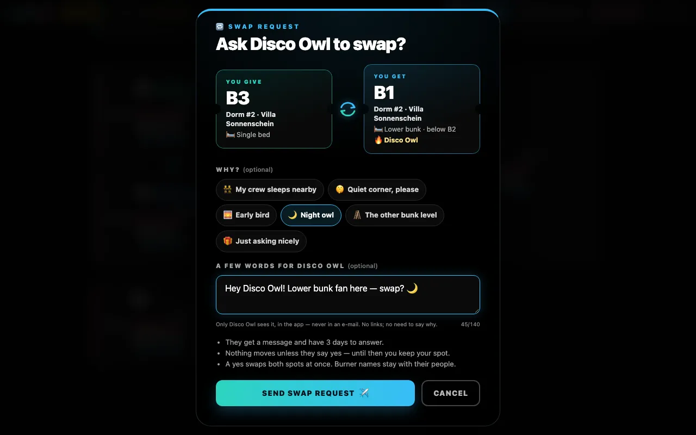
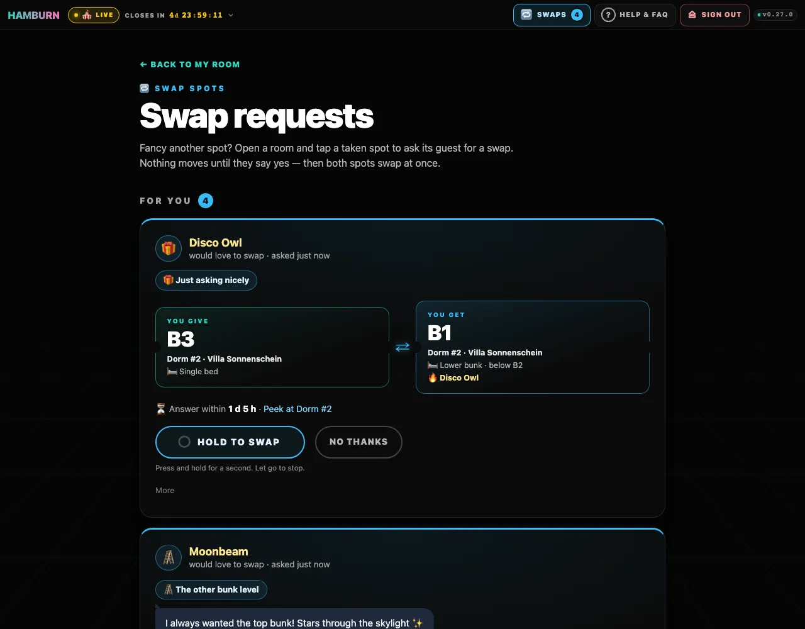
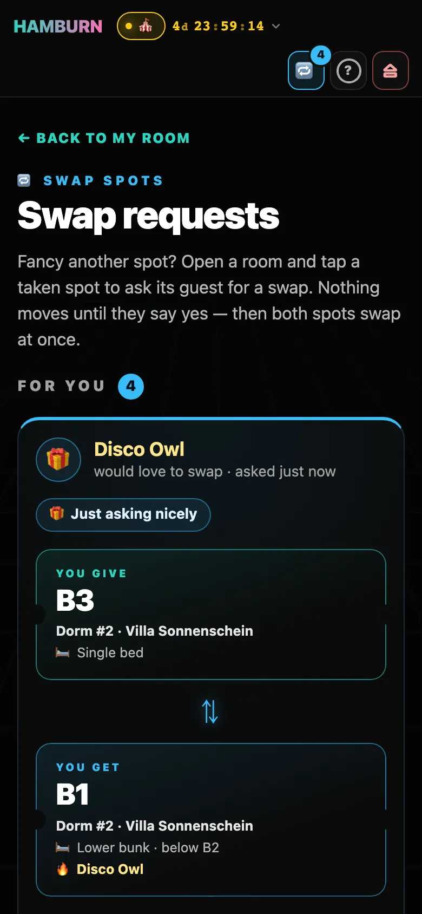
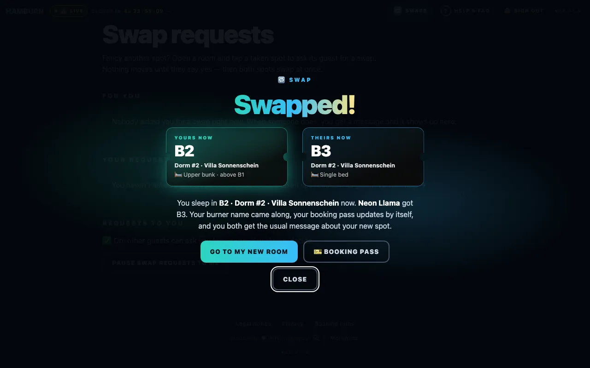

# Swapping spots

Somebody has the spot you dream of, and you'd happily give yours for it? During **Live Booking** you can ask them for a swap. Nothing moves until they say yes — then both spots change hands at once, and you both get the news.

## At a glance

## Asking for a swap

1. **Tap a taken spot**

   You need a spot of your own: a swap trades yours for theirs. Open the room with the spot you'd like. While booking is live, every spot another guest holds says **⇄ Ask to swap** under the burner name. Tap it.

   

2. **Say hi (optional)**

   The swap sheet shows the deal as two tickets: **You give** (your spot, turquoise) and **You get** (theirs, sky blue). Pick a vibe if you like — <kbd>👯 My crew sleeps nearby</kbd>, <kbd>🤫 Quiet corner, please</kbd>, <kbd>🌅 Early bird</kbd>, <kbd>🌙 Night owl</kbd>, <kbd>🪜 The other bunk level</kbd>, <kbd>🎁 Just asking nicely</kbd> — and write a few words, up to 140 characters. Links can't go in, and there is no need to explain why: a friendly word is enough.

   

3. **Send it**

   <kbd>Send swap request ✈️</kbd> — your note flies off as a paper plane. The spot's card now says **⏳ Asked — waiting**. Tap it again to see the request or <kbd>Take it back</kbd>.

The other guest gets an e-mail (and a Telegram message, if they turned Telegram updates on) saying that someone would like to swap, with both spots. Your name and your words are not in it: they only see those in the app.

## When someone asks you

- The 🔁 **Swaps** link in the top bar gets a badge, and the *Welcome Home!* box on your room page says *Someone would like to swap spots with you*. The e-mail links there too.
- **Swap requests** lists them: who asks (their burner name), their vibe and words, the two spots as tickets and how long you have to answer. <kbd>Peek at …</kbd> opens the room you would move to.
- **Yes:** press and hold <kbd>Hold to swap</kbd> for about a second, until the pill is full — letting go early stops it. On a keyboard hold Space or Enter; with a screen reader, activate the button twice. The two tickets fly past each other, fireworks go up from your new spot, and <kbd>Go to my new room</kbd> takes you there.
- **No:** <kbd>No thanks</kbd>. They get a kind *No swap this time*, and both of you keep your spots. Under **More** you can also say no and pause swap requests to you in one go.
- Or just let it run out: nothing happens then.

## After the swap

Both spots change hands in one step — there is no moment in which one of you has no spot or two. Your **burner name** comes along to your new spot, your [booking pass](./booking#your-booking-pass) keeps its code and shows the new spot, a wallet pass updates itself, and you both get **🔁 Swap done!** by e-mail (and on Telegram) instead of the usual *spot changed*.

Your other open requests end, because the spot you offered in them is no longer yours; so do other guests' requests for either of the two spots. **Swap requests** shows them as *Another swap went through first*.

## The rules

| Rule | What it means |
| --- | --- |
| Only during Live Booking | Nobody can ask or say yes before booking opens or after it closes. Waiting requests stay on the page but can't be accepted then. |
| Your spot for theirs | You need a spot to offer. A spot the crew picked for you (a special-needs spot), one the crew set aside, and a spot you have [checked in](./booking#your-booking-pass) at can't be swapped; the room page tells you so. |
| Up to 3 open requests | Wait for an answer, or take one back on **Swap requests**. At most 10 new requests within a day. |
| 72 hours | A request without an answer runs out after three days, or when booking closes. You can ask again after that. |
| A no is a no | Once a guest said no to a swap, you can't ask them for that spot again. |
| First yes wins | Say yes to one request, and every other request that involves your old spot or theirs ends. |
| Some spots can't be swapped | Not every taken spot can change hands (the crew holds some back). A request for such a spot simply gets no answer and runs out — like any request its guest doesn't answer. |

## Pausing requests to you

Happy where you are? At the bottom of **Swap requests**, <kbd>Pause swap requests to me</kbd> stops new requests from reaching you; requests that already arrived can still be answered. <kbd>Turn swap requests on</kbd> undoes it. When your ticket is passed on to someone else, their requests start on again.

## Privacy

- The guest you ask sees your **burner name**, your **spot**, your vibe and your words — what the room pages show anyway, plus your message. Nobody sees your ticket code, your name from the ticket list or your e-mail address.
- Your words are stored **encrypted**, only the guest you ask can read them, in the app. They are never in an e-mail or a Telegram message, and the crew doesn't read them.
- Swap requests are deleted when your ticket is passed on and after the event.

<!-- audience:admin -->
For the crew: [Swap requests](../admin/swaps).
<!-- /audience -->
Something not working? See [FAQ & troubleshooting](./faq#swapping-spots).
