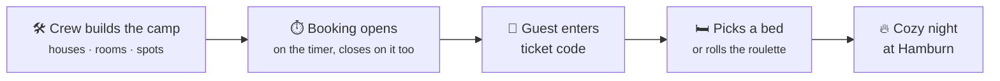

## How it works

🎫 Guests pick a house on the live camp map

<!-- audience:admin -->

🛠️ The crew runs the camp from the Control Center

<!-- /audience -->

## Find your way

<!-- audience:public -->

| I am… | Start here |
| --- | --- |
| 🎫 **A guest** with a ticket | [Booking a bed](./guide/booking): ticket code, map, spot, done. |
| ♿ **In need of a special spot** | [Special-needs spot](./guide/special-needs): ask the crew, even before booking opens. |
| 🤔 **Stuck** somewhere | [FAQ & troubleshooting](./guide/faq), or ask the Hamburn crew. |
| 🛠️ **On the crew** | The admin guide is part of the app and opens for signed-in admins only: `/admin/docs/` on the CozyNights site. |

<!-- /audience -->
<!-- audience:admin -->

| I am… | Start here |
| --- | --- |
| 🎫 **A guest** with a ticket | [Booking a bed](./guide/booking): ticket code, map, spot, done. |
| 🛠️ **On the crew** and need admin access | [Admin access & roles](./admin/access), then [the Control Center](./admin/). |
| 📋 **Organizing** the next burn | [Event checklist](./admin/event-checklist) from first layout to after the event. |
| ♿ **Deciding special-needs requests** | [Special-needs requests](./admin/special-needs): mark spots, decide, book. |
| 🎟️ **At the entrance**, checking guests in | [Booking passes & check-in](./admin/passes): phone camera, check-in page or USB scanner. |
| 💻 **A developer** | [Local development](./develop/) and [Architecture](./reference/architecture). |

<!-- /audience -->
