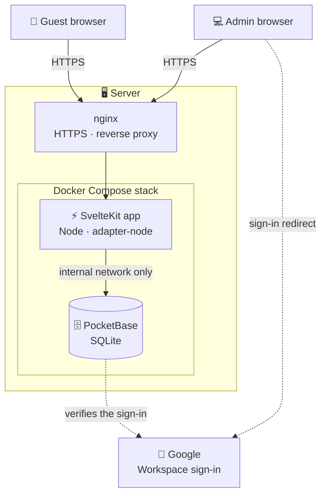
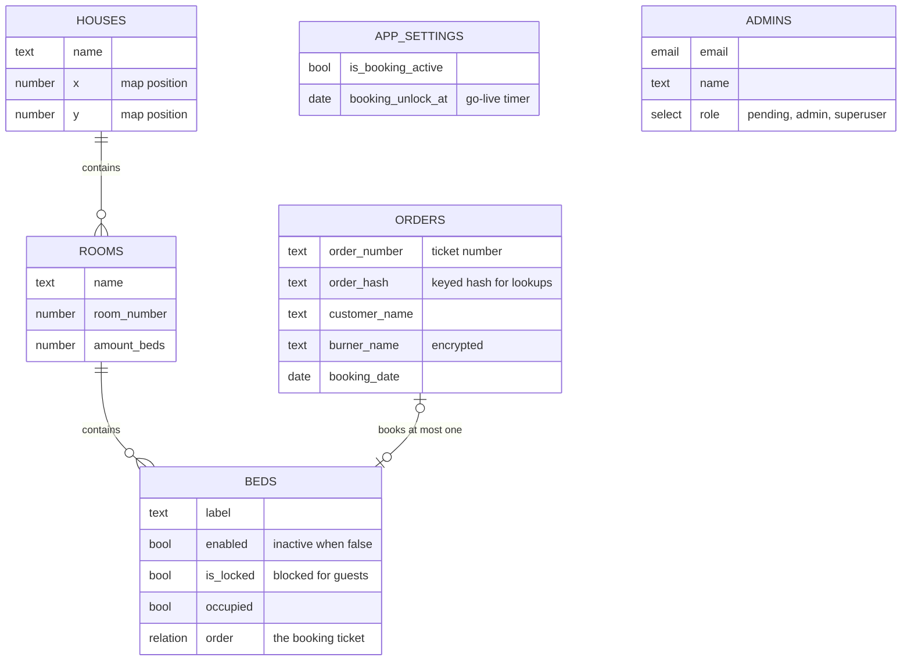
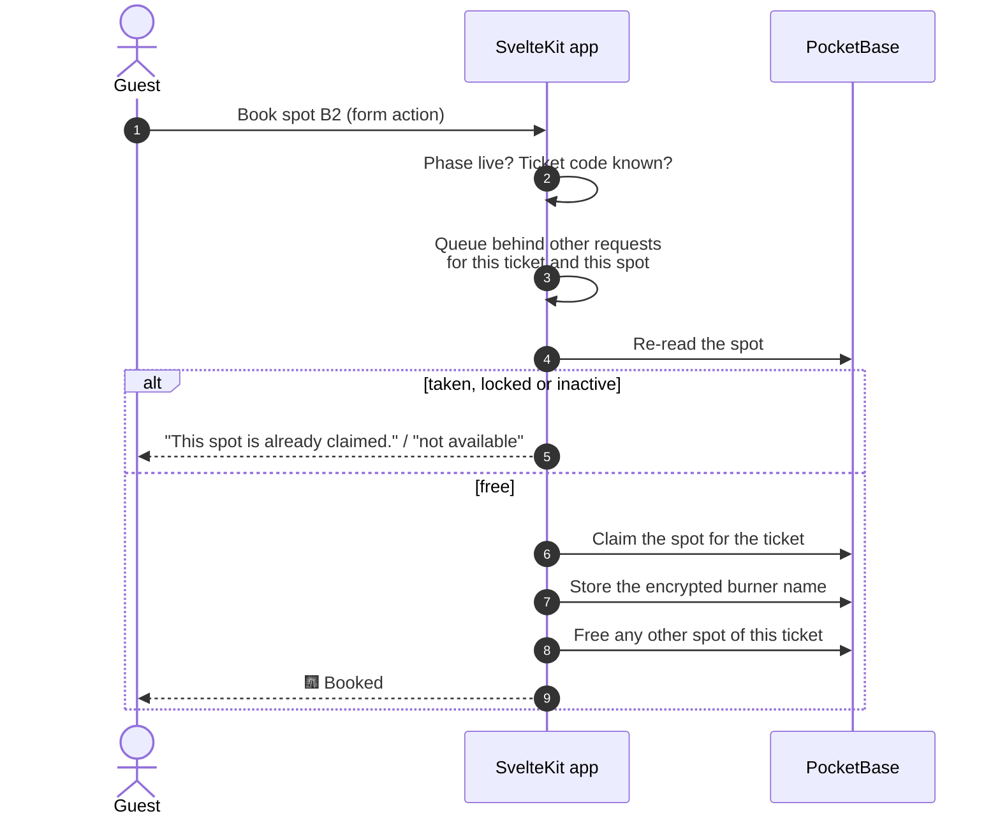

# Architecture

CozyNights is a server-rendered SvelteKit app in front of a PocketBase database, both running in Docker behind nginx.

## The big picture



- **Browsers only ever talk to the app.** Pages are rendered on the server, and every button submits a form to a server action. There is no public database API.
- **PocketBase is internal.** It is reachable from the app over the Docker network, and its dashboard only from the server itself.
- **nginx** terminates TLS and forwards the site's domain to the app, which listens on the server's loopback interface only.

## Tech stack

| Layer | Technology |
| --- | --- |
| Web app | [SvelteKit 2](https://svelte.dev/docs/kit) with Svelte 5, TypeScript, Vite; [`adapter-node`](https://svelte.dev/docs/kit/adapter-node) |
| Styling | Tailwind CSS 4 plus component styles (the "laser" look), WebGL cursor trail |
| Charts | Chart.js |
| Database & auth | [PocketBase](https://pocketbase.io) 0.40 (SQLite); schema and API rules as migrations, server hooks in JavaScript |
| Admin sign-in | Google OAuth 2.0 through PocketBase, limited to a Google Workspace domain |
| Hosting | Docker Compose, nginx with Let's Encrypt certificates |
| Tests | Vitest (unit and security), Playwright (end-to-end) |
| Docs | VitePress on GitHub Pages (this site) |

## Who reads and writes what

The app uses PocketBase in three different ways, each with its own rights:

| Context | Used for | Rights |
| --- | --- | --- |
| **Public** | Camp map, house and room pages | Read-only access to the layout: houses, rooms, spots and the phase settings. No personal data. |
| **Signed-in admin** | Control Center and editors | The admin's own session. PocketBase's API rules only accept layout changes from approved admins. |
| **App server** | Ticket codes, bookings, burner names | A privileged backend connection that only exists inside the app server. The ticket list has no public API access at all. |

Page data is trimmed on the server to what the page shows. A guest's room page, for example, gets spot labels, states and burner names, never other guests' tickets.

## Data model



- **`orders`** is the ticket list: one record per ticket. CozyNights only reads it and writes the burner name. No admin action deletes orders.
- **Spots are called `beds`** in the database. A booking is simply a bed with `occupied` set and a link to its order.
- **`app_settings`** is a single record holding the phase switch and the go-live timer.
- **`admins`** is its own auth collection for Google sign-in. PocketBase's default `users` collection is unused and closed for sign-up.
- Schema and API rules live in `hamburn-cozynights/pb_migrations/`. The migrations are idempotent, so a database restored from a backup is brought to the current rules too.

## Routes

| Route | Who | What |
| --- | --- | --- |
| `/` | everyone | Start page, ticket code sign-in |
| `/map` | everyone | Camp map, blurred with countdown in staging |
| `/house/:id` | guests with a code | Rooms of a house with free spots |
| `/room/:id` | guests with a code | Spots of a room, booking dialog |
| `/random-bed` | guests with a code | Destiny Roulette |
| `/admin/login` | everyone | Google sign-in and the *access requested* page |
| `/auth/callback/google` | – | Where Google sends admins back to |
| `/admin` | admins | Control Center |
| `/admin/house/:id` | admins | Rooms of a house |
| `/admin/room/:id` | admins | Spots of a room |
| `/admin/api/export-template` | admins | Layout template download |

A single server hook (`src/hooks.server.ts`) runs before every request. It restores the guest's ticket session and the admin session, re-checks the admin's role, and refuses admin form actions and API calls without an approved session, so no single action can forget the check.

## Booking, precisely



- **No double bookings.** Requests for the same ticket or the same spot run one after another, and availability is re-checked inside that queue. Two guests clicking the same bed at the same moment: exactly one wins.
- **One ticket, one spot.** Even parallel requests from the same ticket end with a single booked spot.
- **Claim first, then release.** If something fails midway, a guest keeps their old spot rather than ending up with none.
- **Single instance.** The queue lives in the app process, which matches the deployment of exactly one app container per environment.
- **Go-live without a scheduler.** "Booking is open" means *the switch is on, or the timer has passed*. It is evaluated on every request, so nothing has to run at the go-live moment. Admins enter the timer in Europe/Berlin time.

## Repository layout

```text
hamburn-cozynights/                 repository root
├── docs/                           this documentation site (VitePress)
├── .github/workflows/              staging deploy, docs deploy
└── hamburn-cozynights/             the app
    ├── src/
    │   ├── hooks.server.ts         sessions and the admin gate for every request
    │   ├── routes/                 guest pages, /admin, OAuth callback
    │   └── lib/
    │       ├── components/         map, markers, slot machine, admin widgets
    │       └── server/             booking, inventory, settings, admin auth, crypto
    ├── pb_migrations/              database schema and API rules
    ├── pb_hooks/                   PocketBase hooks: admin sign-in guard, admin tool
    ├── scripts/                    admin tool, health check, test setup, backups
    ├── deploy/                     deploy script, nginx vhost, server runbook
    ├── tests/                      Vitest and Playwright tests
    ├── static/                     logo, site plan, background video
    ├── docker-compose.yml          local PocketBase
    └── docker-compose.staging.yml  staging stack
```
